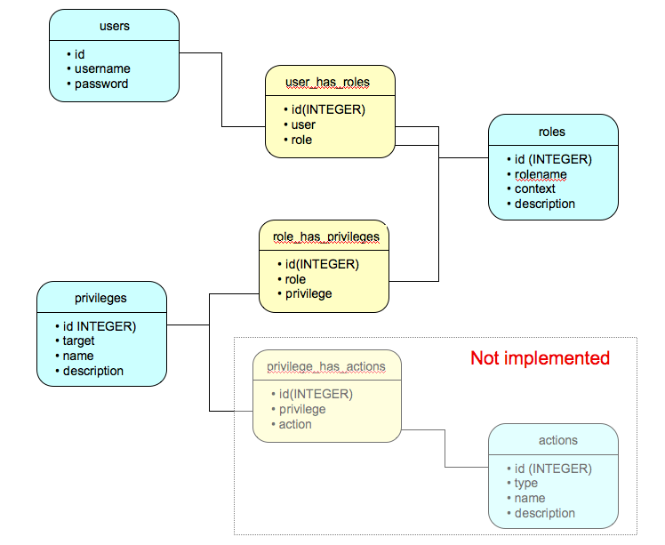

.. _vnfdeveloperguideaccesscontrol:

Access control
==============

database design
---------------

A user can have roles.

A role can have roles.

A role can have privileges.

A privilege may qualitfy a role to perform some actions.

Example ::

  User jbrkeith has a role of vnf/core-developer
  The role vnf/core-developer is in the "group" vnf/developer
  The role vnf/developer is in the "group" vnf/user
  The role vnf/user has the privilege "simulation/run"

API
---

To find out if a user has a privilege, do ::
   
  >>> director.accesscontrol.checkPrivilege(target, name)

the privilege is represented by the target and the name.

Example ::

 >>> director.accesscontrol.checkPrivilege('simulation', 'run')

