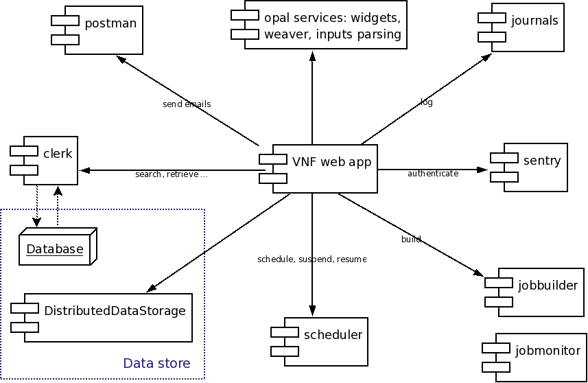
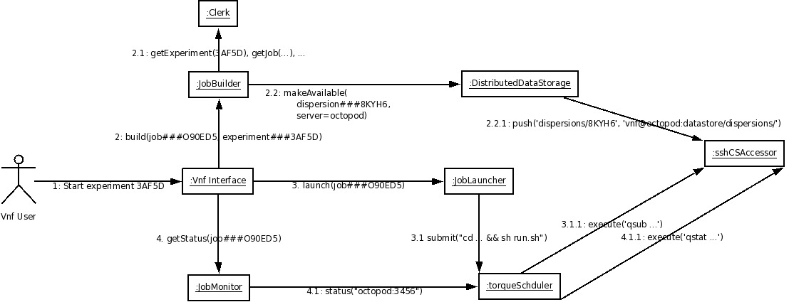

.. _vnfdeveloperguidearchitecture:

Architecture
============

Overview
--------
VNF, the Virtual Neutron Facility, provides computation services for material modeling, material simulation, and simulation of neutron experiments.

The VNF service is built on top of  :ref:`pyre <vnf_arch_pyre>`, a
component-based software framework for high performance computing, and
:ref:`luban <vnf_arch_luban>`, a user interface framework.

Following is a high level component diagram:

Building a web interface for a bunch of interconnected scientific
computation involves many colloborating components. The following
figure presents one peek of the complexity of VNF architecture:

.. _vnf_arch_pyre:

Backbone: pyre
--------------

.. _vnf_arch_luban:

User interface "language": luban
--------------------------------

Data provenance: dsaw.model/dds
---------------------------

Managing computation jobs: job builders and results retrievers
--------------------------------------------------------------

Managing "internal tasks" transparent to users: ITask/IWorker
-------------------------------------------------------------

