.. _tutorial-bvk-to-experiment:

Tutorial: a virtual neutron experiment using phonon data calculated from BvK model
==================================================================================

In this tutorial, we will show step-by-step how to run a virtual neutron expriment
using a simple sample with coherent inelastic scattering from sample phonons
that are computed from a BvK model.

Summary
-------

Starting up and atomic structure:

* :ref:`login <tut-bvk2exp-login>`
* If necessary, :ref:`minimize help window <tut-bvk2exp-minimizehelp>`
* :ref:`select fcc Al at 300K from the atomic structure table <tut-bvk2exp-selectAl300K>`
..   (then click on various "about" menu to get more info)
.. * go through all "tabs" to get a feeling of what they are
.. * back to atomic structure table. play with "my structures" and "all
   structures"

In the :ref:`overview of atomic structure for Al at 300K
<tut-bvk2exp-alat300K>`, 

* :ref:`expand "Phonons" panel <tut-bvk2exp-expandphononpanel>`
* :ref:`start a new phonons simulation <tut-bvk2exp-startnewphononsim>`

In phonons simulation wizard:

* :ref:`select bvk engine <tut-bvk2exp-selectphononengine-bvk>`
* :ref:`choose the bvk model from literature <tut-bvk2exp-selectbvkmodel>`
* :ref:`input N1 and df for bvk phonons computation <tut-bvk2exp-inputbvkparams>`

Computation job:

* :ref:`submit job <tut-bvk2exp-submitjob>`
* :ref:`pack job dir <tut-bvk2exp-packjobdir>`
* :ref:`switch to bvk computation view and load results <tut-bvk2exp-bvkcomputation-view>`
* :ref:`switch to atomic structure (fcc Al) <tut-bvk2exp-backtoatomicstructure>`

Sample

* :ref:`create new sample <tut-bvk2exp-newsample-description>`
* :ref:`select atomic structure (table can also be sorted and filtered) <tut-bvk2exp-newsample-atomicstructure>`
* :ref:`select and configure shape <tut-bvk2exp-newsample-shape>`
* :ref:`add a phonon kernel <tut-bvk2exp-newsample-kernel>`

experiment
* start new
* instrument
 * select ARCS, show large number of components
 * show we can change component
 * back to select Ideal INS.
 * change source to neutrons saved at just before ARCS sample position
 * change sample position and monitor position to 0,0,0
 * change IQEmonitor to use Ei=60
* sample configuration
 * select a sample
 * further configuration of kernel. make sure ei=60
* sampele environment
* review and finish up

We start from log in.

.. _tut-bvk2exp-login:

Log in
------

Point your browser to https://vnf.caltech.edu/vnf/beta

Then login with your username and password.

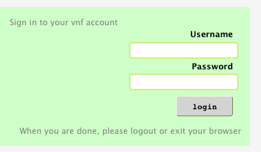

The main vnf view will show up.

.. _tut-bvk2exp-minimizehelp:

Minmize help window
^^^^^^^^^^^^^^^^^^^

A help window could show up with the main vnf view. You can minimize
it by clicking the minimize button:

Atomic structure
----------------

In the "atomic structure" tab, you will see a table of atomic structures.

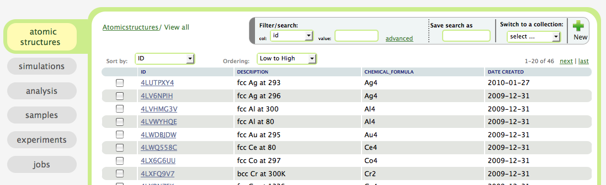

.. _tut-bvk2exp-selectAl300K:

Select Al at 300K
^^^^^^^^^^^^^^^^^^^^^^^^^^^^^^^^^^^^^^^ 
First we search for "Al*" for "chemical_formula"

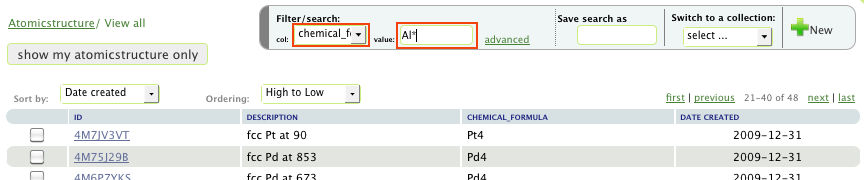

then we choose "fcc Al at 300":

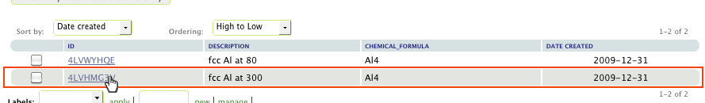

.. _tut-bvk2exp-alat300K:

Atomic structure "Al at 300K"
-----------------------------

We are now in the view of the atomic structure "Al at 300K":

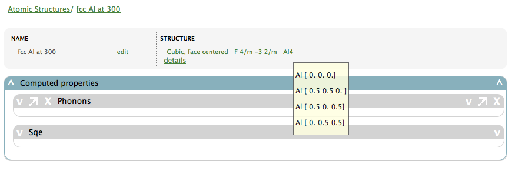

In which there is a panel for computed properties for this material.

.. _tut-bvk2exp-expandphononpanel:

Expand "Phonons" panel
^^^^^^^^^^^^^^^^^^^^^^
Click on the "V" to show the "Phonons" panel:

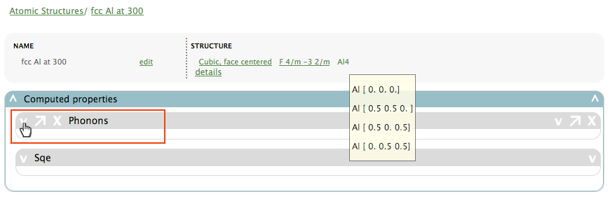

.. _tut-bvk2exp-startnewphononsim:

Start a new phonons simulation
^^^^^^^^^^^^^^^^^^^^^^^^^^^^^^
In the "Phonons" panel,

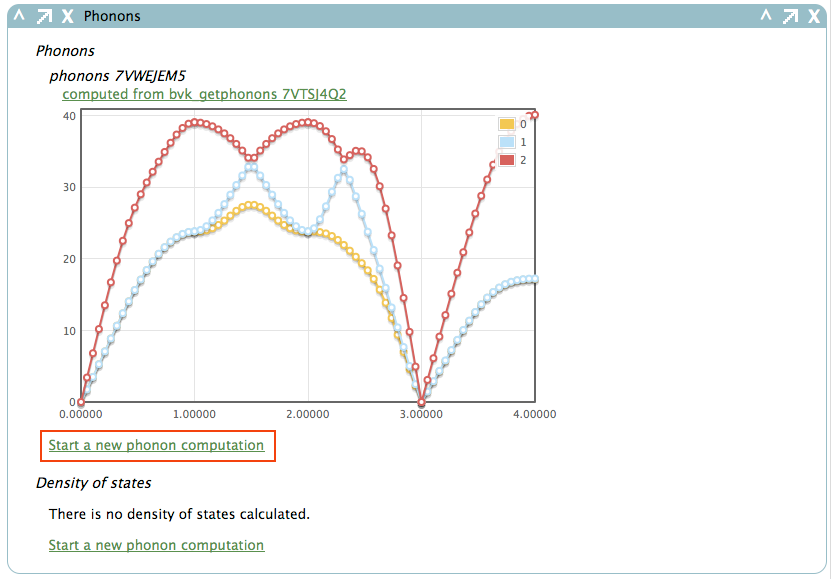

click on "Start a new phonon computation", and we will be led into a
wizard for simulating phonons.

.. _tut-bvk2exp-phononsimwizard:

Phonons simulation wizard
-------------------------

.. _tut-bvk2exp-selectphononengine-bvk:

Select bvk engine
^^^^^^^^^^^^^^^^^

In the starting page of the phonon simulation wizard:

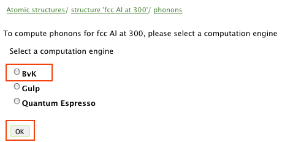

please select "bvk" as the engine, and click "OK" to continue.

.. _tut-bvk2exp-selectbvkmodel:

Choose a bvk model
^^^^^^^^^^^^^^^^^^

Please choose the bvk model from literature (you could expand the
model panel for details about the model if you like):

.. image:: shots/bvk/selectmodel.png
   :width: 700px

.. _tut-bvk2exp-selectcomputationtarget:

Choose a computation target
^^^^^^^^^^^^^^^^^^^^^^^^^^^^^
Please choose to calculate "Phonons on a grid" and click "OK" button

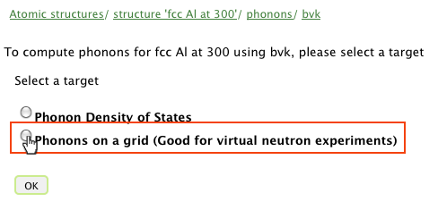

.. _tut-bvk2exp-inputbvkparams:

Input parameters for bvk phonons computation
^^^^^^^^^^^^^^^^^^^^^^^^^^^^^^^^^^^^^^^^^^^

Please input parameters for bvk phonons computation as shown below:

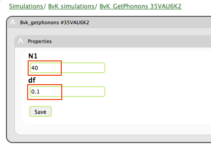

After this step, a computation job is created for you.

Computation job
---------------

.. _tut-bvk2exp-submitjob:

Job submission
^^^^^^^^^^^^^^
In the following form you can configure the computation job:

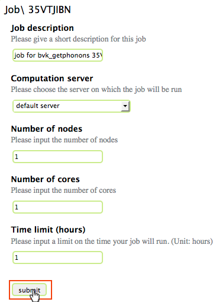

here we don't actually need to change anything, just click "submit",
and you will see the progress of the job submission:

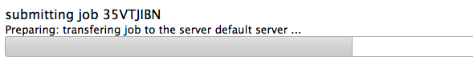

.. _tut-bvk2exp-packjobdir:

Pack job directory
^^^^^^^^^^^^^^^^^^
In the job view

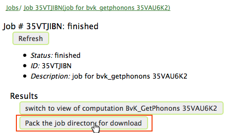

Click "Pack the job ..." button to watch the job being packed for
download.
After job packing is done, a download link will show up

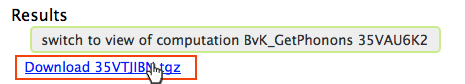

click the link to download the file; 
it contains the job directory
where the computation was run.

Now, back to the job view,

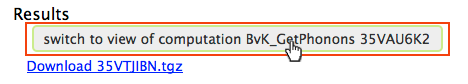

click on the button "switch to view of ..." to see the details of the
bvk computation.

.. _tut-bvk2exp-bvkcomputation-view:

BvK Computation View
^^^^^^^^^^^^^^^^^^^^
We are now presented with a view of the bvk computation we just
performed:

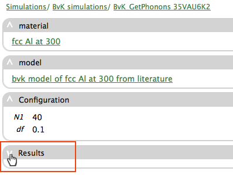

as shown above, expand the "Results" panel, and vnf will be retrieving
computation results from server, and soon you will see a plot
of phonon dispersions of fcc Al:

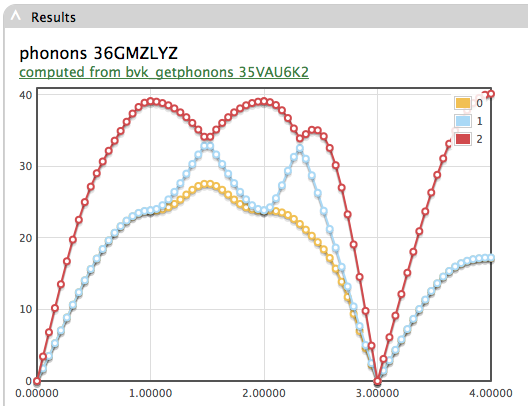

.. _tut-bvk2exp-backtoatomicstructure:

Back to atomic structure of fcc Al
^^^^^^^^^^^^^^^^^^^^^^^^^^^^^^^^^^
Now click on the atomic structure link in the "material" panel:

.. image:: shorts/bvk/bvk-computation-view-togobacktoatomicstructure.png

to go back to the view of atomic structure  "Al at 300K", in which you
could expand the "phonons" panel again to see the new computation
results show up.

Create a sample
---------------
On the main menu on the left side:

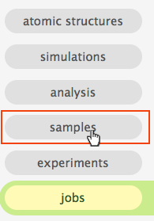

Click on "samples" to view a table of samples in the system:

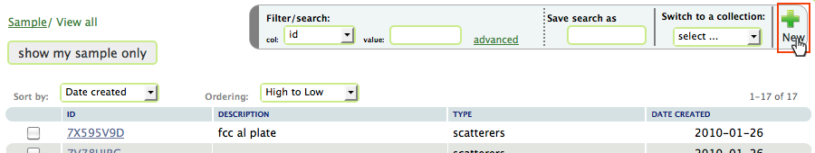

Then click the "new" button on the top toolbar to create a new sample.

.. _tut-bvk2exp-newsample-description:

Sample description
^^^^^^^^^^^^^^^^^^
In the new sample creation form, the first step is to give the sample
a description:

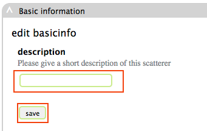

Please input a description of the new sample, such as "fcc Al plate",
and click "save" button.

.. _tut-bvk2exp-newsample-atomicstructure:

Select atomic structure
^^^^^^^^^^^^^^^^^^^^^^^

The next step is to select the atomic structure for the sample:

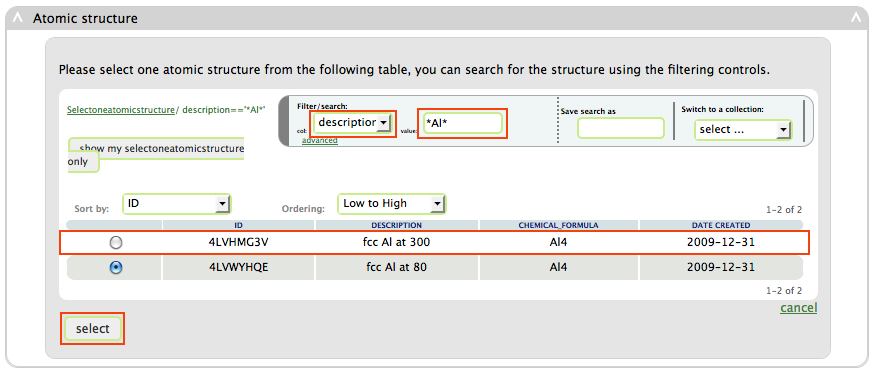

Here you could filter the list of atomic structures by looking for
"\*Al\*" for "description", and then select the "fcc Al at 300"
structure, and then click the "select" button.

.. _tut-bvk2exp-newsample-shape:

Select and configure shape
^^^^^^^^^^^^^^^^^^^^^^^^^^

To configure the shape of the sample, click the "box" button
and input the dimensions, and then click the "save" button:

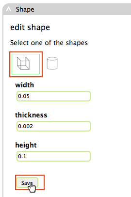

.. _tut-bvk2exp-newsample-kernel:

Add a phonon kernel
^^^^^^^^^^^^^^^^^^^
To give the sample scattering properties, please add a kernel.

First, click on the "add a kernel" button

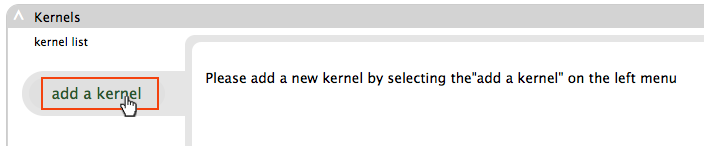

Then you can edit the new kernel:

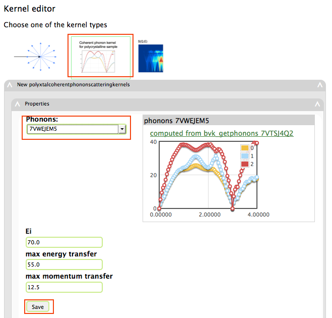

Here, we start with clicking the button that looks like a phonon
dispersion near the top, and then choose a computed phonon 
(each choice represented a computed full-phonon-dispersion-set
for the atomic structure we choose earlier), and then click the
"save" button.

When the following panel shows up, we are done with editing this
sample:

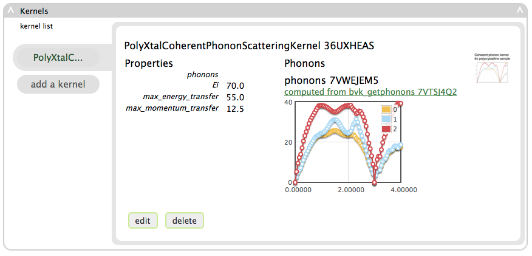

.. _tut-bvk2exp-experiment:

Run a virtual neutron experiment using the new sample
-----------------------------------------------------

* start new
* instrument
 * select ARCS, show large number of components
 * show we can change component
 * back to select Ideal INS.
 * change source to neutrons saved at just before ARCS sample position
 * change sample position and monitor position to 0,0,0
 * change IQEmonitor to use Ei=60
* sample configuration
 * select a sample
 * further configuration of kernel. make sure ei=60
* sampele environment
* review and finish up
