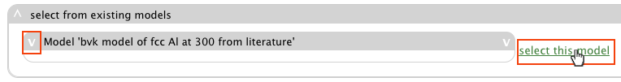

.. _tutorial-bvk-to-experiment:

Tutorial: a virtual neutron experiment using phonon data calculated from BvK model
==================================================================================

In this tutorial, we will show step-by-step how to run a virtual neutron expriment
using a simple sample with coherent inelastic scattering from sample phonons
that are computed from a BvK model.

Summary
-------

Starting up and atomic structure:

* :ref:`login <tut-bvk2exp-login>`
* If necessary, :ref:`minimize help window <tut-bvk2exp-minimizehelp>`
* :ref:`select fcc Al at 300K from the atomic structure table <tut-bvk2exp-selectAl300K>`
..   (then click on various "about" menu to get more info)
.. * go through all "tabs" to get a feeling of what they are
.. * back to atomic structure table. play with "my structures" and "all
   structures"

In the :ref:`overview of atomic structure for Al at 300K
<tut-bvk2exp-alat300K>`, 

* :ref:`expand "Phonons" panel <tut-bvk2exp-expandphononpanel>`
* :ref:`start a new phonons simulation <tut-bvk2exp-startnewphononsim>`

In phonons simulation wizard:

* :ref:`select bvk engine <tut-bvk2exp-selectphononengine-bvk>`
* :ref:`choose the bvk model from literature <tut-bvk2exp-selectbvkmodel>`
* ref:`input N1 and df for bvk phonons computation
  <tut-bvk2exp-inputbvkparams>`

Computatio job:

* :ref:`submit job <tut-bvk2exp-submitjob>`
* :ref:`pack job dir <tut-bvk2exp-packjobdir>`
* switch to bvk computation. load results. load computed phonons
* switch to atomic structure (fcc Al). see new results there

Sample
* create new sample
* input basic info
* select atomic structure (table can also be sorted and filtered)
* select and configure shape
* add a phonon kernel

experiment
* start new
* instrument
 * select ARCS, show large number of components
 * show we can change component
 * back to select Ideal INS.
 * change source to neutrons saved at just before ARCS sample position
 * change sample position and monitor position to 0,0,0
 * change IQEmonitor to use Ei=60
* sample configuration
 * select a sample
 * further configuration of kernel. make sure ei=60
* sampele environment
* review and finish up

We start from log in.

.. _tut-bvk2exp-login:

Log in
------

Point your browser to https://vnf.caltech.edu/vnf/beta

Then login with your username and password.

.. image:: shots/login.png
   :width: 400px

The main vnf view will show up.

.. _tut-bvk2exp-minimizehelp:

Minmize help window
^^^^^^^^^^^^^^^^^^^

A help window could show up with the main vnf view. You can minimize
it by clicking the minimize button:

Atomic structure
----------------

In the "atomic structure" tab, you will see a table of atomic structures.

.. image:: shots/atomicstructure/table-top.png
   :width: 720px

.. _tut-bvk2exp-selectAl300K:

Select Al at 300K
^^^^^^^^^^^^^^^^^^^^^^^^^^^^^^^^^^^^^^^ 
First we search for "Al*" for "chemical_formula"

.. image:: shots/atomicstructure/search-Al.png
   :width: 720px

then we choose "fcc Al at 300":

.. image:: shots/atomicstructure/select-Al300K.png
   :width: 720px

.. _tut-bvk2exp-alat300K:

Atomic structure "Al at 300K"
-----------------------------

We are now in the view of the atomic structure "Al at 300K":

.. image:: shots/atomicstructure/overview-allcollapsed.png
   :width: 720px

In which there is a panel for computed properties for this material.

.. _tut-bvk2exp-expandphononpanel:

Expand "Phonons" panel
^^^^^^^^^^^^^^^^^^^^^^
Click on the "V" to show the "Phonons" panel:

.. image:: shots/atomicstructure/Al300K-expand-phonons-panel.png
   :width: 720px

.. _tut-bvk2exp-startnewphononsim:

Start a new phonons simulation
^^^^^^^^^^^^^^^^^^^^^^^^^^^^^^
In the "Phonons" panel,

.. image:: shots/atomicstructure/Al-phonons-highlight-new-phonon-computation-link.png
   :width: 600px

click on "Start a new phonon computation", and we will be led into a
wizard for simulating phonons.

.. _tut-bvk2exp-phononsimwizard:

Phonons simulation wizard
-------------------------

.. _tut-bvk2exp-selectphononengine-bvk:

Select bvk engine
^^^^^^^^^^^^^^^^^

In the starting page of the phonon simulation wizard:

please select "bvk" as the engine, and click "OK" to continue.

.. _tut-bvk2exp-selectbvkmodel:

Choose a bvk model
^^^^^^^^^^^^^^^^^^

Please choose the bvk model from literature (you could expand the
model panel for details about the model if you like):

.. _tut-bvk2exp-selectcomputationtarget:

Choose a computation target
^^^^^^^^^^^^^^^^^^^^^^^^^^^^^
Please choose to calculate "Phonons on a grid" and click "OK" button

.. _tut-bvk2exp-inputbvkparams:

Input parameters for bvk phonons computation
^^^^^^^^^^^^^^^^^^^^^^^^^^^^^^^^^^^^^^^^^^^

Please input parameters for bvk phonons computation as shown below:

.. image:: shots/bvk/phonons-computation-params.png
   :width: 460px

After this step, a computation job is created for you.

Computation job
---------------

.. _tut-bvk2exp-submitjob:

Job submission
^^^^^^^^^^^^^^
In the following form you can configure the computation job:

here we don't actually need to change anything, just click "submit",
and you will see the progress of the job submission:

.. image:: shots/bvk/submitting-job.png

.. _tut-bvk2exp-packjobdir:

Pack job directory
^^^^^^^^^^^^^^^^^^
In the job view

Click "Pack the job ..." button to watch the job being packed for
download.
After job packing is done, a download link will show up

.. image:: shots/bvk/download-link.png

click the link to download the file;

.. _tut-bvk2exp-bvkcomputation-view

it contains the job directory
where the computation was run.

Click on the button "switch to view of ..." to see the details of the
bvk computation:

BvK Computation View
^^^^^^^^^^^^^^^^^^^^

* switch to bvk computation. load results. load computed phonons
* switch to atomic structure (fcc Al). see new results there

Sample
* create new sample
* input basic info
* select atomic structure (table can also be sorted and filtered)
* select and configure shape
* add a phonon kernel

experiment
* start new
* instrument
 * select ARCS, show large number of components
 * show we can change component
 * back to select Ideal INS.
 * change source to neutrons saved at just before ARCS sample position
 * change sample position and monitor position to 0,0,0
 * change IQEmonitor to use Ei=60
* sample configuration
 * select a sample
 * further configuration of kernel. make sure ei=60
* sampele environment
* review and finish up
