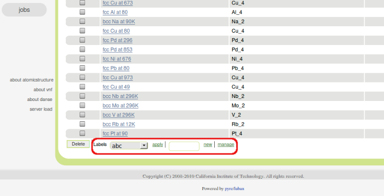
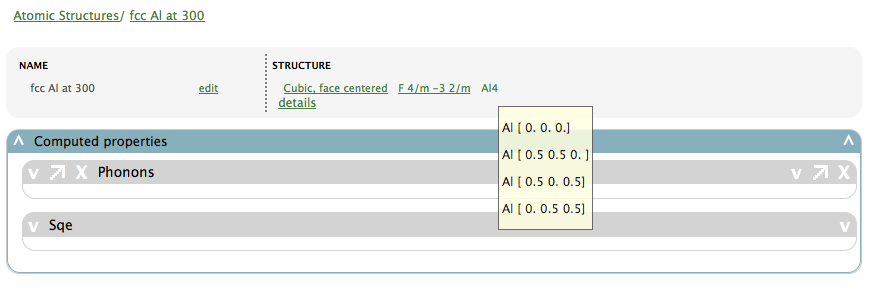

.. _atomic-structures:

Atomic structures
=================

.. _atomic-structures-tableview:

Table view
----------
In this tab, you will see a table of atomic structures.

.. image:: shots/atomicstructure/table-top.png
   :width: 720px

On the top, there is a tool bar that contains mostly filtering tools,
and a "new" button to create new atomic struccture.

Searching/filtering
^^^^^^^^^^^^^^^^^^^
.. image:: shots/atomicstructure/searching.png

Highlighted is a set of controls to filter the table.

Sorting
^^^^^^^
.. image:: shots/atomicstructure/sorting.png

Labels
^^^^^^
In VNF, you can assign labels to records, so that you can arrange
records according to your needs. 

The toolbar for labels is positioned at the left-side of the
bottom of the table view:

A close-up view of the toolbar is here:

.. image:: shots/atomicstructure/labels-toolbar.png

* You can select a label and click the "apply" link to apply the
  label to the selected records (select records using check boxes
  for the rows of interest)
* You can input the name of a new label and click the "new" link
  to create a new label

.. note::
   The label "private" is special. Apply it to those of your records
   that you want to keep private.

Overview of an atomic structure
-------------------------------

In the overview of an atomic structure, the top portion displays basic
information about this structure. 

Computed properties
^^^^^^^^^^^^^^^^^^^
The "computed properties" panel shows physical properties of
this atomic structure that were calculated using various computation 
techniuqes.

There are several sub-panels, each of which corresponds to one type
of physical property.

Phonons
!!!!!!!

This panel displays the phonon-related properties for the current
atomic structure.

* Phonon density of states
* Phonon dispersions

.. image:: shots/atomicstructure/phonons.png
   :width: 640px

S(Q,E)
!!!!!!

