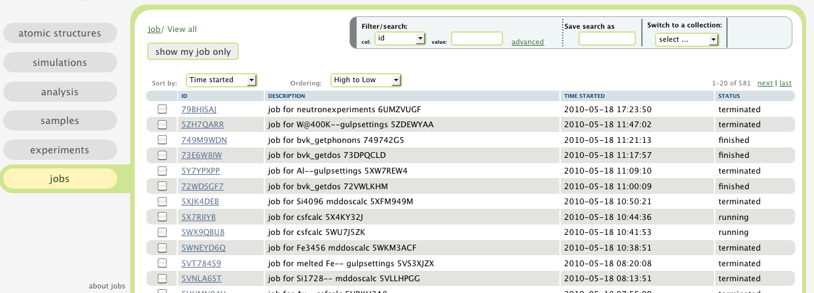

.. _jobs-tab:

Jobs
====

In this tab, a table of **computational jobs** are presented.

A **computational job** will be created when a user finished 
configuring a **computation** and is ready to submit the computation
to a computing cluster.
Here a **computation** could be a simple modeling,
a sophisticated material simulation,
or a Monte Carlo simulation of neutron experiment.

After a **computational job** is created, it can be configured
and submitted to a computing cluster, and be monitored.
Its status can be found out in this tab. To find out more details
about a job, select it from the table to view its details.

To see how to sort, filter, and how to use labels, please read
:ref:`the table view section <atomic-structures-tableview>` for 
:ref:`atomic structures <atomic-structures>` first. The basic 
functionalities of the table view here is the same as the one
for atomic structures.

