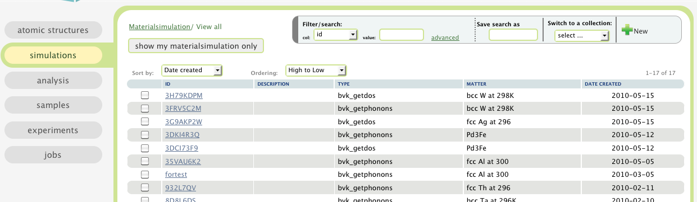

.. _matsim-tab:

Material Simulations and Modelings
==================================

In this tab, a table of material simulations/modelings are presented.

Material simulations of ab initio type and molecular dynamics type
can be created and monitored here.

To see how to sort, filter, and how to use labels, please read
:ref:`the table view section <atomic-structures-tableview>` for 
:ref:`atomic structures <atomic-structures>` first. The basic 
functionalities of the table view here is the same as the one
for atomic structures.

There are tutorials on how to use the quantum espresso engine for the following workflows:
 * :ref:`qe-phonon-dos`
 * :ref:`qe-car-parrinello`
Tutorials also exist for the Born-von Karman calculator:
 * :ref:`tutorial-bvk-to-experiment`
and the GULP engine:
 * :ref:`forcefield-and-analysis-workflows`
which are both forcefield/forceconstant engines.
