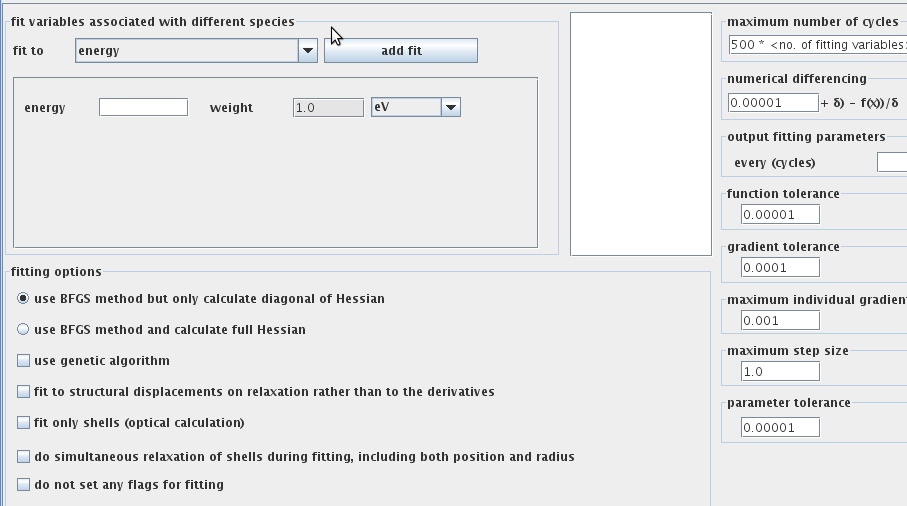

.. _forcefield-and-analysis-workflows:

Tour of forcefield and analysis workflows in VNF
======================================================

Creating a Gulp Physics Job
----------------------------

In this short tutorial I will walkthrough the main steps to calculate an SQE scattering kernel in VNF using the Gulp as an md engine.

Create New Simulation
^^^^^^^^^^^^^^^^^^^^^^^^^^^^^^^

Go to the “Simulations” section, click on the “New” green cross-like button.

.. image:: images/qe-phonon-dos/1.sim-table.png
   :scale: 70 
..  :width: 720px

A table of simulation packages will be displayed with a short description. Click on the “Gulp” link:

.. image:: images/md-sqe/forcefieldEngine/selectGulp.png
   :scale: 70 
..   :width: 470px

You can then select an atomic structure from the list or create a new one from the “Atomic Structure” section.

.. image:: images/md-sqe/forcefieldEngine/selectMaterial.png
   :scale: 70 
..   :width: 470px

Click select and deploy AtomSim by clicking “Launch”.  A Java GUI should appear.  Review the atomic coordinates:

.. image:: images/md-sqe/forcefieldEngine/coordinates.png
   :scale: 70 
..   :width: 720px
   
Review the cell parameters.  To create a supercell input the parameters below.  To set (or unset) the spacegroup symmetry, use the space group tab:

.. image:: images/md-sqe/forcefieldEngine/cellParameters.png
   :scale: 70 
..   :width: 720px

Specifying a potential
^^^^^^^^^^^^^^^^^^^^^^^^^^

Many types of potentials are available in the forcefield workflow.  They can either be accessed by selection from a list:

.. figure:: images/md-sqe/forcefieldEngine/potentialExample.png
   :scale: 70 

or by specifying directly:

.. figure:: images/md-sqe/forcefieldEngine/potentials.png
   :scale: 70 
   
Additionally, users can set a variety of options for each potential:

.. figure:: images/md-sqe/forcefieldEngine/potentialOptions.png
   :scale: 70 
   
The potential can also be fit to experimental data or ab initio calculations when users elect the 'fit' runtype:

   
We now discuss a few other runtypes.
   
Runtype settings
^^^^^^^^^^^^^^^^^^^^^^^^^^
   
When preparing for a phonon or md calculation it is often useful to optimize the positions of the atomic structure or the unit cell first:

.. image:: images/md-sqe/forcefieldEngine/optimization.png
   :scale: 70 
   
After a possible optimization, one may input phonon calculation parameters by clicking on the phonon panel and adding that calculation to the list of runtypes:

   
One may also elect to specify a dispersion calculation by clicking on the band structure panel:

Alternatively the md options may be input by clicking on the md runtype and inputting ensemble, timestep size, output frequency, length of run, temperature, and other options:

.. figure:: images/md-sqe/forcefieldEngine/md.png
   :scale: 70 

Submitting the job
^^^^^^^^^^^^^^^^^^^^^^^^^^

After all input options are set, one may inspect the input file for gulp and choose additional output options under the output tab:

Then the file is stored by clicking submit under the execution tab:

.. figure:: images/md-sqe/forcefieldEngine/execution.png
   :scale: 70 
   
To submit the job, close the UI and click next until one reaches the job submission screen:

.. figure:: images/md-sqe/forcefieldEngine/jobsubmission.png
   :scale: 70 

After inputting server choice (octopod or foxtrot) and time estimations, we submit and see the job running screen:

.. figure:: images/md-sqe/forcefieldEngine/jobrunning.png
   :scale: 70 
..   :width: 720px
   
Eventually the job terminates and we refresh to view the trajectory (trajectory viewer under construction).

.. _analysis-tutorial:

Creating scattering kernels and analyses
-----------------------------------------

Setup
^^^^^^

From an md trajectory or phonon calculation one may perform a variety of analyses, as well as create a scattering kernel for use in a Monte Carlo neutron instrument simulation.  This can be done by clicking on the analysis tab to bring up the analysis table:

   
which shows previous analyses that have been calculated. To calculate a new analysis simply select the new button in the top right-hand corner and select what type of analysis you would like to compute:  

   
At the time of writing of this document, the DOS and coherent and incoherent scattering function calculators have been rigororously tested.  For the purposes of this tutorial we select the DOS and are next asked to select a previously calculated trajectory:

Analyses forms
^^^^^^^^^^^^^^^

Note various parameters of the trajectory are available to allow the user to easily select the correct one.  After selecting a lead md run with 2048 molecules, one must decide what range of energy (in meV) one is interested in using the energy axis planner tool at the top of the DOS parameter input screen.  Deciding on an upper limit of 20 meV and an energy axis resolution of 0.5 meV and inputing the time step used in the trajectory of 0.005 gives the following results:

.. figure:: images/md-sqe/analyses/mdPlan.png
   :scale: 70 
   
Which tell us the actual upper limit that will be calculated, 19.693654; the actual resolution, 0.495735; and some useful information about what time steps to use in the analysis calculation in order to achieve that energy range and resolution.  For example, we see the number of time steps needed is 1659 but only every 21st step should be used.  Inputting these in the DOS parameters form and selecting "save" gives:
   

where we see a summary of our choices.  Alternatively we could have chosen to calculate a coherent scattering function, which would additionally involve Q-vector parameters:

Submission and results
^^^^^^^^^^^^^^^^^^^^^^^^^

Clicking next on the DOS form gives the job parameters page where we accept the defaults and use the foxtrot server:

   
Clicking 'submit' moves the job to the computational server and starts it.  After a short time it is finished the screen refreshes:

Clicking on the "switch to the view of computation..." under the "Results" heading shows the DOS:

   
If we had chosen to submit the coherent S(Q,E) instead it would have shown
   

as the result where we see the vague features of the S(Q,E) but are unable to view the detailed results until we navigate closer.

