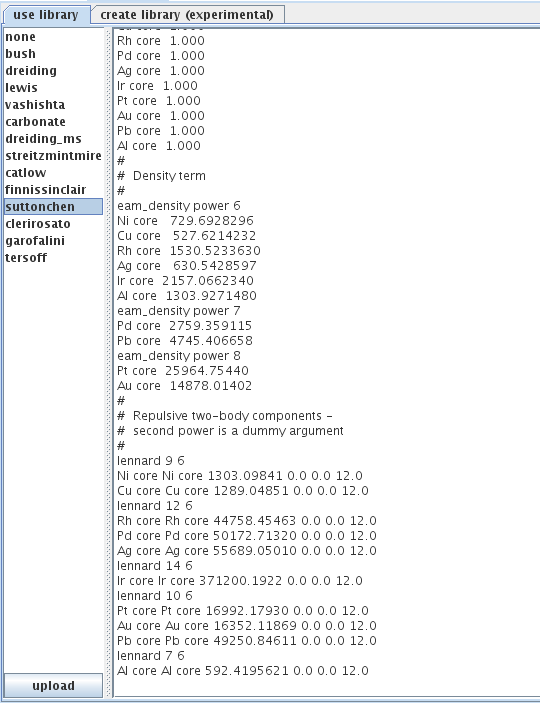

Tour of forcefield and analysis workflows in VNF
======================================================

Introduction
------------

In this short tutorial I will walkthrough the main steps to calculate an SQE scattering kernel in VNF using the Gulp as an md engine.

Create New Simulation
---------------------

Go to the “Simulations” section, click on the “New” green cross-like button.

.. figure:: images/md-sqe/1.sim-table.png
   :width: 720px

A table of simulation packages will be displayed with a short description. Click on the “Gulp” link:

.. figure:: images/md-sqe/selectGulp.png
   :width: 450px

You can then select an atomic structure from the list or create a new one from the “Atomic Structure” section.

.. figure:: images/md-sqe/selectMaterial.png
   :width: 450px

Click select and deploy AtomSim by clicking “Launch”.  A Java GUI should appear.  Review the atomic coordinates:

.. figure:: images/md-sqe/coordinates.png
   :width: 720px
   
Review the cell parameters:

.. figure:: images/md-sqe/cellParameters.png
   :width: 720px

Many types of potentials are available in AtomSim.  They can either be accessed by selection from a list:

or by specifying directly:

   
Additionally, users can set a variety of options for each potential:

   
The potential can also be fit to experimental data or ab initio calculations:

   
When preparing for a phonon or md calculation it is often useful to optimize the positions of the atomic structure or the unit cell first:

   
After a possible optimization, one may input phonon by clicking on the phonon panel and adding that calculation to the AtomSim runtypes:

.. figure:: images/md-sqe/phonons.png
   :width: 720px
   
One may also elect to specify a dispersion calculation by clicking on the band structure panel:

Alternatively the md options may be input by clicking on the md runtype and inputting ensemble, timestep size, output frequency, length of run, temperature, and other options:

.. figure:: images/md-sqe/md.png
   :width: 720px

After all input options are set, one may inspect the input file for gulp and choose additional output options under the output tab:

.. figure:: images/md-sqe/output.png
   :width: 720px

Then the file is stored by clicking submit under the execution tab:

.. figure:: images/md-sqe/execution.png
   :width: 720px
   
To submit the job, close the UI and click next until one reaches the job submission screen:

.. figure:: images/md-sqe/md.png
   :width: 720px

The process

Retrieving Results
------------------

When the simulation job is completed it is nice to get the results of the 
simulation :). To retrieve the results, just click on the button “Check”. 
The status of the results packing will be displayed

.. figure:: images/qe-phonon-dos/20.pw-job-completed.png
   :width: 420px

   *Fig. 20 Retrieving simulation results*

Here is the content of the results tarball:

.. figure:: images/qe-phonon-dos/21.pw-tarball.png
   :width: 450px

   *Fig. 21 PW results tar ball*

To avoid the results delivery failure you can try to retrieve results again from 
the computational cluster after 3 min. This feature is implemented to give some 
time for the results to be delivered or in case if the delivery failed.

Running the PH Task
-------------------

Once the PW task is successfully completed you can create PH task and set
configuration input for it.

   *Fig. 22 Add PH configuration input*

The form will be displayed where you can set the size of Q grid. All parameters 
in this form are required.

   *Fig. 23 PH configuration input form*

When you click on “Generate Input Configuration” the configuration form is displayed.
As for PW input you can edited the configuration text.

.. figure:: images/qe-phonon-dos/24.ph-input-generated.png
   :width: 450px

