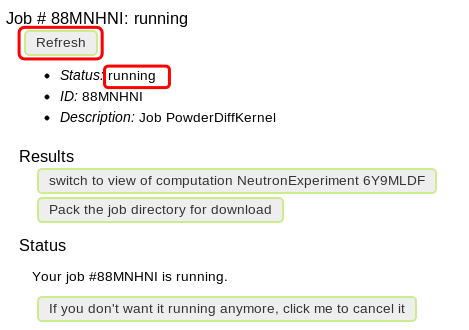

.. _powder-diffraction-kernel:

Using Powder Diffraction Kernel in VNF
======================================================

Introduction
------------

In this tutorial we will learn how to use Powder Diffraction Kernel for simple
instrument composed of three components in VNF:

::

[SimpleSource] -> [SampleComponent] -> [EMonitor]

``SimpleSource`` generates beam of neutrons uniformly distributed within the energy range
``[E0-dE, E0+dE]`` which are scattered by ``SampleComponent`` with the powder
diffraction kernel inside. Neutrons scattered by the ``SampleComponent`` are detected by the
``EMonitor`` - the energy sensitive monitor. As a result we should see distinctive
peaks on the Intensity vs. Energy I(E) plot. The configuration provided in this
tutorial is consistent with `Simulation with Powder Diffraction Kernel <http://docs.danse.us/MCViNE/sphinx/Tutorials-PowderKernel.html>`_
tutorial in McVine documentation.

Create New Sample
-----------------

To explore the diffraction properties of material we create the new
sample with the powder diffraction kernel. In the tab *Sample*
click on the *Create New Sample* button.

.. figure:: images/powder-diff-kernel/1.sample-list.png
   :width: 720px

   *Fig. 1 Create new sample*

To configure sample one needs to fill out several sections:

* Basic information
* Atomic structure
* Geometry shape
* Kernels

Let's start with the ``Basic information`` section. In this section all you need
to set is the ``description``. This description can be important to help you find
this experiment later on. Once the description is set don't forget to click on
``Save`` button.

.. figure:: images/powder-diff-kernel/2.sample-description.png
   :width: 300px

   *Fig. 2 Edit sample description*

In ``Atomic structure`` section you select the structure that was previously 
created in ``Atomic structure`` tab. Search filter will help you to select structure
according to description or chemical formula.

   *Fig. 3 Select atomic structure*

After atomic structure has been selected you need to select shape type (box or 
cylinder) and set geometry parameters (e.g. width, thickness, height).

.. figure:: images/powder-diff-kernel/4.sample-shape.png
   :width: 300px

   *Fig. 4 Select and edit sample shape*

Add Powder Diffraction Kernel
--------------------------------

The final step in creating the sample is to add scattering kernel. You can add several
scattering kernels for the same sample, which means that several scattering processes
will be performed on neutrons one after another. In this tutorial we will use one kernel:
``Powder Diffraction Kernel``.

   *Fig. 5 Select Powder Diffraction Kernel*

To configure the kernel you need to specify several parameters:

* dfraction
* dwfactor
* lazcontent

``dfraction`` parameter is the relative line width, :math:`\Delta d/d`,
``dwfactor`` parameter is the global Debye-Waller factor and
``lazcontent`` parameter is the content of .laz file (powder pattern file)
that defines various parameters including multiplicity factor, scattering factor
for each diffraction plane. The list
of available .laz files for many atomic elements can be found in
http://www.mcstas.org/download/components/data/ . The powder pattern file can be
customized and extended to describe symmetry properties of various atomic structures.

.. figure:: images/powder-diff-kernel/6.sample-kernel-form.png
   :width: 520px

   *Fig. 6 Edit parameters for the kernel*

Here is the content of predefined McStas Al.laz file for *Al* provided for the reference purpose:

::

    # TITLE *Aluminum-Al-[FM3-M] Miller, H.P.jr.;DuMond, J.W.M.[1942] at 298 K
    # CELL 4.049320 4.049320 4.049320 90.000000 90.000000 90.000000
    # SPCGRP F M 3 M   CUBIC STRUCTURE
    # ATOM AL 1 0.000000 0.000000 0.000000
    # SCATTERING FACTOR  COEFFICIENTS: AL     F= 0.345 CM-12
    # Reference: Physical Review (1940) 57, 198-206
    #
    # Physical parameters:
    # sigma_coh 1.495   coherent scattering cross section in [barn]
    # sigma_inc 0.0082  incoherent scattering cross section in [barn]
    # sigma_abs 0.231   absorption scattering cross section in [barn]
    # density   2.70    in [g/cm^3]
    # weight    26.98   in [g/mol]
    # nb_atoms  4       in [atoms/unit cell]
    # v_sound   5100    in [m/s]
    # v_sound_l 6420    velocity of longitudinal sound in [m/s]
    # v_sound_t 3040    velocity of transversal sound in [m/s]
    # T_m       933.5   melting temperature in [K]
    # T_b       2792.2  boiling temperature in [K]
    # At_number 13      atomic number Z
    # lattice_a 4.04932 lattice parameter a in [Angs]
    #
    # Format parameters: Lazy format <http://icsd.ill.fr>
    # column_j 17 multiplicity 'j'
    # column_d 6  d-spacing 'd' in [Angs]
    # column_F 13 norm of scattering factor |F| in [barn^0.5]
    # column_h 1
    # column_k 2
    # column_l 3
    #
    # H  K  L  THETA  2THETA D VALUE  1/D**2 SIN2*1000  H  K  L INTENSITY         /F(HKL)/       A(HKL)      B(HKL) PHA.ANG. MULT   LPG
      1  1  1  12.35  24.70   2.3379  0.1830    45.74   1  1  1    1000.0              1.3         1.32         0.00    0.00  8  22.38
      2  0  0  14.30  28.59   2.0247  0.2439    60.99   2  0  0     550.0              1.3         1.30         0.00    0.00  6  16.92
      2  2  0  20.44  40.88   1.4317  0.4879   121.97   2  2  0     503.5              1.2         1.22         0.00    0.00 12   8.75
      3  1  1  24.18  48.35   1.2209  0.6709   167.71   3  1  1     686.4              1.2         1.17         0.00    0.00 24   6.54
      2  2  2  25.32  50.65   1.1689  0.7318   182.96   2  2  2     205.3              1.1         1.15         0.00    0.00  8   6.05
      4  0  0  29.60  59.20   1.0123  0.9758   243.95   4  0  0     106.3              1.1         1.08         0.00    0.00  6   4.71
      3  3  1  32.56  65.13   0.9290  1.1587   289.69   3  3  1     337.1              1.0         1.03         0.00    0.00 24   4.10
      4  2  0  33.52  67.04   0.9055  1.2197   304.93   4  2  0     314.0              1.0         1.02         0.00    0.00 24   3.93
      4  2  2  37.22  74.45   0.8266  1.4637   365.92   4  2  2     242.5              1.0         0.96         0.00    0.00 24   3.43
      5  1  1  39.91  79.82   0.7793  1.6466   411.66   5  1  1     204.2              0.9         0.91         0.00    0.00 24   3.17
      3  3  3  39.91  79.82   0.7793  1.6466   411.66   3  3  3      68.1              0.9         0.91         0.00    0.00  8   3.17
      4  4  0  44.31  88.61   0.7158  1.9516   487.89   4  4  0      79.3              0.8         0.85         0.00    0.00 12   2.86
      5  3  1  46.93  93.86   0.6845  2.1345   533.63   5  3  1     277.3              0.8         0.81         0.00    0.00 48   2.74
      4  4  2  47.81  95.61   0.6749  2.1955   548.88   4  4  2     132.9              0.8         0.80         0.00    0.00 24   2.71
      6  0  0  47.81  95.61   0.6749  2.1955   548.88   6  0  0      33.2              0.8         0.80         0.00    0.00  6   2.71
      6  2  0  51.35 102.69   0.6403  2.4395   609.87   6  2  0     113.9              0.7         0.75         0.00    0.00 24   2.63
      5  3  3  54.07 108.13   0.6175  2.6224   655.61   5  3  3     102.9              0.7         0.72         0.00    0.00 24   2.60
      6  2  2  54.99 109.98   0.6105  2.6834   670.85   6  2  2      99.8              0.7         0.71         0.00    0.00 24   2.60
      4  4  4  58.81 117.63   0.5845  2.9274   731.84   4  4  4      29.9              0.7         0.66         0.00    0.00  8   2.64
      5  5  1  61.86 123.72   0.5670  3.1103   777.58   5  5  1      84.6              0.6         0.63         0.00    0.00 24   2.73
      7  1  1  61.86 123.72   0.5670  3.1103   777.58   7  1  1      84.6              0.6         0.63         0.00    0.00 24   2.73
      6  4  0  62.92 125.85   0.5615  3.1713   792.83   6  4  0      83.4              0.6         0.62         0.00    0.00 24   2.77
      6  4  2  67.52 135.04   0.5411  3.4153   853.82   6  4  2     163.1              0.6         0.59         0.00    0.00 48   3.06
      5  5  3  71.52 143.05   0.5272  3.5982   899.56   5  5  3      85.2              0.6         0.56         0.00    0.00 24   3.51
      7  3  1  71.52 143.05   0.5272  3.5982   899.56   7  3  1     170.5              0.6         0.56         0.00    0.00 48   3.51
      8  0  0  81.05 162.10   0.5062  3.9032   975.79   8  0  0      34.4              0.5         0.52         0.00    0.00  6   6.59

   *Fig. 7 Powder Diffraction Kernel information*

The final configuration for our sample will look as follows:

.. figure:: images/powder-diff-kernel/8.sample-kernel-info-full.png
   :width: 720px

   *Fig. 8 Final sample configuration*

Create New Experiment
---------------------

After we created the properly configured sample we are ready to investigate the diffraction
properties of the sample by creating simple instrument. As mentioned in the introduction,
the instrument will consist of ``SimpleSource``, ``SampleComponent`` and ``EMonitor``.
To create new experiment click on ``create new experiment`` in ``experiments`` tab.

.. figure:: images/powder-diff-kernel/9.experiment-new.png
   :width: 720px

   *Fig. 9 Create new experiment*

Next, select ``Ideal Inelastic Neutron Scattering Instrument for Powder Sample``
from the list of available instruments and click ``continue``.

   *Fig. 10 Select instrument type*

The default source and monitor need to be replaced by ``SimpleSource`` and
``EMonitor`` correspondingly. To choose different component click on the
current component and select new one from the list of available components
in the ``change component type`` drop-down menu. Our instrument will look as follows:

   *Fig. 11 Instrument component chain*

Instrument Components Configuration
-----------------------------------

After we created the component chain we need to configure each component separately.
Though some reasonable parameter values are already set by default, one needs to
make sure that they correspond to our system parameters. The ``SimpleSource`` component
corresponds to the McStas
`Source_simple <http://www.mcstas.org/download/components/sources/Source_simple.html>`_
which generates neutrons with flat energy spectrum and arbitrary flux.

.. figure:: images/powder-diff-kernel/12.source-parameters.png
   :width: 450px

   *Fig. 12 Edit SimpleSource configuration*

.. figure:: images/powder-diff-kernel/13.source-info.png
   :width: 720px

   *Fig. 13 SimpleSource configuration*

Next, we configure ``SampleComponent``. At this point all we can define in the
``SampleComponent`` is the basic configuration: ``position`` and ``orientation``.
Other important parameters related to sample can be configured and reviewed later on.

.. figure:: images/powder-diff-kernel/14.sample-edit.png
   :width: 720px

   *Fig. 14 Edit basic sample configuration*

.. figure:: images/powder-diff-kernel/15.sample-info-chain.png
   :width: 720px

   *Fig. 15 Basic sample configuration*

Finally, we need to configure ``EMonitor`` which corresponds to the
McStas `E_monitor <http://www.mcstas.org/download/components/monitors/E_monitor.html>`_.

.. figure:: images/powder-diff-kernel/16.monitor-edit.png
   :width: 300px

   *Fig. 16 Edit EMonitor configuration*

.. figure:: images/powder-diff-kernel/17.monitor-info-chain.png
   :width: 720px

   *Fig. 17 EMonitor configuration*

After configuring each component click on ``continue`` button:

.. figure:: images/powder-diff-kernel/18.continue-button.png
   :width: 150px

   *Fig. 18 Continue Button*

Sample Configuration
--------------------

The ``continue`` button leads us to more detailed sample configuration where we
can select any sample from the list. This time we will select "Al Powder Kernel"
that we created in the previous sections.

.. figure:: images/powder-diff-kernel/19.sample-select.png
   :width: 720px

   *Fig. 19 Select sample for sample component*

We can review the sample configuration:

.. figure:: images/powder-diff-kernel/20.sample-review.png
   :width: 720px

   *Fig. 20 Review sample configuration*

... and configure environment for the sample:

.. figure:: images/powder-diff-kernel/21.sample-environment.png
   :width: 720px

   *Fig. 21 Sample environment configuration*

Experiment Configuration
------------------------

The final step is to configure the experiment itself. Here we have several parameters:
``short description`` to identify the experiment, ``ncount`` - number of generated
neutrons and ``buffer size`` - vague parameter which is normally set 10 times smaller
than ``ncount``.

.. figure:: images/powder-diff-kernel/22.experiment-edit.png
   :width: 450px

   *Fig. 22 Edit basic experiment configuration*

.. figure:: images/powder-diff-kernel/23.experiment-info.png
   :width: 720px

   *Fig. 23 Basic experiment configuration*

Before submitting simulation job we can review all configurations for the
experiment and change them if necessary:

.. figure:: images/powder-diff-kernel/24.experiment-review.png
   :width: 400px

   *Fig. 24 Review of full experiment configuration*

If you agree with the experiment configuration click on button ``create job``:

   *Fig. 25 Create job*

Job Submission, Monitoring and Results Retrieval
------------------------------------

In the job view we can set job description, select computation server and click
``submit`` button:

   *Fig. 26 Edit experiment job*

The job submission progress bar displays the current progress of the job. This process
includes creating auxiliary configuration files, establishing connection with computational
server and copying the configuration files to the server.

   *Fig. 27 Job submission*

When the job is successfully submitted the status of the job changes to ``running``.
The status will not be updated automatically. You can click on the ``Refresh`` button
to have the job status updated:

   *Fig. 28 Running job*

When the simulation for the experiment is finished the job status will be updated
to ``finished``.

::

    Note: Sometimes, when you leave the simulation running for a while and refresh
          the job status you might be surprised by the status 'terminated'.
          It can be OK. This status can just mean that the job client cannot find
          the simulation in the queue manager because the simulation is finished.
          The exit code for the simulation will also be not 0.

If the simulation ran successfully, the exit code will be 0 and
you can click on the ``Pack the job directory for download`` to retrieve the simulation
results:

.. figure:: images/powder-diff-kernel/29.job-finished.png
   :width: 720px

   *Fig. 29 Finished job*

.. figure:: images/powder-diff-kernel/30.job-packing.png
   :width: 720px

   *Fig. 30 Results retrieval*

After the results have been successfully retrieved from the computational server
you will be able to see the download link pointing to the .tgz file with experimental
results. To switch to the experiment and see the results in the browser click on
the NeutronExperiment link:

   *Fig. 31 Results ready for download*

Experiment Results
---------------------

The experiment view has the following sections:

* Overview
* Sample details
* Experiment details
* Results

You also can switch back to the ``View job`` to see the job configuration with the
results ready for download. At this point we are interested in results, so click
on the ``Results`` down arrow:

.. figure:: images/powder-diff-kernel/32.experiment-results.png
   :width: 720px

   *Fig. 32 Experiment results*

The plot will be displayed with Intensity vs. Energy: I(E). This plot shows
distinctive peaks corresponding to the selective energy values characteristic to
the diffraction scattering process of neutrons in the sample:

.. figure:: images/powder-diff-kernel/33.results-histogram.png
   :width: 720px

   *Fig. 33 Plot I(E)*

