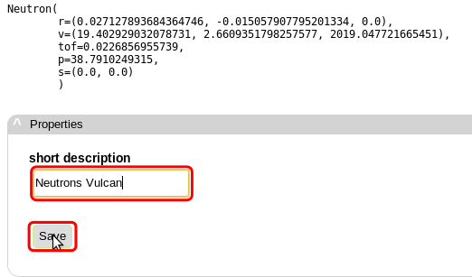
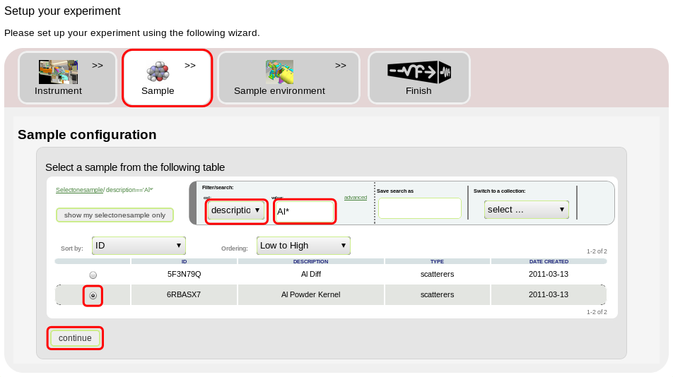

.. _vulcan-instrument:

VULCAN Instrument
=================

Introduction
^^^^^^^^^^^^

VULCAN is a diffractometer at the Spallation Neutron Source intended for
measurements of deformation, residual stress related studies, spatial mapping
of chemistry, microstructure, and texture.

.. figure:: images/vulcan/_1.vulcan-image.png
   :width: 500px

   *Fig. 1 Part of VULCAN instrument with sample and detectors*

.. figure:: images/vulcan/_2.vulcan-geometry.png
   :width: 500px

   *Fig. 2 Geometry of VULCAN instrument with numbered sections*

*X.-L. Wang et al. Physica B 385–386 (2006) 673–675*

   *Fig. 3 Schema of VULCAN instrument*

VULCAN Instrument Model
^^^^^^^^^^^^^^^^^^^^^^^

The VULCAN instrument can be modelled by a sequence of components where each of them
performs some action on neutron beam. The model that we used in VNF experiment is
provided on *Fig. 4* with only difference being that
``Monitor_nD`` were omited and set of ``PSD_TEWMonitor`` were replaced by
``VulcanDetectorSystem``.

.. figure:: images/vulcan/_4.vulcan-components.png
   :width: 720px

   *Fig. 4 Components sequence in VULCAN instrument model*

So the actual component chain in VNF experiment looks as follows:

::

    [SNSModerator] -> [CollimatorLinear] -> {Slit} -> [LMonitor1] -> {Guide} ->
    [LMonitor2] -> {Guide} -> [LMonitor3] -> [DiskChopper] -> {Guide} ->
    [LMonitor4] -> {Guide} -> [LMonitor5] -> {Guide} -> [LMonitor6] -> [Slit] ->
    {GuideGravity} -> [LMonitor7] -> [Slit] -> {GuideGravity} -> [LMonitor8] ->
    [LMonitor9] -> [LMonitor10] -> [PSDMonitor] -> [SAMPLE] -> [VulcanDetectorSystem]

where curly brackets ``{}`` specify set of components of the same type. Please consult
McVine script for more detailed configuration of VULCAN instrumet: `vulcan-mcvine.sh <http://dev.danse.us/trac/MCViNE/browser/trunk/instruments/VULCAN/tests/vulcan/vulcan-mcvine.sh>`_
Many of these components are standard McStas components but some of them are specific to VULCAN
instrument. Here we provide description of each of the components used in VULCAN:

``SNSModerator`` - Neutron source that produces a time and energy distribution from
the SNS moderator files (see section *SNSModerator Component*)

``CollimatorLinear`` - Soller collimator with rectangular opening and specified
length (see also `Collimator_linear <http://www.mcstas.org/download/components/optics/Collimator_linear.html>`_)

``Slit`` - Simple rectangular or circular slit
(see also `Slit <http://www.mcstas.org/download/components/optics/Slit.html>`_)

``LMonitor`` - Wavelength-sensitive monitor
(see also `L_monitor <http://www.mcstas.org/download/components/monitors/L_monitor.html>`_)

``Guide`` - Rectangular neutron guide tube centered on the Z axis
(see also `Guide <http://www.mcstas.org/download/components/optics/Guide.html>`_)

``DiskChopper`` - Disc chopper with n identical slits, which are symmetrically
disposed on the disc (see also `DiskChopper <http://www.mcstas.org/download/components/optics/DiskChopper.html>`_)

``GuideGravity`` - Rectangular neutron straight guide tube centered on the Z axis, with
gravitation handling (see also `Guide_gravity <http://www.mcstas.org/download/components/optics/Guide_gravity.html>`_)

``PSDMonitor`` - Position-sensitive monitor (see also `PSD_monitor <http://www.mcstas.org/download/components/monitors/PSD_monitor.html>`_)

``VulcanDetectorSystem`` - System of 3 time-of-flight sensitive and 3 wavelength sensitive monitors
(see section *Vulcan Detector System*)

The full experiment with VULCAN instrument in VNF

::

    [SNSModerator] -> {{... Components ...}} -> [SAMPLE] -> [VulcanDetectorSystem]

can be split into two parts: 

**Part 1: Instrument before sample**

::

    [SNSModerator] -> {{... Components ...}} -> [NeutronRecorder]

**Part 2: Instrument with sample and detector system**

::

    [NeutronPlayer] -> [SAMPLE] -> [VulcanDetectorSystem]

In the first part the information about the neutron profile is collected along the instrument
from set of ``LMonitor`` and ``PSDMonitor``. In the second part we get scattered
neutrons from sample for time-of-flight and wavelength sensitive monitors. This flexibility
allows to save neutrons passing through instrument right before sample and use them
for different samples later on without redoing the simulation over and over again.

Instrument Before Sample
^^^^^^^^^^^^^^^^^^^^^^^^

Let's start with the first part: *Instrument before sample*. First we need to
create new experiment in ``experiments`` tab click on plus sign ``create new experiment``.
In ``Setup your experiment`` page select ``VULCAN`` instrument and click ``continue``.

.. figure:: images/vulcan/1.select-vulcan.png
   :width: 720px

   *Fig. 5 Select VULCAN instrument*

You will see the a long component chain with over 100 different components starting
with ``SNSModerator`` and ending with ``NeutronRecorder``. These
components are already properly configured according to the VULCAN instrument
model but you still can adjust parameters, replace or even add new components
by clicking on a component. 

   *Fig. 6 Component chain of VULCAN instrument*

SNSModerator Component
^^^^^^^^^^^^^^^^^^^^^^

Source of neutrons in VULCAN instrument is generated by SNSModerator component -
a custom component created at SNS Oak Ridge National Laboratory, that generates
time and energy distribution from neutron profile file. As you can see in *Fig. 7*
there is no neutron profile specified by default, so we need to set it first.

::

    WARNING: If you don't specify the neutron profile you will discover an error
             message when the job gets submitted.

In the ``SNSModerator`` component click on *edit* link.

.. figure:: images/vulcan/3.edit-snsmoderator.png
   :width: 400px

   *Fig. 7 No neutron profile specified*

... and select neutron profile from available options.

   *Fig. 8 Select neutron profile*

The selected neutron profile will be displayed in properties:

.. figure:: images/vulcan/5.snsmoderator-info.png
   :width: 720px

   *Fig. 9 SNSModerator component*

::

    Note: Though the selected neutron profile is implemented for ARCS instrument
          it still can be used for VULCAN.

To show more examples of other components configuration in the instrument
the configuration of ``LMonitor`` is shown in Fig. 10.

.. figure:: images/vulcan/6.lmonitor10-info.png
   :width: 720px

   *Fig. 10 LMonitor component*

NeutronRecorder Component
^^^^^^^^^^^^^^^^^^^^^^^^^

The final component in the chain is ``NeutronRecorder``. This component saves
neutrons that can later be used or replayed for different component chains.
Here we save neutrons at the sample position to use in instrument with sample
and detector system.

.. figure:: images/vulcan/7.neutronrecorder-info.png
   :width: 720px

   *Fig. 11 NeutronRecorder component*

When we are agree with the components configuration click on ``continue`` button and edit
description to the experiment. Here we create ``1e6`` neutrons.

.. figure:: images/vulcan/8.edit-experiment.png
   :width: 400px

   *Fig. 12 Edit basic experiment configuration*

Next, review the full experiment configuration and click on ``create job`` button,
then select computational server and click ``submit``.

.. figure:: images/vulcan/9.job-edit.png
   :width: 300px

   *Fig. 13 Edit experiment job*

After the job is finished you can retrieve results by clicking on
``Pack the job directory for download``. 

.. figure:: images/vulcan/10.job-finished.png
   :width: 450px

   *Fig. 14 Finished job*

::

    Note: The job exited with code 0, meaning that simulation ran successfully.

Now switch to NeutronExperimen page:

.. figure:: images/vulcan/11.job-download.png
   :width: 450px

   *Fig. 15 Switch to NeutronExperiment view*

... and you will see the following sections:

* Overview

* Experiment details

* Results

   *Fig. 16 NeutronExperiment view with results*

Intermediate Detectors
^^^^^^^^^^^^^^^^^^^^^^

In the ``Results`` section the histograms are displayed from ``LMonitor`` and
``PSDMonitor``. Here ``I(w)`` is the intensity vs. wavelength plot.

   *Fig. 17 Plot I(w) for LMonitor1*

.. figure:: images/vulcan/14.lmonitor2.png
   :width: 500px

   *Fig. 18 Plot I(w) for LMonitor2*

.. figure:: images/vulcan/15.lmonitor3.png
   :width: 500px

   *Fig. 19 Plot I(w) for LMonitor3*

.. figure:: images/vulcan/16.lmonitor4.png
   :width: 500px

   *Fig. 20 Plot I(w) for LMonitor4*

.. figure:: images/vulcan/17.lmonitor5.png
   :width: 500px

   *Fig. 21 Plot I(w) for LMonitor5*

.. figure:: images/vulcan/18.lmonitor6.png
   :width: 500px

   *Fig. 22 Plot I(w) for LMonitor6*

   *Fig. 23 Plot I(w) for LMonitor7*

.. figure:: images/vulcan/20.lmonitor8.png
   :width: 500px

   *Fig. 24 Plot I(w) for LMonitor8*

   *Fig. 25 Plot I(w) for LMonitor9*

.. figure:: images/vulcan/22.lmonitor10.png
   :width: 500px

   *Fig. 26 Plot I(w) for LMonitor10*

.. figure:: images/vulcan/23.psdmonitor.png
   :width: 500px

   *Fig. 27 Neutron intensity distribution I(x,y) for PSDMonitor*

In results section of NeutronExperiment page you also can see ``Neutron storage``
subsection where information about 20 neutrons is displayed showing velosity,
position, tof and other parameters.

   *Fig. 28 Several neutrons saved by NeutronRecorder*

One important step that needs to be done is to edit description for recorded
neutrons. This little step allows you to find the recorded neutrons when you use
``NeutronPlayer`` in the next part of our experiment.

   *Fig. 29 Add description to recorded neutrons*

Instrument with Sample and Detector System
^^^^^^^^^^^^^^^^^^^^^^^^^^^^^^^^^^^^^^^^^^

   *Fig. 30 Component chain for sample*

NeutronPlayer Component
^^^^^^^^^^^^^^^^^^^^^^^

.. figure:: images/vulcan/27.neutron-player-edit.png
   :width: 400px

   *Fig. 31 No neutrons are set for NeutronPlayer*

   *Fig. 32 Select recorded neutrons for NeutronPlayer*

.. figure:: images/vulcan/29.neutronplayer-info.png
   :width: 720px

   *Fig. 33 NeutronPlayer component*

.. figure:: images/vulcan/30.sample-info.png
   :width: 720px

   *Fig. 34 Sample component*

Vulcan Detector System
^^^^^^^^^^^^^^^^^^^^^^

.. figure:: images/vulcan/31.detector-system-info.png
   :width: 720px

   *Fig. 35 VulcanDetectorSystem component*

   *Fig. 36 Select sample for sample component*

.. figure:: images/vulcan/33.edit-experiment.png
   :width: 650px

   *Fig. 37 Edit basic experiment configuration with sample*

Experiment Results
^^^^^^^^^^^^^^^^^^

.. figure:: images/vulcan/34.experiment-vsd-results.png
   :width: 720px

   *Fig. 38 Experiment view with results*

.. figure:: images/vulcan/35.m1.png
   :width: 500px

   *Fig. 39 Plot I(TOF) for side center detector*

   *Fig. 40 Plot I(w) for side center detector*

.. figure:: images/vulcan/37.m3.png
   :width: 500px

   *Fig. 41 Plot I(TOF) for side top detector*

.. figure:: images/vulcan/38.m4.png
   :width: 500px

   *Fig. 42 Plot I(w) for side top detector*

.. figure:: images/vulcan/39.m5.png
   :width: 500px

   *Fig. 43 Plot I(TOF) for side buttom detector*

.. figure:: images/vulcan/40.m6.png
   :width: 500px

   *Fig. 44 Plot I(w) for side buttom detector*

