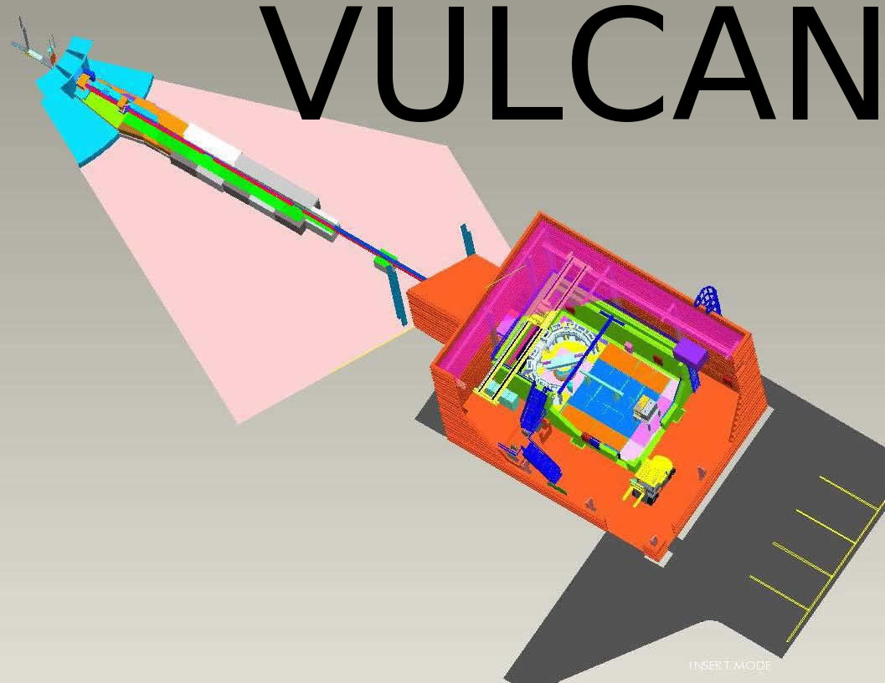

.. _vulcan-instrument:

VULCAN Instrument
=================

Introduction
------------

   *Fig. *

   *Fig. *

   *Fig. *

.. figure:: images/vulcan/_4.vulcan-components.png
   :width: 720px

   *Fig. *

   *Fig. *

.. figure:: images/vulcan/2.vulcan-chain.png
   :width: 720px

   *Fig. *

   *Fig. *

.. figure:: images/vulcan/4.select-neutronprofile.png
   :width: 720px

   *Fig. *

.. figure:: images/vulcan/5.snsmoderator-info.png
   :width: 720px

   *Fig. *

.. figure:: images/vulcan/6.lmonitor10-info.png
   :width: 720px

   *Fig. *

.. figure:: images/vulcan/7.neutronrecorder-info.png
   :width: 720px

   *Fig. *

   *Fig. *

.. figure:: images/vulcan/9.job-edit.png
   :width: 720px

   *Fig. *

   *Fig. *

.. figure:: images/vulcan/11.job-download.png
   :width: 720px

   *Fig. *

.. figure:: images/vulcan/12.experiment-vulcan-results.png
   :width: 720px

   *Fig. *

.. figure:: images/vulcan/13.lmonitor1.png
   :width: 720px

   *Fig. *

.. figure:: images/vulcan/14.lmonitor2.png
   :width: 720px

   *Fig. *

   *Fig. *

.. figure:: images/vulcan/16.lmonitor4.png
   :width: 720px

   *Fig. *

.. figure:: images/vulcan/17.lmonitor5.png
   :width: 720px

   *Fig. *

.. figure:: images/vulcan/18.lmonitor6.png
   :width: 720px

   *Fig. *

.. figure:: images/vulcan/19.lmonitor7.png
   :width: 720px

   *Fig. *

   *Fig. *

.. figure:: images/vulcan/21.lmonitor9.png
   :width: 720px

   *Fig. *

   *Fig. *

.. figure:: images/vulcan/23.psdmonitor.png
   :width: 720px

   *Fig. *

.. figure:: images/vulcan/24.neutronstorage-info.png
   :width: 720px

   *Fig. *

.. figure:: images/vulcan/25.neutrons-save.png
   :width: 720px

   *Fig. *

.. figure:: images/vulcan/26.component-chain.png
   :width: 720px

   *Fig. *

   *Fig. *

.. figure:: images/vulcan/28.select-neutrons.png
   :width: 720px

   *Fig. *

   *Fig. *

   *Fig. *

.. figure:: images/vulcan/31.detector-system-info.png
   :width: 720px

   *Fig. *

.. figure:: images/vulcan/32.select-sample.png
   :width: 720px

   *Fig. *

   *Fig. *

   *Fig. *

   *Fig. *

.. figure:: images/vulcan/36.m2.png
   :width: 720px

   *Fig. *

.. figure:: images/vulcan/37.m3.png
   :width: 720px

   *Fig. *

.. figure:: images/vulcan/38.m4.png
   :width: 720px

   *Fig. *

.. figure:: images/vulcan/39.m5.png
   :width: 720px

   *Fig. *

   *Fig. *

