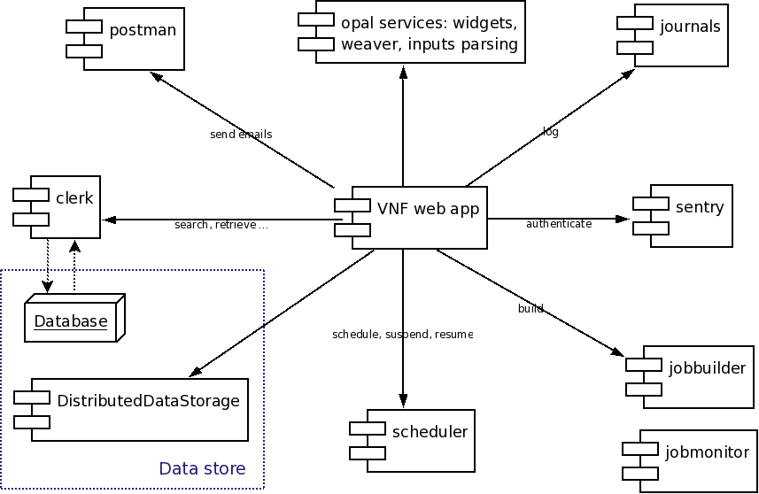
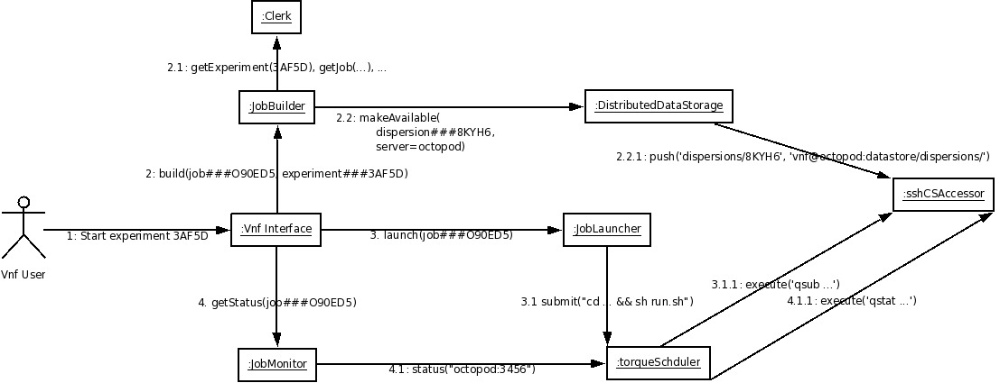

.. _vnfdeveloperguidearchitecture:

Architecture
============

Overview
--------
VNF, the Virtual Neutron Facility, provides computation services for material modeling, material simulation, and simulation of neutron experiments.

The VNF service is built on top of  :ref:`pyre <vnf_arch_pyre>`, a
component-based software framework for high performance computing, and
:ref:`luban <vnf_arch_luban>`, a user interface framework.

Following is a high level component diagram:

Building a web interface for a bunch of interconnected scientific
computation involves many colloborating components. The following
figure presents one peek of the complexity of VNF architecture:

.. _vnf_arch_pyre:

Backbone: pyre
--------------

.. _vnf_arch_luban:

User interface "language": luban
--------------------------------

Data provenance and file transfer: dsaw.model/dds
-------------------------------------------------
Overview
^^^^^^^^^^^^^^^^

"How Tos" for various tasks with dds:
^^^^^^^^^^^^^^^^^^^^^^^^^^^^^^^^^^^^^^^
1) find the absolute path of files associated with a data object::
	orm = director.clerk.orm
	dataObject = DataObject()
	datadir = director.dds.abspath(orm(dataObject))

Managing computation jobs: job builders and results retrievers
--------------------------------------------------------------

Managing "internal tasks" transparent to users: ITask/IWorker
-------------------------------------------------------------

ITask/IWorker is a pair of data-object/component developed for
handling "internal tasks" of VNF web interface. VNF, as a web
application, needs to respond to users requests quickly. A user-click,
however, might trigger a series of operations that may need some time
(a few millisecond to a couple of minutes) to finish. Here are a few
examples of such operations:

* User requests to tar ball a job directory for download
* User requests to submit a job to a cluster. What happen behind the scene is
 * building the job dir
 * copying job to remote cluster
 * launch job using some scheduler
* User requests to view results of a phonon dos computation. What happen behind the scene is
 * see if the computation result is already cached. Yes -> plot it
 * No -> figure out where the result is (which cluster?), copy the file over. Generate plot

For any operation that requires a bit of time to complete, we should not let users wait for its completion and get no response from the user interface. In VNF, we can make any such operation an internal task (itask). An iworker instance will be launched from the main web app to handle that itask, and that iworker instance will be detached from the main web app to run in its own process, so that users can get a response from our website instananeously.

A itaskmonitor widget, which monitor the progress of an itask instance, is available in VNF so that users will see a progress indicator when the itask is running. This way, users can know VNF is doing something for him and not get too bored. Users can also leave that page and come back later, and the itask monitor will do the right thing: report the current progress or let users know it is done.

Public interface
^^^^^^^^^^^^^^^^

ITask definition
!!!!!!!!!!!!!!!!

The following is the dom class definition of ITask

ITask ::

    from registry import tableRegistry

    from OwnedObject import OwnedObject as base
    class ITask(base):

        'internal tasks'

        name = 'itasks'

        import pyre.db

        time_completion = pyre.db.timestamp(name='time_completion')
        time_completion.meta['tip'] = 'time left to completion'

        time_start = pyre.db.timestamp(name='time_start')
        time_start.meta['tip'] = 'the time the job started'

        state = pyre.db.varchar( name = 'state', length = 16 )
        # state:
        #   - created: just created. has not been submitted
        #   - running
        #   - finished
        #   - failed
        #   - cancelled

        progress_percentage = pyre.db.real(name='progress_percentage')
        progress_text = pyre.db.varchar(name='progress_text', length=1024)

        # the party that benefits from this internal task
        beneficiary = pyre.db.versatileReference(
            name = 'beneficiary', tableRegistry = tableRegistry)

        # the type of this internal task
        type = pyre.db.varchar(name='type', length=128)

        # the worker of this internal task
        worker = pyre.db.varchar(name='worker', length=128)

        options = pyre.db.varcharArray(name='options', length=64, default=[])

        error = pyre.db.varchar(name='error', length=8192)

ITask factories
!!!!!!!!!!!!!!!

You can create an itask by calling its factory method::

  from vnf.dom.ITask import createITask
  itask = createITask(id, beneficiary, worker, type='', state='created', **options)

IWorker interface
!!!!!!!!!!!!!!!!!

IWorker is a pyre component. The signature of a IWorker component is the method "run"::

  class MyIWorker(Component):
      ...
      def run(self, task):
          ...

How to handle a itask in my actor
^^^^^^^^^^^^^^^^^^^^^^^^^^^^^^^^^

How to create my iworker
^^^^^^^^^^^^^^^^^^^^^^^^
A iworker is a pyre component. It is required to have one method "run". Here is an example::

    from pyre.components.Component import Component

    class Worker(Component):

        class Inventory(Component.Inventory):

            import pyre.inventory

        def run(self, task):
            director = self.director

            # the computation
            phon = director.clerk.dereference(task.beneficiary)

            # the job
            job = director.clerk.dereference(phon.job)

            # the server this job was run
            server = director.clerk.dereference(job.server)

            # the job dir on the server
            remotejobdir = director.dds.abspath(job, server=server)

            # check dispersion files
            director.declareProgress(0.2, 'Check if dispersion files exist')
            map = {
                'energies.idf': 'Omega2',
                'polarizations.idf': 'Polarizations',
                'DOS_meV.idf': 'DOS',
                }
            for datafile in map:
                if not director.dds.is_available(job, filename=datafile, server=server):
                    director.declareProgress(0.5, 'data file %s does not exist' % datafile)
                    return

            # dispersion db object
            director.declareProgress(0.3, 'Create new Dispersion container')
            from vnf.dom.ins.PhononDispersion import PhononDispersion
            dispersion = director.clerk.newDbObject(PhononDispersion)

            # create directory
            localdir = director.dds.abspath(dispersion)
            os.makedirs(localdir)

            #
            progress = 0.3
            for src, dest in map.iteritems():
                progress += 0.1
                director.declareProgress(progress, 'copying %s:%s to %s' % (
                    server.short_description, src, dest))
                # remote file
                remotefile = os.path.join(remotejobdir, src)

                # copying
                # the local path
                localpath = os.path.join(localdir, dest)
                director.csaccessor.copyfile(server, remotefile, LocalHost, localpath)

                continue

            # create file Qgridinfo
            director.declareProgress(0.8, 'Connect Dispersion and phon computation')
            qGrid = phon.qGrid
            matter = phon.matter.dereference(director.clerk.db)
            cartesian_lattice = matter.cartesian_lattice
            from vnf.utils.crystallattice import reciprocal
            reciprocal_lattice = reciprocal(cartesian_lattice)
            #
            content = makeQgridinfo(reciprocal_lattice, qGrid)
            #
            filename = 'Qgridinfo'
            filepath = os.path.join(localdir, filename)
            open(filepath, 'w').write('\n'.join(content))

            # connect dispersion record and the phon computation
            director.declareProgress(0.9, 'Connect Dispersion and phon computation')
            dispersion.matter = phon.matter
            dispersion.origin = phon
            director.clerk.updateRecord(dispersion)

            results_set = phon.results
            results_set.add(dispersion, director.clerk.db, name='phonon dispersion')

            director.declareProgress(1., 'done.')
            return

        def _configure(self):
            super(Worker, self)._configure()
            return

    def makeQgridinfo(reciprocal, gridsizes):
        ret = []
        for i in range(3):
            v = reciprocal[i]
            n = gridsizes[i]
            j = i+1
            ret.append('b%(j)d=%(v)s; n%(j)d=%(n)d' % locals())
            continue
        return ret

    from vnf.dom.Server import LocalHost
    import os

    def iworker():
        return Worker('retrieve-phon-results-phonon-dispersion', 'iworker')

Please note that the method ::

  $ director.declareProgress(percentage, text)

is used to report the progress of the itask.

How to debug my iworker
^^^^^^^^^^^^^^^^^^^^^^^

Suppose you already got an itask and an iworker, you can debug the
iworker by ::

  $ cd $EXPORT_ROOT/vnf/bin
  $ ./itaskapp.py --id=<itaskid> --iworker=<iworkername>

