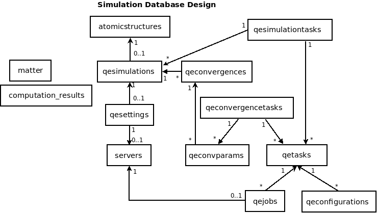

.. _vnf_developer_guide_qe

Architecture of Quantum Espresso Simulation
===========================================

Introduction
------------

*In the beginning there was a command line, and the command line was dark and
the green ASCII characters were with it. Through it all things were made and
without it nothing was made that has been made.*

Quantum Espresso package architecture was designed mostly for command line. 
Several binaries are provided for solving specific DFT problem accepting input 
file and producing output file as in example:

::
    
    pw.x < input_file > output_file

Each output file can be used for the input file of the next task, thus creating
simulation chain. This archinecture is very flexible allowing to combine various
tasks in arbitrary order. Please read more about Quantum Espresso simulations in
official `User's Guide <www.quantum-espresso.org/user_guide.pdf>`_ for more details.

Architecture Overview
---------------------

VNF implementation of Quantum Espresso sets some restrictions on types of simulation
tasks and their order in the simulation chain.

Simulation Chains
-----------------

Simulation chains with task types are listed below:

* Electron Structure: [PW]
* Electron DOS: [PW] -> [PW] -> [DOS]
* Electron Dispersion: [PW] -> [PW] -> [BANDS] -> [PLOTBAND]
* Geometry Optimization: [PW]
* Single Phonon: [PW] -> [PH] -> [DYNMAT] (useful for phonon sensitivity to input parameters)
* Multiple Phonon: [PW] -> [PH] -> [Q2R] -> [MATDYN]
* Molecular Dynamics: {Variable simulation chain}

The simulation tasks include:

* PW:       Plane wave calculation
* PH:       Phonon calculation
* BANDS:    Bands structure calculation
* PLOTBAND: Plot bands post processing
* PP:       Post processing
* DOS:      Electronic Density of States (DOS) calculation
* Q2R:      Fourier transform to real space
* MATDYN:   Dynamical matrix calculation
* DYNMAT:   Dynamical matrix calculation
* D3:       Third-order derivative calculation
* CP:       Car-Parrinello molecular dynamics
* CPPP:     Car-Parrinello molecular dynamics post processing

Simulation Workflow
-------------------

Here are the steps user should go through to get simulation results:

* Select atomic structure when creating the simulation
* Select the simulation type
* Create settings to setup the computational environment
* For each task:

    * Create configuration input
    * Run task
    * Check status of the job
    * Retrieve results
    * Procede to the next task

* Review the results in "Analyze" section
* (optional) Export results ("DOS" or "Dispersion")

Database Schema
---------------

Here is the database schema for Quantum Espresso simulation. The main table
``qesimulations`` has many-to-many relationship with ``qetasks`` through
``qesimulationtasks``

   *Fig. Database schema for Quantum Espresso simulation*

Inputs
------

Inputs are patially saved in database, partially on the file system with idea
similar to document-oriented databases: MongoDB http://www.mongodb.org/ or
CouchDB http://couchdb.apache.org/

Input Generators
^^^^^^^^^^^^^^^^

Input generators allow to generate configuration inputs for each task type based
on few parameters.

Input Fiters
^^^^^^^^^^^^

Inputs can have parameters pointing to the output file location on remote
cluster from previous simulation tasks. Input filters make sure that these
kinds of parameters are set properly, even though user just copies and pastes
configuration inputs from example.

Jobs
----

Job is submitted to the remote cluster when user clicks ``Run Task``. During this
procedure, system collects settings, configuration inputs, generates auxiliary
scripts, then copies these files to the remote cluster and sends it the queue manager.

Job Submission
^^^^^^^^^^^^^^

Job submission is tracked by the progress bar showing status of each step.

Job Status
^^^^^^^^^^

User can check the status of the job by clicking ``Refresh`` button
    
Results
-------

Results Retrieval
^^^^^^^^^^^^^^^^^

User can retrieve results as many times as she wants. Results are retrieved as
a compressed file with input and output files.

Results Export
^^^^^^^^^^^^^^

Results can be exported to the other part of the VNF system. At this point user
can do export: ``Export DOS`` and ``Export Dispersion``.

Optimization
------------

Quantum Espresso simulation supports multi-core simulation. It can run either on 
NFS file system over the network or having scratch space on each machine, thus
speeding up the simulation. The perfomance comparison for NFS and scratch space
are presented in `Report NFS vs. Scratch <http://dev.danse.us/trac/VNET/export/3678/vnf/branches/beta-useluban/vnfb/docs/reports/Report.NFS.vs.Scratch.pdf>`_. User can select with run simulation
with optimization (using scratch space) or without (using NFS). Using scratch space
may have some problems when the cluster is used by more than one user.

Convergence Tasks
-----------------

Convergence tasks are important when you want to find right parameters for
simulation that are close to optimal solution in a sense that the solution
will not change much as some parameter continues to increment. At this point
Quantum Espresso simulation mostly supports convergence tasks but implementation
is not ready for production yet.

Applications
------------

EPSC Simulation
^^^^^^^^^^^^^^^

This architecture was successfully applied to implementing *Elasto Plastic Self
Consistent (EPSC) Model*. Please see the tutorial
`Running EPSC Simulation in VNF <http://docs.danse.us/VNET/epsc.html>`_ for more
details.

