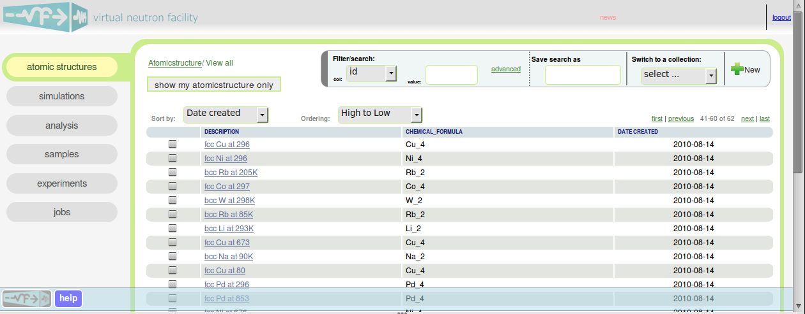
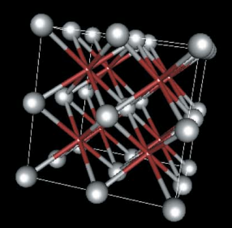
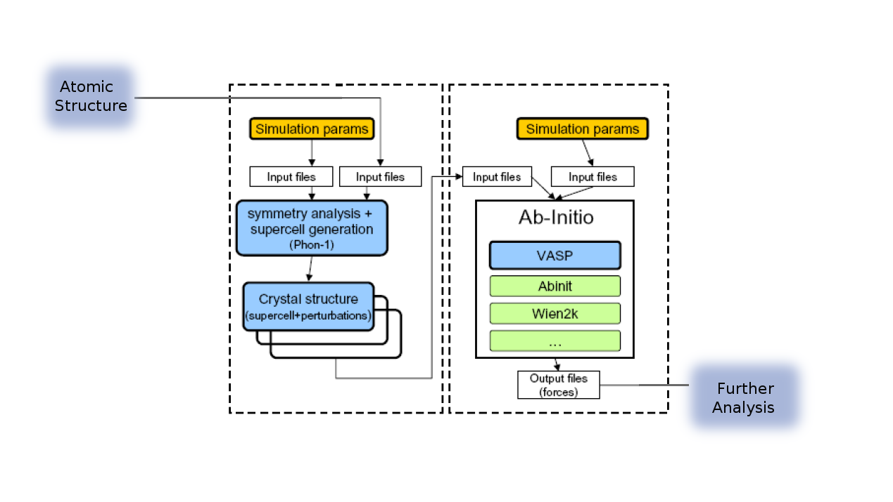
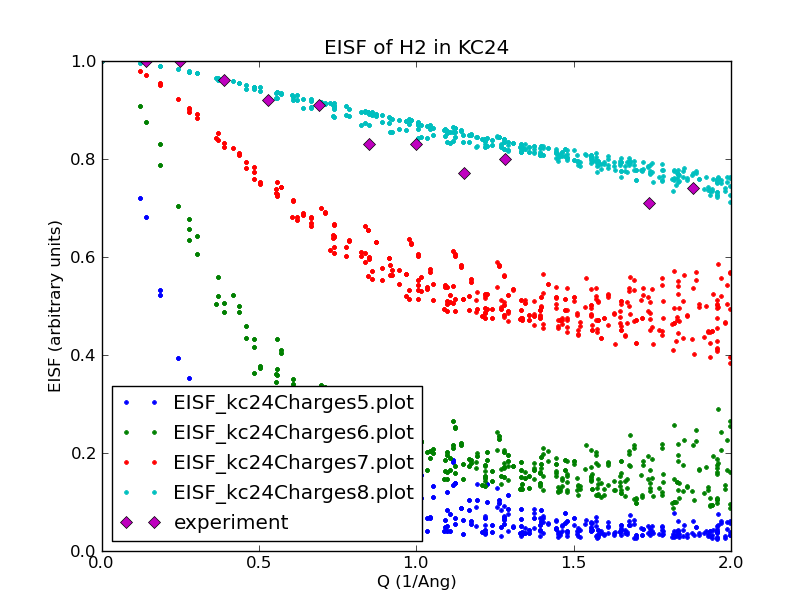
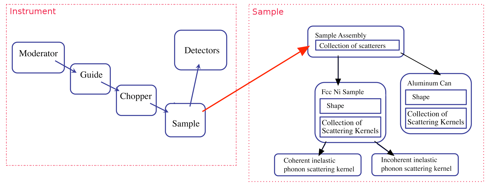

.. _vnfuserguideoverview:

Overview
========

Virtual neutron facility is a web service where you can plan 
and run virtual neutron experiments, 
and collect virtual experiment data for your virtual sample.
In a virtual neutron experiment, virtual neutrons are generated from a
virtual neutron source, guided by virtual neutron guides, scattered by
a virtual sample and sample environment, and intercepted by virtual detectors.

You can perform your experiments on a variety of neutron instruments, both
actual physical instruments and conceptual instruments.

You can also create your sample and predict its neutron scattering
properties  by calculating its structure or dynamics. For example, the
material behaviors calculated by ab initio or molecular dynamics
methods become scattering kernels that can be used in the sample
simulation part of your virtual experiment.

The user interface of VNF has an overall uniform structure:
the main interface is organized as tabs, of which several 
menu items are on the left side of the screen,
linking to a variety of functions. 
In each tab, the main view is a table of entities such as
atomic structures, experiments, or computational jobs.
Also presented in the main view of a tab are controls to
create a new entity, to navigate, sort and search the table, 
and to tag entities with labels for easier organization
(More details of these controls are explained
:ref:`using the "atomic structures" tab as the example <atomic-structures>`).

The sequence of the tabs is arranged to roughly follow a typical
chain of simulation/analysis steps, leading users 
to start from an atomic structure to end with performing virtual
neutron experiments on the atomic structure.

**Atomic structures**
An atomic structure is the target of your research. 
You always start your virtual experiment by first creating 
an atomic structure or find it in the database.
Neutron scattering experiments are ways to probe its physical properties.

   *An example of atomic structure*

**Simulations**
The "Simulations" tab is for material simulations and modelings
that compute from
atomic structure (and additional information)
things like electronic ground state, 
trajectories, phonon modes, etc.
Shown in the above figure is one typical workflow of
a first principle simulation.
The goal of these simulations are creating
details of physical properties of the atomic structure
which later can be (directly or indirectly) used to create scattering kernels
of virtual samples.

   *A typical workflow of Ab Initio simulation*

**Analysis**
The purpose of analysis is to obtain data that are more easily understandable
(than things like wave-functions and md trajectories). 
For example, shown in the figure above is an elastic incoherent
structure factor resulted from an analysis of a md trajectory.
Some of the analysis results here can be directly compared
to data reduced from real data (for example, phonon DOS are computed
from some analysis and can be compared to phonon DOS reduced from
real experiments), and some can be used in futher simulations
of neutron experiments as inputs to scattering kernels of samples.

   *An example of Elastic incoherent structure factor resulted from an analysis of a molecular dynamics trajectory*

**Samples**
In this tab, you will create and manage virtual samples for virtual experiments.

   *Instrument and sample in VNF virtual experiments*

**Experiments**
In this tab, you will create and manage virtual experiments.

**Jobs**
In this tab, you can monitor the computational jobs for the material
simulations/modelings, and also virtual experiments.

Another principle of the VNF user interface is to show the interconnections
of entities. For example, in the view of an atomic structure, you 
should be able to see (links to) entities related this atomic structure,
for example, its phonon density of states computed from a bvk
computation; in a view of a computation job, there will be a link 
that can bring you to the view of the computation that job is about.

At this moment, you may want to explore VNF a little bit.
For example, you
can review past experiments by clicking 
:ref:`"Experiments" <exps-tab>`, 
or browse your
personal library of samples by clicking 
:ref:`"Samples" <samples-tab>`. 
A library of
materials you and other researchers are interested are in the tab
:ref:`"Atomic structures" <atomic-structures>`.
You can try to 
start a virtual experiment [#start-exp]_ ,
or a material simulation [#start-mat-sims]_ , 
and they can
become computational jobs to be submitted to computing resources. 
You can monitor their progress by clicking "Jobs".

For a quick start, you may want to 
watch some videos, and
follow some tutorials:

* :ref:`Video clips of typical workflows <screencasts>`
* :ref:`Tutorials <userguide-tutorials>`

Detailed explanations of all tabs are also available

* :ref:`Atomic structures <atomic-structures>`
* :ref:`Material simulations <matsim-tab>`
* :ref:`Analysis <analysis-tab>`
* :ref:`Samples <samples-tab>`
* :ref:`Experiments <exps-tab>`
* :ref:`Jobs <jobs-tab>`

.. rubric:: Footnotes

.. [#start-exp] See  
   :ref:`virtual experiment tutorials <exp-tutorials>`, 
   and also video demos, e.g.
   `Video: inelastic scattering of lead plate <http://www.youtube.com/watch?v=puHiA4qcL7U&fmt=22>`_
.. [#start-mat-sims] Video demos, e.g. 
   `Quantum Espresso workflow <http://docs.danse.us/VNET/movies/qe.html>`_, 
   `Lead phonon dispersions from bvk  <http://www.youtube.com/watch?v=3BYNlvENz_k&fmt=22>`_,
   `Forcefield simulation and S(Q,E) generation--setup (with audio) <http://docs.danse.us/VNET/movies/st_screencast.mov>`_
