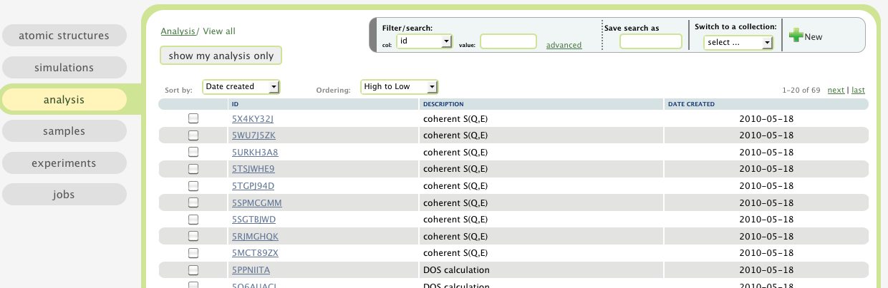

.. _analysis-tab:

Analysis
========

In this tab, a table of post-simulation analysis are presented.

To see how to sort, filter, and how to use labels, please read
:ref:`the table view section <atomic-structures-tableview>` for 
:ref:`atomic structures <atomic-structures>` first. The basic 
functionalities of the table view here is the same as the one
for atomic structures.

A brief tutorial about how to calculate a density of phonon states or an S(Q,E) is shown below:
 * :ref:`analysis-tutorial`
Other examples of analysis calculations include elastic incoherent structure factors, velocity autocorrelation function and the resulting diffusion coefficient, mean squared displacement and its resulting diffusion coefficient, etc.
