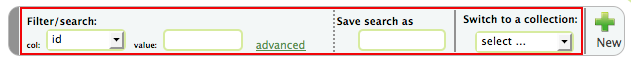

Atomic structures
=================

Table view
----------
In this tab, you will see a table of atomic structures.

.. image:: shots/atomicstructure/table-top.png
   :width: 720px

On the top, there is a tool bar that contains mostly filtering tools,
and a "new" button to create new atomic struccture.

Searching/filtering
^^^^^^^^^^^^^^^^^^^

Highlighted is a set of controls to filter the table.

Sorting
^^^^^^^

Overview of an atomic structure
-------------------------------

In the overview of an atomic structure, the top portion displays basic
information about this structure. 

The "computed properties" panel shows physical properties of
this atomic structure that were calculated using various computation 
techniuqes.

