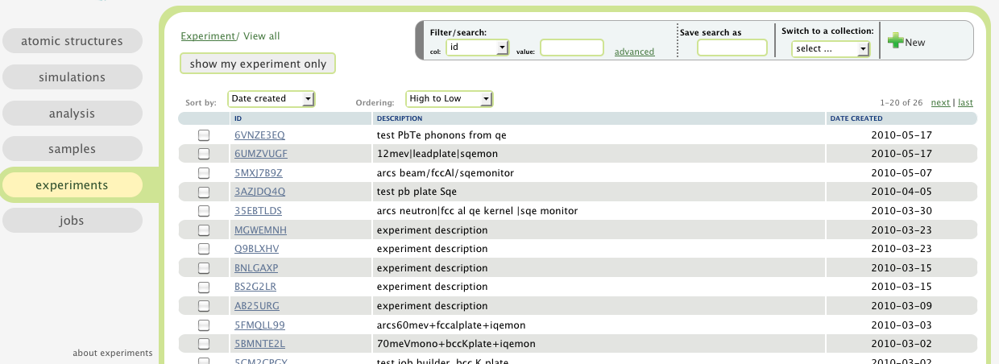
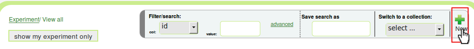
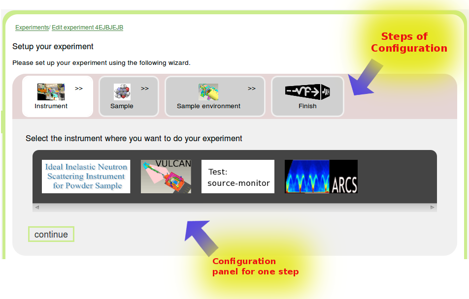

.. _exps-tab:

Experiments
===========

In this tab, a table of virtual neutron experiments are presented.

Virtual neutron experiments are Monte Carlo simulations of neutron
experiments.
A virtual neutron experiment consists of a virtual neutron instrument,
a virtual sample (and possibly a sample environment), and other
user instructions of how this experiment is carried out.

In this table, you can create a new neutron experiment, look for
old neutron experiments, and also view their details and 
experiment results.

To see how to sort, filter, and how to use labels, please read
:ref:`the table view section <atomic-structures-tableview>` for 
:ref:`atomic structures <atomic-structures>` first. The basic 
functionalities of the table view here is the same as the one
for atomic structures.

What is an experiment
---------------------
In VNF, an (virtual) experiment is defined as a simulated
run of a neutron instrument, with or without sample.
In an experiment, you choose or set up a neutron instrument,
and (optionally) choose and configure a sample,
and let a specific number of neutrons run through the instrument.

How to setup and run an experiment
----------------------------------

Tutorial 1: a simple test experiment
""""""""""""""""""""""""""""""""""""

To create an experiment, first click the "new" button at the
top-right corner of the "experiment" page:

A wizard for configuring your new experiment will show up:

