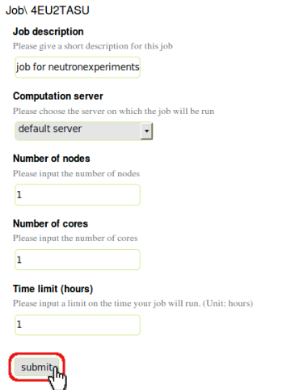
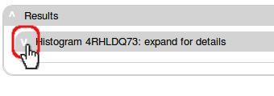

.. _exps-tab:

Experiments
===========

In this tab, a table of virtual neutron experiments are presented.

Virtual neutron experiments are Monte Carlo simulations of neutron
experiments.
A virtual neutron experiment consists of a virtual neutron instrument,
a virtual sample (and possibly a sample environment), and other
user instructions of how this experiment is carried out.

In this table, you can create a new neutron experiment, look for
old neutron experiments, and also view their details and 
experiment results.

.. image:: shots/experiments/table-top.png
   :width: 720px

To see how to sort, filter, and how to use labels, please read
:ref:`the table view section <atomic-structures-tableview>` for 
:ref:`atomic structures <atomic-structures>` first. The basic 
functionalities of the table view here is the same as the one
for atomic structures.

What is an experiment
---------------------
In VNF, an (virtual) experiment is defined as a simulated
run of a neutron instrument, with or without sample.
In an experiment, you choose or set up a neutron instrument,
and (optionally) choose and configure a sample,
and let a specific number of neutrons run through the instrument.

.. _exp-tutorials:

How to setup and run an experiment
----------------------------------

.. _exp-tut-simple-src-mon:

Tutorial 1: a simple test experiment
""""""""""""""""""""""""""""""""""""

To create an experiment, first click the "new" button at the
top-right corner of the "experiment" page:

A wizard for configuring your new experiment will show up:

.. image:: shots/experiments/experiment-wizard-overview.png
   :width: 700px

The wizard panel consists of two parts: the upper portion
shows the steps you need to go through to configure your
experiment, and also what current step is; the lower portion
has the configuration details of the current step.

We are in the first step of configuring an experiment:
select and customize a neutron instrument.
In the lower portion of panel we see icons of neutron
instruments. In this tutorial, we will select the 
simplest instrument "Test: source-monitor" icon
in the instrument gallery, and then hit the "continue"
button:

Now we are presented with a view to configure the selected
instrument:

1. The upper portion shows the neutron component chain of the
   instrument. Click on a component in the chain allows us
   to edit the selected component.
2. The lower portion is a panel showing details of the selected
   component.

In the lower portion (2), you can change the type of a component:

or delete a component:

or edit the component properties by clicking the "edit" link:

After you are done with editing all the components, you can click
the "continue" button to move on to the next step:

The instrument we chose "Test: source-monitor" is a simple
instrument without sample, therefore this experiment setup
only consists of two steps. We are now in step 2:

Here we will need to

1. Give this experiment a simple but clear description
2. Click the "save" button to save your changes
3. Click the "continue" button to continue

A summary of the experiment will show up:

and you can
go through it to review and check your experimental setup.
You can then minimize the summary by clicking on the
arrow-up icon to collapse the document, and we end up with:

Click the "create job" button allows us to create
a computation job  for this experiment:

Click the "submit" button will submit job to the job queue
at the computing server you have chosen:

You will see the job is queued (in some cases, it might be 
already "running", or even "finished").
Click the "Refresh" button will update the status of your job.
For this example, your job should be done fairly quickly.
If not, please wait for email alerts from the vnf system
for change of status. Anyway, after a while, your job should be 
done:

Click the "switch to view of computation..." button in the "Results" section
will bring you to a view of the experiment:

Expand the "results" section, we will see VNF retrieving results
for you, and for this particular experiment, one histogram panel will
show up inside the results panel:

Expand this only histogram panel there you will see a plot!

And you can download the data for the plot by clicking the 
"download data" link.

Tutorial 2: an experiment with a powder sample with inelastic phonon scattering kernel
""""""""""""""""""""""""""""""""""""""""""""""""""""""""""""""""""""""""""""""""""""""

`A video demo for this tutorial <http://www.youtube.com/watch_popup?v=puHiA4qcL7U&vq=hd720>`_
