.. _samples-tab:

Samples
=======

In this tab, a table of virtual samples are presented.

Samples are the core of neutron experiments. In this tab,
you can create a new sample, and also search and learn details
of previously created samples.

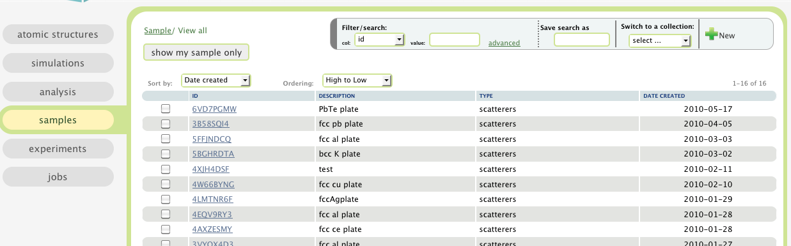

To see how to sort, filter, and how to use labels, please read
:ref:`the table view section <atomic-structures-tableview>` for 
:ref:`atomic structures <atomic-structures>` first. The basic 
functionalities of the table view here is the same as the one
for atomic structures.

What is a sample
----------------
In VNF, a sample is a neutron scatterer with a shape. 
The neutron scatterer consists of homogeneously distributed
material (or can be regarded as homogenesously distributed in 
some averaging scheme)
within the shape.

A neutron scatterer can have multiple scattering kernels, 
each of which scatter neutrons in a way that is independent
of the position of scattering inside the shape of the scatterer.

How to create a sample
----------------------
Here we will try to create a polycrystalline Fe plate sample with
phonon inelastic scattering kernel.

To create a sample, first click the "new" button at the
top-right corner of the "sample" page:

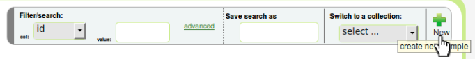

Then input a description of your sample in the "description"
input text box, and click the "save" button.

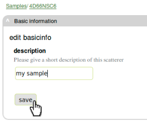

Now we need to select an atomic structure for the sample.
From within the filter/search toolbox, please select "description" 
and input "\*Fe\*", 

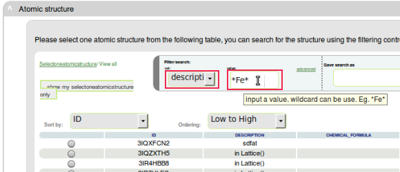

and hit **Enter** key 
to search for Fe related structures:

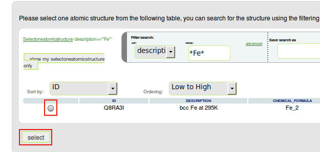

Select the "bcc Fe at 295K" material and click the select button,
you will see an overview of the material:

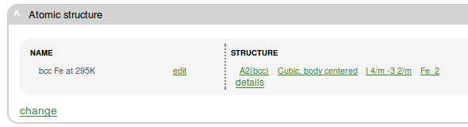

Now you can move on to the shape panel,

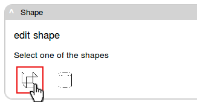

and click on one of the shape icons. A form for editing the
shape will come up. The default configuratioin there is 
for a plate. Please click the "save" button after configuration:

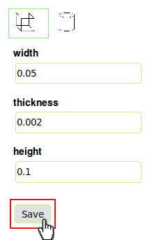

and an overview of the configured shape shows up:

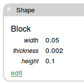

Now our focus is to provide the sample neutron scattering 
properties. This will be done in the "kernels" panel:

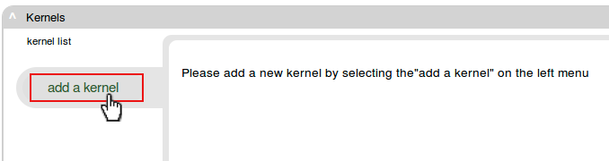

Click "add a kernel" button to add a new kernel.
A few icons of kernel types show up, and please
click on the "isotropic elastic kernel" type:

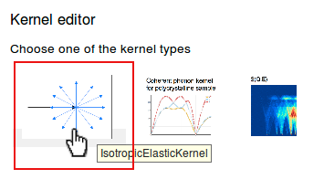

Click the "Save" button to save your configuration:

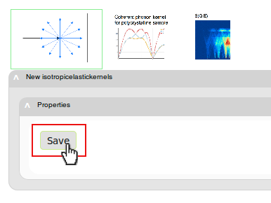

And you are now done with creating a sample with an isotropic
neutron scattering kernel. You can add more kernels to the sample,
if you want:

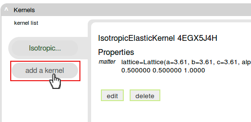
