.. _epsc:

Running EPSC Simulation in VNF
==============================

Introduction
------------

EPSC Model
----------

Create New Simulation
---------------------

Settings and Configurations
---------------------------

Running Simulation
------------------

Simulation Results
------------------

   *Fig. *

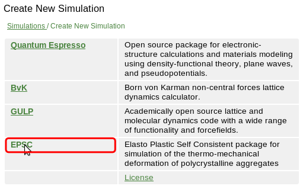

   *Fig. *

   *Fig. *

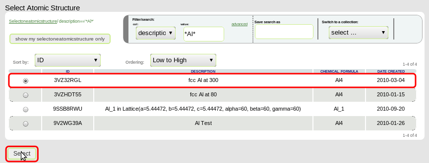

   *Fig. *

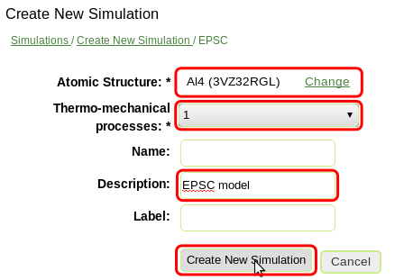

   *Fig. *

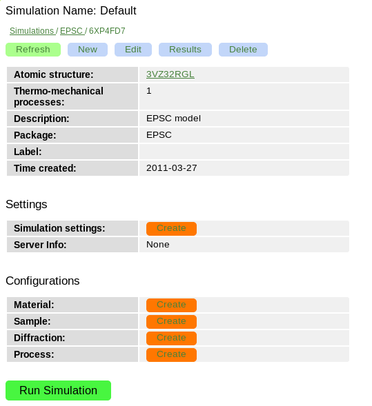

   *Fig. *

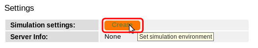

   *Fig. *

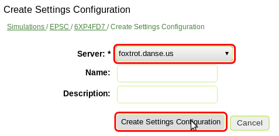

   *Fig. *

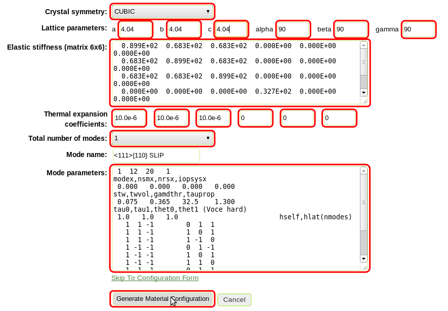

   *Fig. *

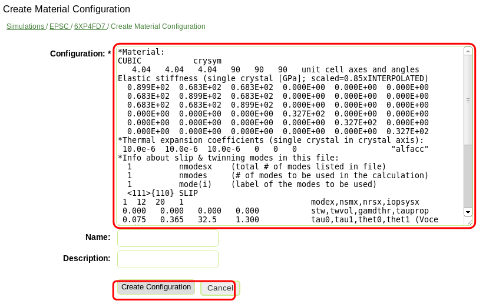

   *Fig. *

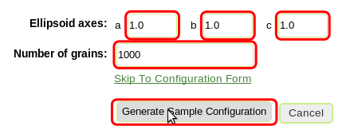

   *Fig. *

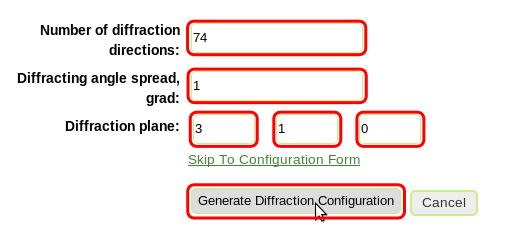

   *Fig. *

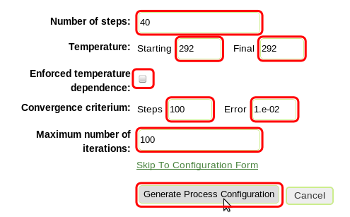

   *Fig. *

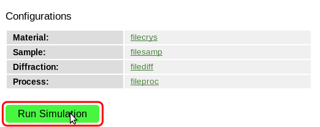

   *Fig. *

   *Fig. *

   *Fig. *

   *Fig. *

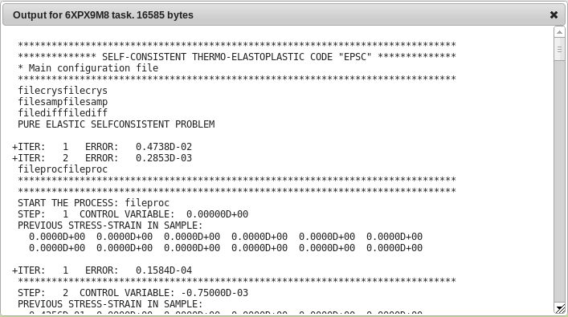

   *Fig. *

   *Fig. *

   *Fig. *

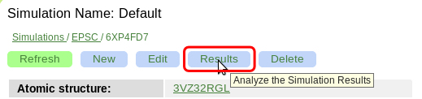

   *Fig. *

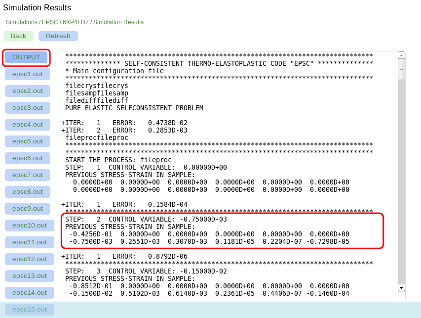

   *Fig. *

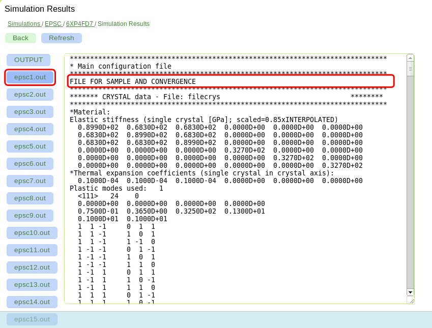

   *Fig. *

::

    *Material:
    CUBIC           crysym
       4.04   4.04   4.04   90   90   90   unit cell axes and angles
    Elastic stiffness (single crystal [GPa]; scaled=0.85xINTERPOLATED)
      0.899E+02  0.683E+02  0.683E+02  0.000E+00  0.000E+00  0.000E+00
      0.683E+02  0.899E+02  0.683E+02  0.000E+00  0.000E+00  0.000E+00
      0.683E+02  0.683E+02  0.899E+02  0.000E+00  0.000E+00  0.000E+00
      0.000E+00  0.000E+00  0.000E+00  0.327E+02  0.000E+00  0.000E+00
      0.000E+00  0.000E+00  0.000E+00  0.000E+00  0.327E+02  0.000E+00
      0.000E+00  0.000E+00  0.000E+00  0.000E+00  0.000E+00  0.327E+02
    *Thermal expansion coefficients (single crystal in crystal axis):
     10.0e-6  10.0e-6  10.0e-6   0   0   0                    "alfacc"
    *Info about slip & twinning modes in this file:
      1          nmodesx    (total # of modes listed in file)
      1          nmodes     (# of modes to be used in the calculation)
      1          mode(i)    (label of the modes to be used)
      <111>{110} SLIP
     1  12  20   1                           modex,nsmx,nrsx,iopsysx
     0.000   0.000   0.000   0.000           stw,twvol,gamdthr,tauprop
     0.075   0.365   32.5    1.300           tau0,tau1,thet0,thet1 (Voce hard)
     1.0   1.0   1.0                         hself,hlat(nmodes)
       1  1 -1        0  1  1
       1  1 -1        1  0  1
       1  1 -1        1 -1  0
       1 -1 -1        0  1 -1
       1 -1 -1        1  0  1
       1 -1 -1        1  1  0
       1 -1  1        0  1  1
       1 -1  1        1  0 -1
       1 -1  1        1  1  0
       1  1  1        0  1 -1
       1  1  1        1  0 -1
       1  1  1        1 -1  0

::

    AXES OF THE REPRESENTATIVE ELLIPSOID
            1.0	1.0	1.0
    DISCRETE TEXTURE FROM ODF FILE
    B	1000	0
            67.5665935776	30.7723200734	200.645581423	1
            320.9954098	25.674444712	313.528263287	1
            281.921283004	84.9278764658	190.345130696	1
            13.5237255003	15.9706662546	107.702130497	1
            168.702831231	90.5544456582	298.823202199	1
            328.333753396	86.2341328896	9.37555775605	1
            66.6689573599	176.814219307	77.9934852685	1
            284.910931568	27.9559104296	215.307960082	1
            102.398620084	132.167551392	278.212450538	1
            336.256847143	114.000641344	313.310094337	1
            196.973773959	125.145209119	268.126650506	1
            324.433609308	81.3434035609	282.394127615	1
            ...

::

    *DIFFRACTING PLANES AND DIRECTION
    *Number of diffraction directions and diffracting angle spread:
      74  1					"ndif"	"spread"
    *Plane type and direction angle:
    *"n3" or "n4"   "theta"        "phi"
    3 1 0		0		50
    3 1 0		5		50
    3 1 0		10		50
    3 1 0		15		50
    3 1 0		20		50
    3 1 0		25		50
    3 1 0		30		50
    3 1 0		35		50
    ...

::

    * Thermo-mechanical process
    *Number of steps in the process:
    40								"nsteps"
    *Starting and final temperature:
    292  292						"temp_s" "temp_f"
    *Enforced temperature dependence of elastic constants (1=YES or 0=NO)?
    0                                                                 "i_temp_cij"
    *Indexes and values for the stress boundary condition:
            0	1	1	1	1	1			"istbd"
            999	0.0	0.0	0.0	0.0	0.0			"stbc"
    *Indexes and values for the strain boundary condition:
            1	0	0	0	0	0			"ietbc"
            -0.03	999   999	999	999	999			"etbc"
    *Reset macroscopic strain to zero (1=YES or 0=NO)?
    1
    *Control process variable: 0=temp , 1,2,3=etss(1,2,3) , 4,5,6=stss(1,2,3)
    1									"i_control_var"
    *Convergence criterium for the sample moduli:
    100  1.e-02                                           "itmax_mod"  "error_mod"
    *Maximum number of iterations to select the set of systems in grains:
    100                                            "itmax_grain"

::

    * Main configuration file
    *File for the material data:
    filecrys
    *File for the sample (grain shape+texture) data:
    filesamp
    *Reads state from previous process (1=YES or 0=NO) and related file:
    0                                                                "i_prev_proc"
    *
    *Reads diffracting planes and diffraction directions (1=YES or 0=NO) and file:
    1                                                                 "i_diff_dir"
    filediff
    *Number of thermomechanical processes to be run:
    1                                                                     "nproc"
    *Files containing information about each process:
    fileproc

