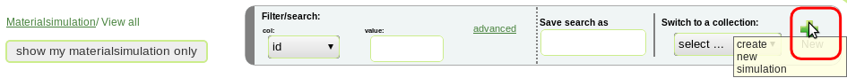
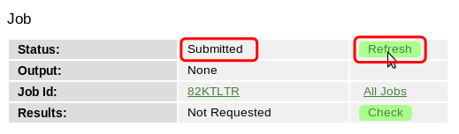

.. _epsc:

Running EPSC Simulation in VNF
==============================

Introduction
------------

Elasto Plastic Self Consistent Model
------------------------------------

Create New EPSC Simulation
--------------------------

To create new EPSC simulation go to ``simulations`` tab and click button
``create new simulation``.

   *Fig. 1 Create new simulation*

In the list of available simulation packages click on ``EPSC`` package and
the ``Create New Simulation`` form will be displayed.

   *Fig. 2 Select EPSC simulation*

You will need to select the atomic structure you want to use for EPSC simulation.

.. figure:: images/epsc/3.atomic-structure.png
   :width: 350px

   *Fig. 3 Select atomic structure*

For this simulation we selected ``Al`` atomic structure from the list of available
structures. You can use filter and some simple regular expressions if needed to
narrow down available options.

   *Fig. 4 Select atomic structure from table*

Once you selected the atomic structure you can easily choose another one by clicking
on link ``Change``. Next, select number of thermo-mechanical processes - there is no
much choice here as only one thermo-mechanical process is supported at this moment.
Finally, add description (this can help to find your simulation later on)
and click ``Create New Simulation``. Setting ``Name`` and ``Label`` can also be useful :).

::

    Note: At this moment only one thermo-mechanical process is supported.
          We plan to support several processes in future releases.

.. figure:: images/epsc/5.create-simulation.png
   :width: 400px

   *Fig. 5 Create new simulation form*

After the simulation is created you will see the simulation view which displays 
various information:

* Navigation buttons (New, Edit etc.)
* General information about the simulation (atomic structure, thermo-mechanical processes etc.)
* Settings (parameters for computational environment)
* Configurations (parameters which define the EPSC model)
* Job (status of computational job and results when simulation was run)

Before running simulation you need to create settings and configurations marked
by red buttons ``Create``.

.. figure:: images/epsc/6.simulation-view.png
   :width: 500px

   *Fig. 6 EPSC simulation view*

Settings and Configurations
---------------------------

In the ``Settings`` section click on ``Create`` button

.. figure:: images/epsc/7.create-settings-link.png
   :width: 500px

   *Fig. 7 Create settings link*

... and select computational cluster (server) you want to run your simulation on -
this is all the control you have :).

::

    Note: Because the EPSC package was developed for a single core you cannot run
          the simulation on more than one core (processor).

   *Fig. 8 Create settings configuration*

Next step is to create configurations. There four configuration types:

* **Material**, material configuration
* **Sample**, grain shape and texture
* **Diffraction**, diffracting planes and direction
* **Process**, thermo-mechanical process

::

    Note: Because only one thermo-mechanical process is supported there is one
          "Process" configuration.

   *Fig. 9 Create material configuration link*

When you click on ``Create`` button in ``Material`` configuration, the ``Create
Material Configuration`` form will displayed. Here you can setup the following parameters:

* Unit cell parameters
* Elastic stiffness tensor
* Thermal expansion coefficients
* Mode parameters

::

    Notes:
    
      - Crystal symmetry can only be either "Cubic" or "Hexagonal" even if the
        atomic structure that you selected before has different symmetry.

      - Total number of modes is one: it can be either slipping or twinning.

   *Fig. 10 Generate material configuration*

When you click on ``Generate Material Configuration`` button, the system will automitically
generate configuration using parameters that you specified in the form.

   *Fig. 11 Create material configuration*

::

    *Material:
    CUBIC           crysym
       4.04   4.04   4.04   90   90   90   unit cell axes and angles
    Elastic stiffness (single crystal [GPa]; scaled=0.85xINTERPOLATED)
      0.899E+02  0.683E+02  0.683E+02  0.000E+00  0.000E+00  0.000E+00
      0.683E+02  0.899E+02  0.683E+02  0.000E+00  0.000E+00  0.000E+00
      0.683E+02  0.683E+02  0.899E+02  0.000E+00  0.000E+00  0.000E+00
      0.000E+00  0.000E+00  0.000E+00  0.327E+02  0.000E+00  0.000E+00
      0.000E+00  0.000E+00  0.000E+00  0.000E+00  0.327E+02  0.000E+00
      0.000E+00  0.000E+00  0.000E+00  0.000E+00  0.000E+00  0.327E+02
    *Thermal expansion coefficients (single crystal in crystal axis):
     10.0e-6  10.0e-6  10.0e-6   0   0   0                    "alfacc"
    *Info about slip & twinning modes in this file:
      1          nmodesx    (total # of modes listed in file)
      1          nmodes     (# of modes to be used in the calculation)
      1          mode(i)    (label of the modes to be used)
      <111>{110} SLIP
     1  12  20   1                           modex,nsmx,nrsx,iopsysx
     0.000   0.000   0.000   0.000           stw,twvol,gamdthr,tauprop
     0.075   0.365   32.5    1.300           tau0,tau1,thet0,thet1 (Voce hard)
     1.0   1.0   1.0                         hself,hlat(nmodes)
       1  1 -1        0  1  1
       1  1 -1        1  0  1
       1  1 -1        1 -1  0
       1 -1 -1        0  1 -1
       1 -1 -1        1  0  1
       1 -1 -1        1  1  0
       1 -1  1        0  1  1
       1 -1  1        1  0 -1
       1 -1  1        1  1  0
       1  1  1        0  1 -1
       1  1  1        1  0 -1
       1  1  1        1 -1  0
       
*Fig. 11a Material configuration. See also:*
`filecrys <http://dev.danse.us/trac/VNET/browser/vnf/branches/beta-useluban/vnfb/docs/files/epsc/filecrys?rev=3654>`_

In this configuration we have one slip mode.
You can edit the configuration manually if you understand what you are doing :).
Or even skip the configuration generation by clicking ``Skip To
Configuration Form``. After you reviewed the configuration, click ``Create
Configuration`` and the configuration for material will be stored in the system.

Next step is to create configuration for sample: click ``Create`` button for **Sample**
and ``Create Sample Configuration`` form will be displayed. In this form you define
the grain shape (ellipsoid axes) and number of grains. All the grains in EPSC model
have the same shape with different orientation.

.. figure:: images/epsc/11.sample-form.png
   :width: 420px

   *Fig. 12 Generate sample configuration*

Click ``Generate Sample Configuration`` and the system will create texture with
uniformly distributed orientation of grains.

::

    AXES OF THE REPRESENTATIVE ELLIPSOID
            1.0	1.0	1.0
    DISCRETE TEXTURE FROM ODF FILE
    B	1000	0
            67.5665935776	30.7723200734	200.645581423	1
            320.9954098  	25.674444712	313.528263287	1
            281.921283004	84.9278764658	190.345130696	1
            13.5237255003	15.9706662546	107.702130497	1
            168.702831231	90.5544456582	298.823202199	1
            328.333753396	86.2341328896	9.37555775605	1
            66.6689573599	176.814219307	77.9934852685	1
            284.910931568	27.9559104296	215.307960082	1
            102.398620084	132.167551392	278.212450538	1
            336.256847143	114.000641344	313.310094337	1
            196.973773959	125.145209119	268.126650506	1
            324.433609308	81.3434035609	282.394127615	1
            ...

*Fig. 12a Sample configuration. See full configuration:* `filesamp <http://dev.danse.us/trac/VNET/browser/vnf/branches/beta-useluban/vnfb/docs/files/epsc/filesamp?rev=3654>`_

Next, create configuration for diffraction by clicking ``Create`` button
for **Diffraction** and ``Create Diffraction Configuration`` form will be displayed.
Here you can specify parameters:

* Number of diffraction directions
* Difracting angle spread, and
* Diffraction plane

   *Fig. 13 Generate diffraction configuration*

::

    *DIFFRACTING PLANES AND DIRECTION
    *Number of diffraction directions and diffracting angle spread:
      74  1					"ndif"	"spread"
    *Plane type and direction angle:
    *"n3" or "n4"   "theta"        "phi"
    3 1 0		0		50
    3 1 0		5		50
    3 1 0		10		50
    3 1 0		15		50
    3 1 0		20		50
    3 1 0		25		50
    3 1 0		30		50
    3 1 0		35		50
    ...

*Fig. 13a Diffraction configuration. See full configuration:* `filediff <http://dev.danse.us/trac/VNET/browser/vnf/branches/beta-useluban/vnfb/docs/files/epsc/filediff?rev=3654>`_

Finally, we need to create configuration for single thermo-mechanical process. In the
``Create Process Configuration`` form you can specify:

* Number of steps
* Temperature parameters
* Convergence criteria, and
* Iteration limits

   *Fig. 14 Generate thermo-mechanical process configuration*

To set mechanical properties for the process, go to generated configuration
and modify, if necessary, the boundary conditions for stress and strain:

::

    * Thermo-mechanical process
    *Number of steps in the process:
    40								"nsteps"
    *Starting and final temperature:
    292  292						"temp_s" "temp_f"
    *Enforced temperature dependence of elastic constants (1=YES or 0=NO)?
    0                                                                 "i_temp_cij"
    *Indexes and values for the stress boundary condition:
            0	1	1	1	1	1			"istbd"
            999	0.0	0.0	0.0	0.0	0.0			"stbc"
    *Indexes and values for the strain boundary condition:
            1	0	0	0	0	0			"ietbc"
            -0.03	999   999	999	999	999			"etbc"
    *Reset macroscopic strain to zero (1=YES or 0=NO)?
    1
    *Control process variable: 0=temp , 1,2,3=etss(1,2,3) , 4,5,6=stss(1,2,3)
    1									"i_control_var"
    *Convergence criterium for the sample moduli:
    100  1.e-02                                           "itmax_mod"  "error_mod"
    *Maximum number of iterations to select the set of systems in grains:
    100                                            "itmax_grain"

*Fig. 14a Thermo-mechanical process configuration. See also:* `fileproc <http://dev.danse.us/trac/VNET/browser/vnf/branches/beta-useluban/vnfb/docs/files/epsc/fileproc?rev=3654>`_

That's all we need to configure EPSC model. When you run simulation, the system
will automatically generate the main configuration file ``epsc3.in`` behind the
scenes which is first read by the EPSC package on the computational cluster.

::

    * Main configuration file
    *File for the material data:
    filecrys
    *File for the sample (grain shape+texture) data:
    filesamp
    *Reads state from previous process (1=YES or 0=NO) and related file:
    0                                                                "i_prev_proc"
    *
    *Reads diffracting planes and diffraction directions (1=YES or 0=NO) and file:
    1                                                                 "i_diff_dir"
    filediff
    *Number of thermomechanical processes to be run:
    1                                                                     "nproc"
    *Files containing information about each process:
    fileproc

*Main configuration file. See also:* `epsc3.in <http://dev.danse.us/trac/VNET/browser/vnf/branches/beta-useluban/vnfb/docs/files/epsc/epsc3.in?rev=3654>`_

Running Simulation
------------------

After all this preparation now is the fun time!

.. figure:: images/epsc/14.run-simulation.png
   :width: 500px

   *Fig. 15 Run simulation*

.. figure:: images/epsc/15.submitting-job.png
   :width: 500px

   *Fig. 16 Submitting job to the cluster*

   *Fig. 17 Update job status*

   *Fig. 18 View simulation output*

   *Fig. 19 Simulation output*

   *Fig. 20 Retrieve results*

.. figure:: images/epsc/20.job-completed.png
   :width: 500px

   *Fig. 21 Download compressed package with results*

Simulation Results
------------------

.. figure:: images/epsc/21.results-link.png
   :width: 500px

   *Fig. 22 View results*

.. figure:: images/epsc/22.results-output.png
   :width: 720px

   *Fig. 23 Simulation output in results view*

.. figure:: images/epsc/23.results-epsc1.png
   :width: 720px

   *Fig. 24 epsc1.out file content in results view*

* **OUTPUT** Standard output
* **epsc1.out** File for sample and convergence
* **epsc2.out** File for grains state and plastic activity
* **epsc3.out** Components 11 22 33 of sample strain, stress, elastic  strain and avacs
* **epsc4.out** Final sample and grains state
* **epsc5.out** Evolution of sample strain rate, strain (and devs)
* **epsc6.out** Evolution of sample stress rate, stress (and devs)
* **epsc7.out** Relative activity in each mode and avacs vs strain
* **epsc8.out** Equivalent states
* **epsc9.out** Evolution of internal strains

