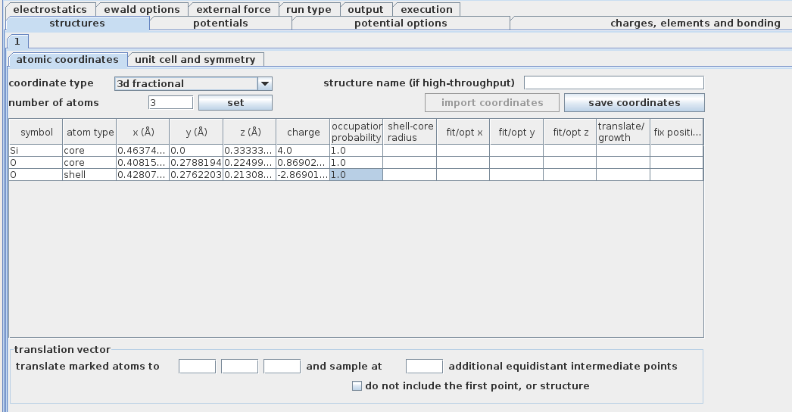
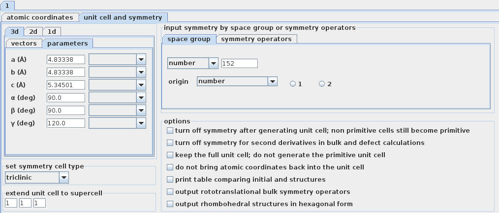
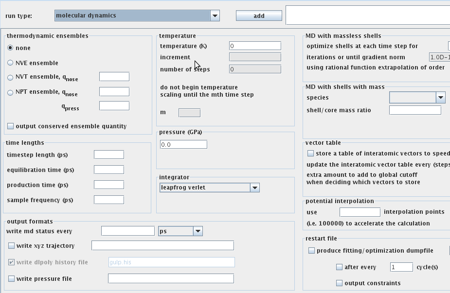
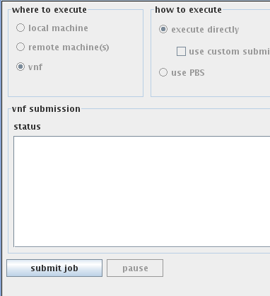

Tour of forcefield and analysis workflows in VNF
======================================================

Introduction
------------

In this short tutorial I will walkthrough the main steps to calculate an SQE scattering kernel in VNF using the Gulp as an md engine.

Create New Simulation
---------------------

Go to the “Simulations” section, click on the “New” green cross-like button.

.. image:: images/qe-phonon-dos/1.sim-table.png
   :scale: 70 
..  :width: 720px

A table of simulation packages will be displayed with a short description. Click on the “Gulp” link:

..   :width: 470px

You can then select an atomic structure from the list or create a new one from the “Atomic Structure” section.

..   :width: 470px

Click select and deploy AtomSim by clicking “Launch”.  A Java GUI should appear.  Review the atomic coordinates:

..   :width: 720px
   
Review the cell parameters.  To create a supercell input the parameters below.  To set (or unset) the spacegroup symmetry, use the space group tab:

..   :width: 720px

Specifying a potential
-----------------------

Many types of potentials are available in the forcefield workflow.  They can either be accessed by selection from a list:

.. figure:: images/md-sqe/potentialExample.png
   :scale: 70 

or by specifying directly:

.. figure:: images/md-sqe/potentials.png
   :scale: 70 
   
Additionally, users can set a variety of options for each potential:

.. figure:: images/md-sqe/potentialOptions.png
   :scale: 70 
   
The potential can also be fit to experimental data or ab initio calculations when users elect the 'fit' runtype:

.. figure:: images/md-sqe/fitting.png
   :scale: 70 
   
We now discuss a few other runtypes.
   
Runtype settings
-----------------
   
When preparing for a phonon or md calculation it is often useful to optimize the positions of the atomic structure or the unit cell first:

.. image:: images/md-sqe/optimization.png
   :scale: 70 
   
After a possible optimization, one may input phonon calculation parameters by clicking on the phonon panel and adding that calculation to the list of runtypes:

.. figure:: images/md-sqe/phonons.png
   :scale: 70 
   
One may also elect to specify a dispersion calculation by clicking on the band structure panel:

.. figure:: images/md-sqe/phonons-dispersion.png
   :scale: 70 

Alternatively the md options may be input by clicking on the md runtype and inputting ensemble, timestep size, output frequency, length of run, temperature, and other options:

Submitting the job
-------------------

After all input options are set, one may inspect the input file for gulp and choose additional output options under the output tab:

.. figure:: images/md-sqe/output.png
   :scale: 70 

Then the file is stored by clicking submit under the execution tab:

   
To submit the job, close the UI and click next until one reaches the job submission screen:

.. figure:: images/md-sqe/jobsubmission.png
   :scale: 70 

After inputting server choice (octopod or foxtrot) and time estimations, we submit and see the job running screen:

..   :width: 720px
   
Eventually the job terminates and we are emailed.

Results
--------

Performing an analysis
------------------------

