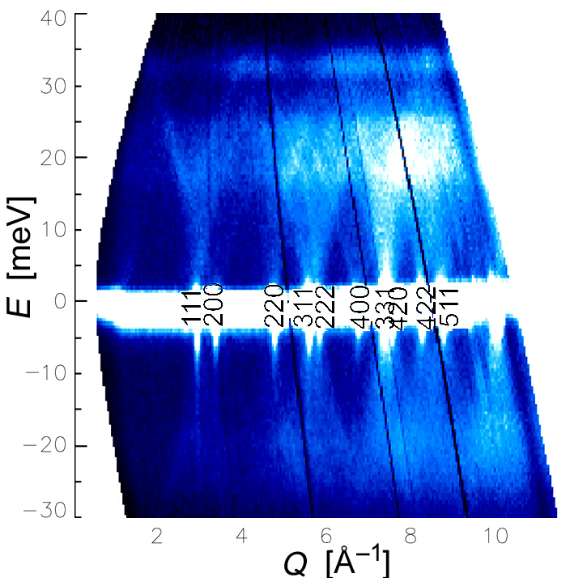

.. _vnfoverview:

Overview
--------

The Virtual Neutron Facility  is a set of
interoperable software packages that allow scientists to simulate
neutron scattering experiments.  Much like real experiments, vnf has
two main parts: 1) instruments, which uses the subpackage MCViNE, and
2) samples, which uses the subpackages for scattering kernels  based
on modern methods from the theory of materials structure and dynamics.

.. image:: Vimages/common/NET_fig_a.jpg
	:width: 400

Many of these capabilities within vnf have been available for a number
of years, and fortunately have been tested well. For example, Monte
Carlo simulations of instruments are well established, as are plane
wave pseudopotential codes for electronic structure calculations.
There are a number of missing steps between these theory codes and a
neutron instrument simulation that are provided by vnf, such as
building a sample assembly containing different scatterers, simulating
modern, complex detector system, or considering the effects beyond
single excitations in inelastic scattering. The vnf packages provides
these missing capabilities in a cohesive manner, and offers a natural
work flow in setting up the simulated experiments.

The essence of neutron scattering is shown in the diagram at right,
with a neutron interacting with the sample. The incident flux of
neutrons is generated by MCViNE and the final neutron state is
detected by MCViNE. The scattering law, S(Q,E), is provided by a
scattering Kernel.

The software boundary between MCViNE and the Kernel is shown in the
figure at left, which depicts more details of a neutron instrument.
Note that only a selected piece of the sample assembly is modeled by
the scattering Kernel. Most of the sample assembly, such as the
holder, aluminum can, and shape of chunks of material, and handling of
multiple scattering, are parts of the Monte Carlo framework, MCViNE.
The interface between MCViNE and Kernel is through a data structure
for the scattering function, S(Q,E), which can describe experimental
results such as the S(Q,E) in the figure below, and could include
multiphonon scattering if so desired.

.. image:: images/common/VNET_figure_2.jpg
	:width: 330

`MCViNE (Monte Carlo Virtual Neutron Experiment) <http://danse.us/trac/MCViNE>`_
--------------------------------------------------------------------------------

The simulations are based on Monte Carlo simulations of instruments,
which can be configured by the user at runtime. Instrument components
(some of them come from python bindings of !McStas, for example) are
assembled together to form an virtual instrument, and a simulation
engine passes groups of neutrons through them. Datasets from the
primary flight path (neutrons on sample) can be recorded, and used
later for an experiment on a particular instrument with a specific
incident energy and energy resolution. These pre-recorded neutron
fluxes on sample can then be used for interaction with the sample to
produce a scattered beam of neutrons to the detectors. Interface to
the sample is through the scattering function, S(Q,E), which contains
the scattering law as a function of momentum transfer, Q, and energy
transfer, E.

Dynamics Engines, Analysis and Scattering Kernel Generation
------------------------------------------------------------------------

The sample structure utilizes an S(Q,E) obtained by simulation or
modeling, and different S(Q,E) are provided by different modules for
materials theory and simulation. The scattering component with
underlying theory is termed the "scattering kernel." The kernels can
be as simple as quick functions to generate an arbitrary S(Q,E) -- a
constant background may be useful, for example.

More sophisticated kernels implement physical models of scattering.
These are described in several textbook references, and more advanced
discussions as in
http://drchops.caltech.edu:5001/click_monitor/ARCS-bigbook
The more substantial scattering kernels make use of the developments
in materials theory over the past decade in both modeling and
simulation. Computationally it is important to distinguish between a
model and a simulation. All models have parameters that can be
optimized based on fitting to experimental data. These calculations
are iterative, used to fit experimental data by optimization. On the
other hand, ab-initio simulation have no adjustable parameters, and
are forward computational chains. In the middle, however, are
simulations such as molecular dynamics simulations, which have some
ab-initio characteristics, but some parametric behavior. 

=== Architecture and Developer's Guide ===

 * VNF is built on top of [http://danse.us/trac/pyre/browser/pythia-0.8/packages/opal opal], a web interface builder, and [http://danse.us/trac/pyre pyre], an integration framework for high performance computing.
 * An overview of the architecture is shown in [source:/vnf/trunk/docs/developer/vnf-webapp-componentdiagram.png this diagram].
 * [wiki:vnfdevguide VNF developer guide]

Current engines:

* Vasp

* Quantum Espresso

* Gulp

* Mmtk

* BvK

Analysis engines 

(list and have link to PESAT)

Instruments:

* ARCS

Monte Carlo Neutron simulators:

* McVine summary and link

Guide to extending VNF:

Guide to using VNF services:

Framework: luban link, pyre link

