.. _powder-diffraction-kernel:

Using Powder Diffraction Kernel in VNF
======================================================

Introduction
------------

In this tutorial we will learn how to use Powder Diffraction Kernel.

Create New Sample
-----------------

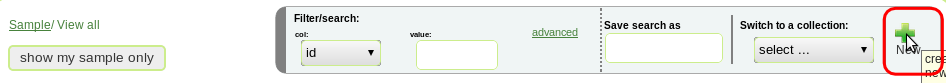

   *Fig. 1 Create new sample*

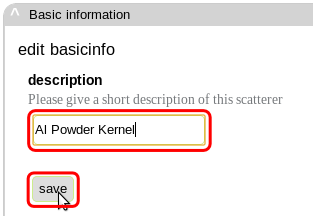

   *Fig. 2 Edit sample description*

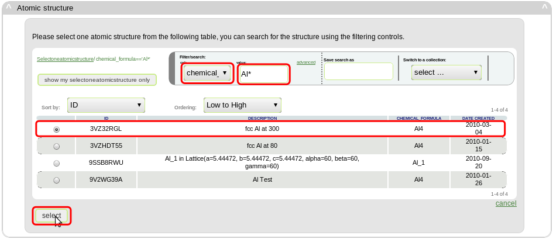

   *Fig. 3 Select atomic structure*

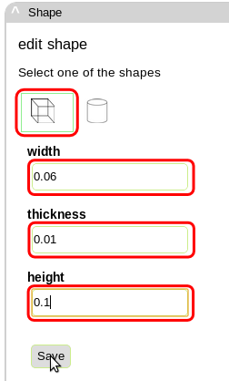

   *Fig. 4 Select and edit sample shape*

Add Powder Diffraction Kernel
--------------------------------

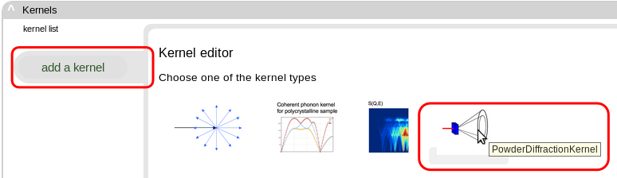

   *Fig. 5 Select Powder Diffraction Kernel*

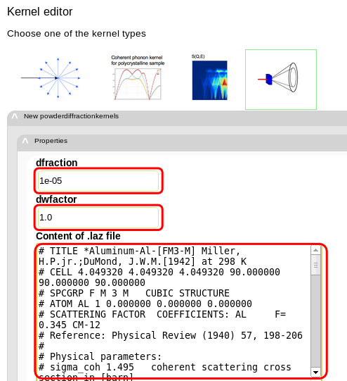

   *Fig. 6 Edit parameters for the kernel*

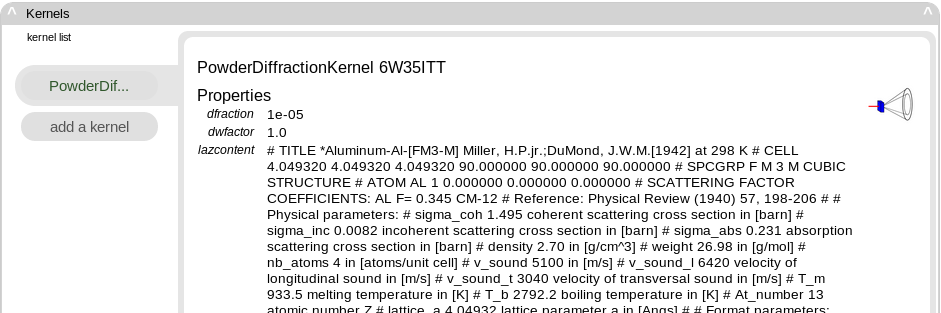

   *Fig. 7 Powder Diffraction Kernel information*

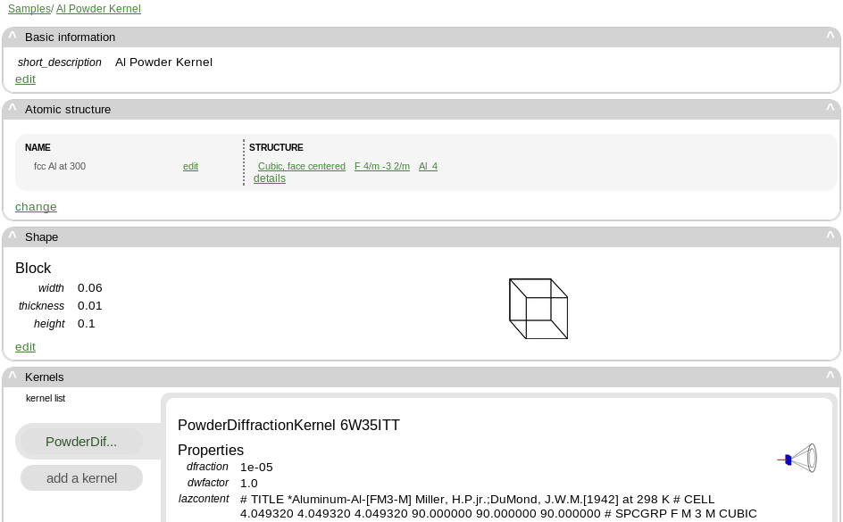

   *Fig. 8 Final sample information*

Create New Instrument
---------------------

   *Fig. 9 Create new instrument*

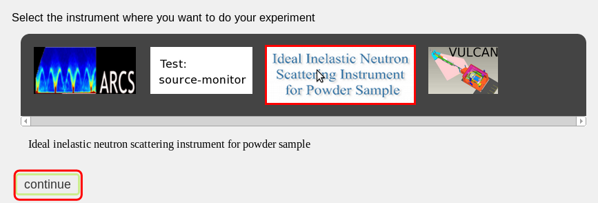

   *Fig. 10 Select instrument type*

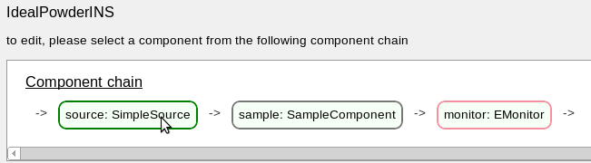

   *Fig. 11 Instrument component chain*

Instrument Components Configuration
-----------------------------------

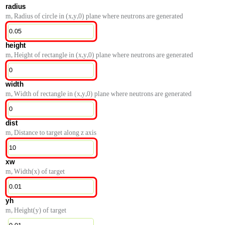

   *Fig. 12 Edit *

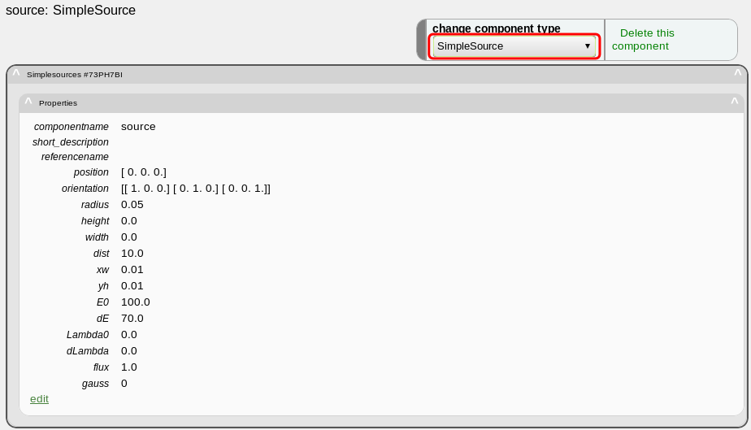

   *Fig. *

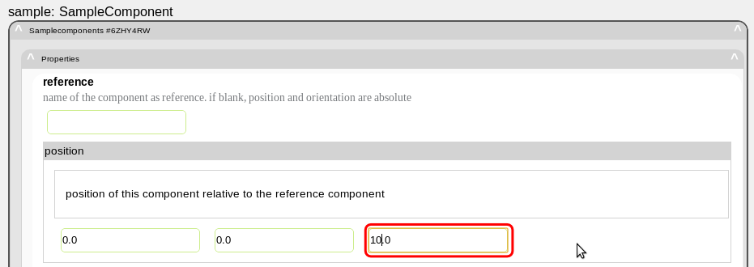

   *Fig. *

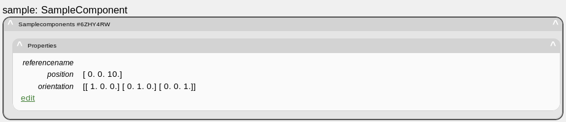

   *Fig. *

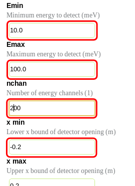

   *Fig. *

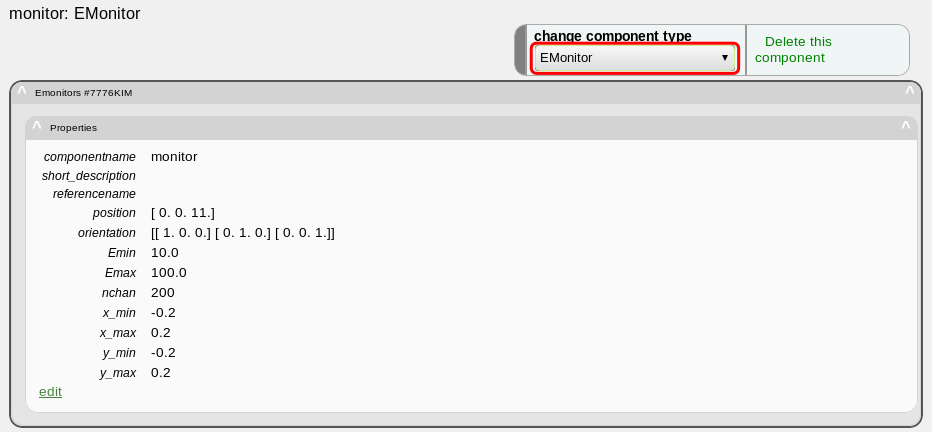

   *Fig. *

   *Fig. *

Sample Configuration
--------------------

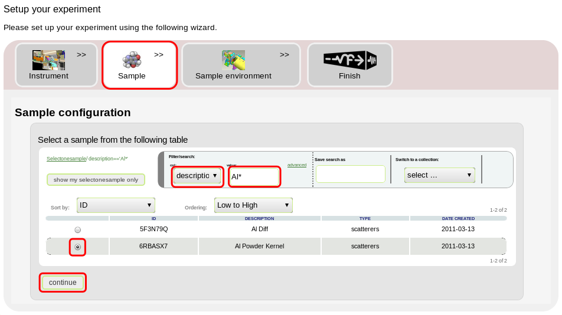

   *Fig. *

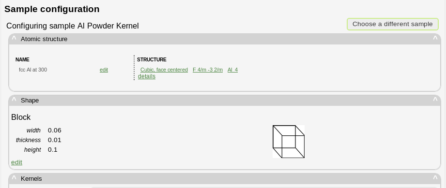

   *Fig. *

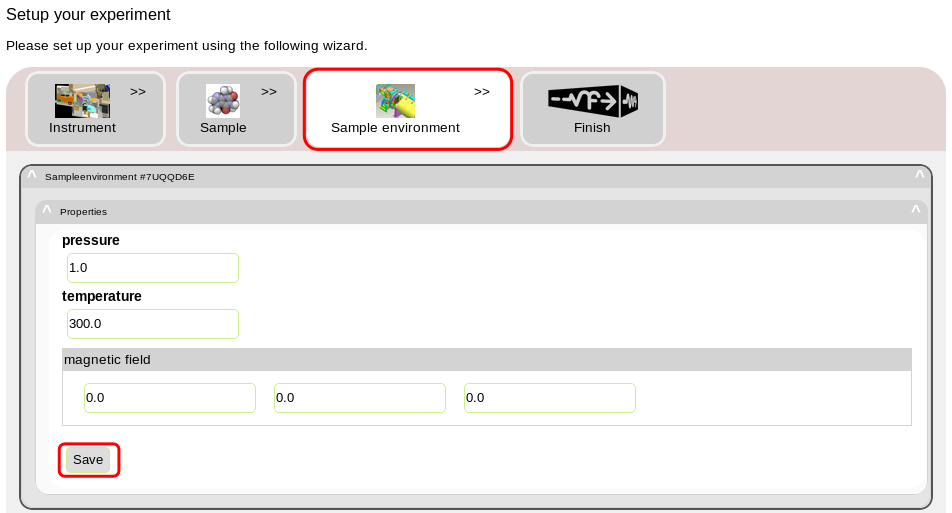

   *Fig. *

Experiment Configuration
------------------------

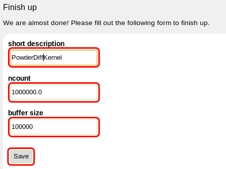

   *Fig. *

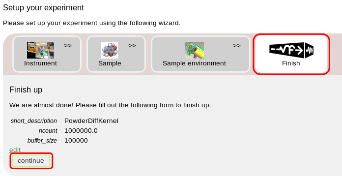

   *Fig. *

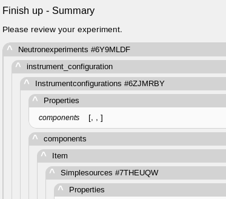

   *Fig. *

   *Fig. *

Job Submission, Monitoring and Results Retrieval
------------------------------------

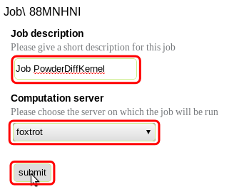

   *Fig. *

   *Fig. *

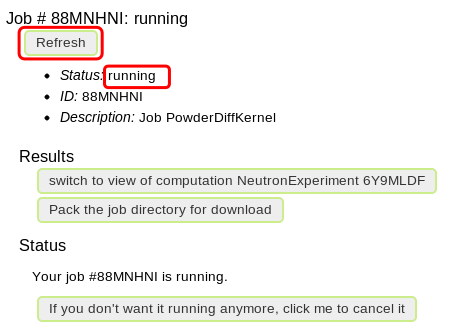

   *Fig. *

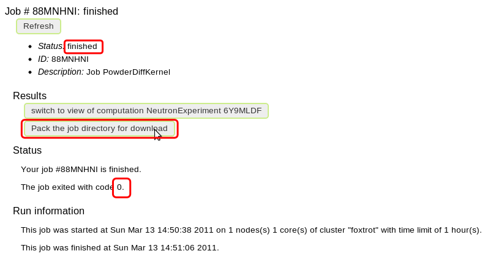

   *Fig. *

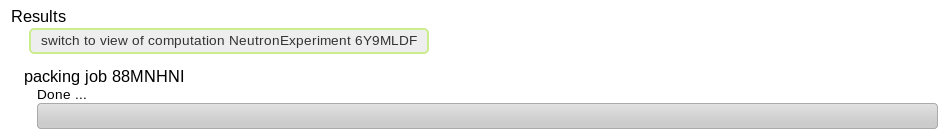

   *Fig. *

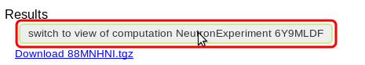

   *Fig. *

Experiment Results
---------------------

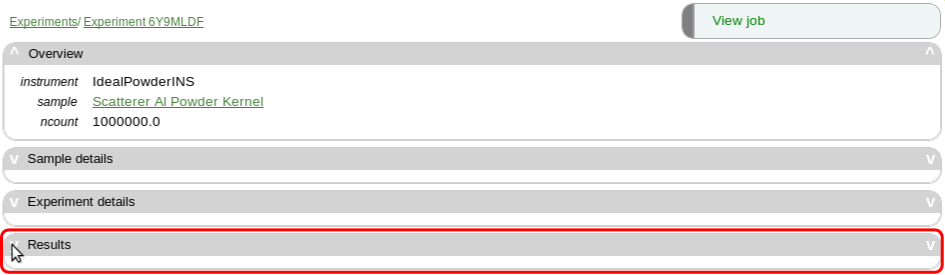

   *Fig. *

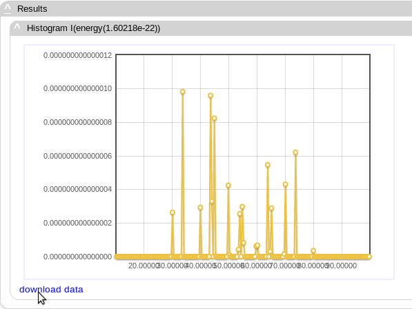

   *Fig. *

