.. _qe-phonon-dos:

Phonon DOS Calculation Using Quantum Espresso with VNF
======================================================

Introduction
------------

In this short tutorial I will show the main steps of the workflow to calculate
phonon DOS using Quantum Espresso with VNF.

Create New Simulation
---------------------

There are two ways to create a new simulation. The first way is to go to the
“Simulations” section, click on the “New” green cross like button.

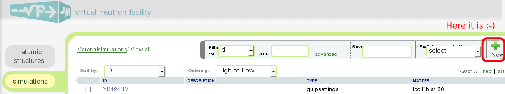

   *Fig. 1 Material simulations table*

Table of simulation packages will be displayed with short description. You will
need to click on the “Quantum Espresso” link.

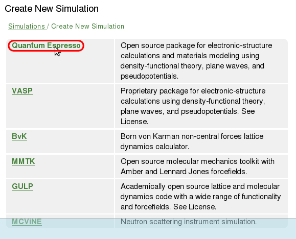

   *Fig. 2 Simulation packages supported by VNF*

The “Create New Simulation” page will be displayed. You can first select the
atomic structure.

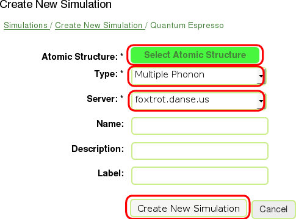

   *Fig. 3 Select atomic structure*

You can select the atomic structure from the list or create a new one from the
“Atomic Structure” section.

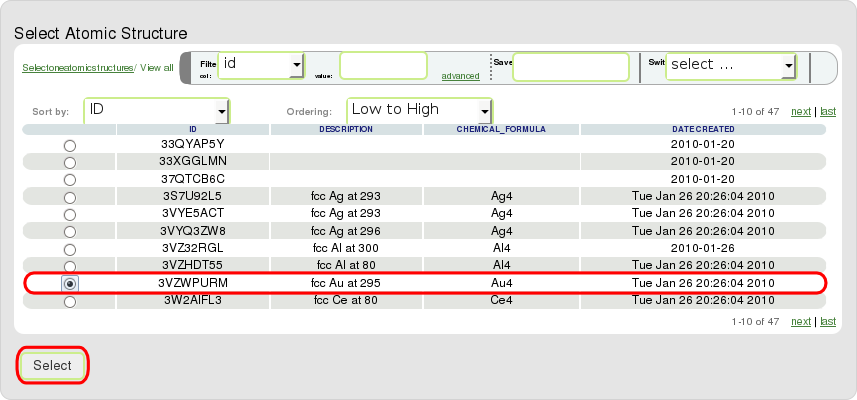

   *Fig. 4 List of atomic structures to select from*

Currently several types of Quantum Espresso simulations are supported which include:

* Total Energy
* Electron DOS
* Electron Dispersion
* Geometry Optimization
* Single Phonon
* **Multiple Phonon**

This tutorial covers only “Multiple Phonon” simulations. You then need to select
the server on which to run the simulation. The star (*) sign specifies the required
fields. Once you set the required fields, click on “Create New Simulation” button.

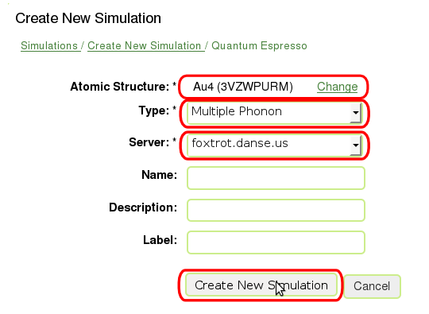

   *Fig. 5 Create new simulation*

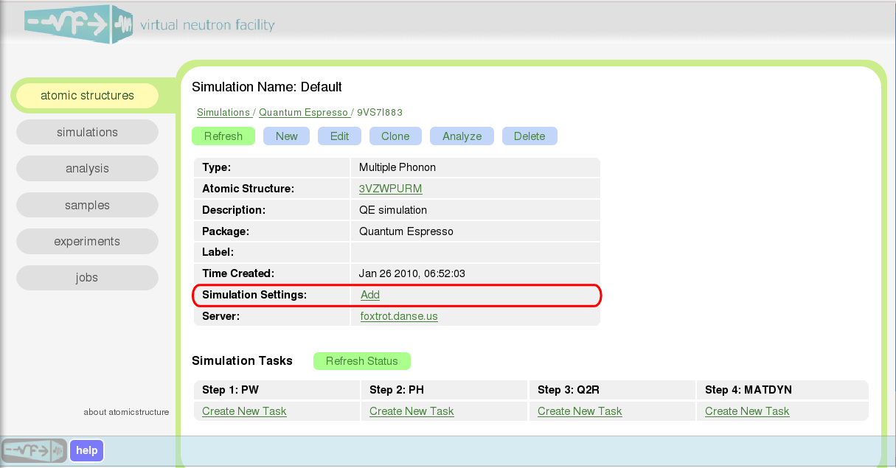

   *Fig. 6 Simulation view page*

The Multiple Phonon simulation in Quantum Espresso consists of four steps:

**Step 1. PW**
	Self consistent calculation of electron density. Outputs are wave functions

**Step 2. PH**
	Phonon calculation from linear response, with output on a rough grid

**Step 3. Q2R**
	Fourier transform to real space and obtain force constants by interpolation

**Step 4. MATDYN**
	Calculation of all phonons from dynamical matrix, given the force constants

From the simulation view page you can also see atomic structure of the simulation
by clicking on the structure id in the “Atomic Structure” field.

The second way to create the new simulation is to go to “Atomic Structures”
section on the main panel and choose the atomic structure.

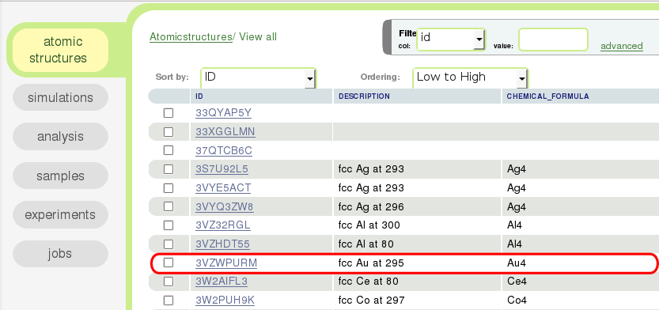

   *Fig. 7 Choose atomic structure for the simulation*

Then go to “Phonons” subsection and in the bottom click on the link Start a 
new phonon computation.

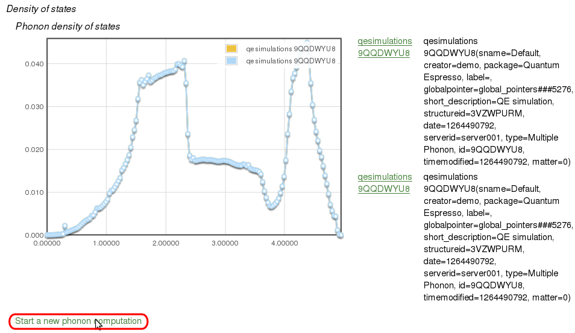

   *Fig. 8 Start a new phonon computation*

The page will be displayed where you can select computation engine to calculate
phonon DOS or phonon dispersion.

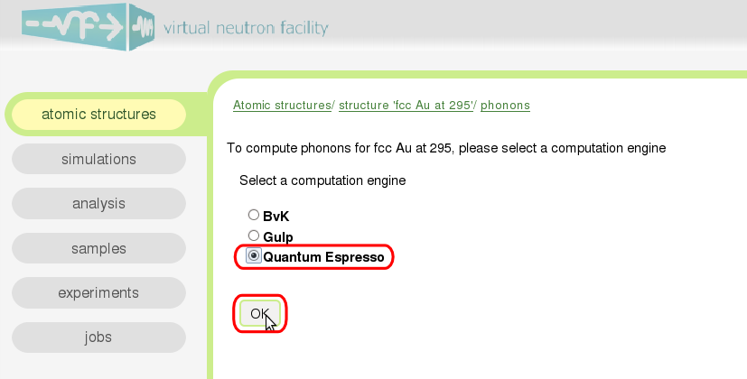

   *Fig. 9 Select a computation engine*

Create Settings Configuration
-----------------------------

To set the simulation environment on the simulation view page click on Add link
for “Simulation Settings”. You can choose the number of processors.

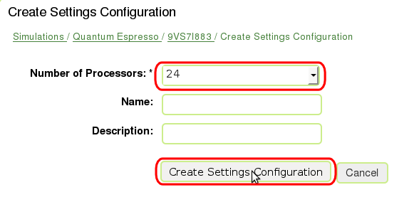

   *Fig 10 Create Settings Configuration page*

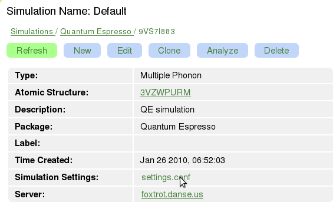

   *Fig. 11 Simulation Settings is created*

If you want to change the number of processors or delete the configuration, you
can go to the Settings Configuration page and click on “Edit” or “Delete” button.

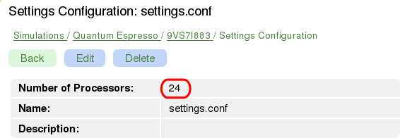

   *Fig. 12 Settings Configuration view*

Create Simulation Tasks
-----------------------

Each simulation in Quantum Espresso consists of a sequence, or chain, of
simulation tasks. The subsequent task depends on the results of the previous task.
In most cases you will need to run PW task first, and then run other tasks
depending on the purpose of your simulation. To create the new simulation task,
click on Create New Task link in “Simulation Tasks” subsection.

   *Fig. 13 Create New Task field*

Each task is required to have one configuration input. To set the input for the 
task click on Add link.

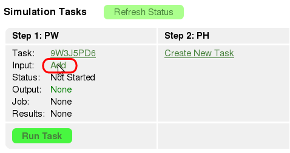

   *Fig. 14 Add PW configuration input*

**Notes:**
	In the future, users will be able to change the simulation task to a 
        different one to make use of existing task results (that might have taken several 
        weeks to run). 

When you click on the link, the form for PW input is displayed

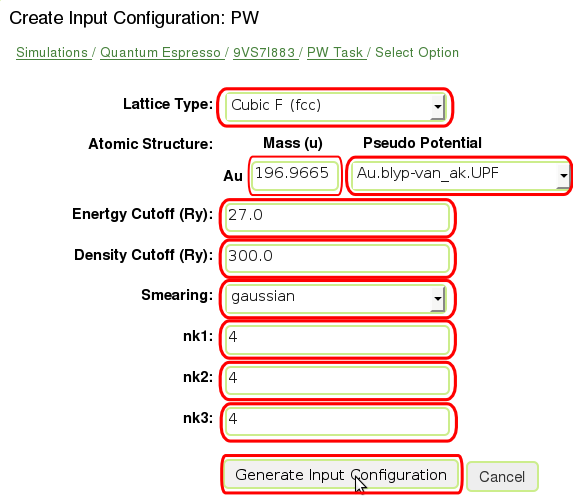

   *Fig. 15 PW input form*

In the PW input form all of the fields are required. The values for the fields
are extracted automatically from the atomic structure. Other parameters are
specific to the simulation. Default values are good enough for many cases and
give you the idea of the parameters. When you click on “Generate Input Configuration”,
the configuration form is displayed. The parameters in the configuration are
generated from the PW input form and you can edit them if you are familiar with
Quantum Espresso. This text is the actual configuration input that will be used
in the simulation. Feel free to copy and paste text that you want to use for the
PW configuration, there are no further bindings of the atomic structure to the
configuration input.

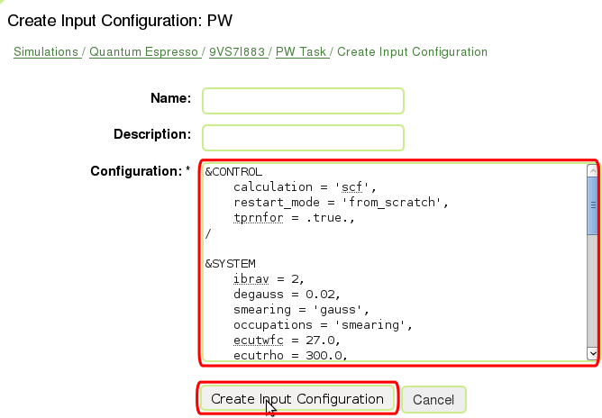

   *Fig. 16 PW configuration input form*

When the configuration input is created you can always edit it or delete.

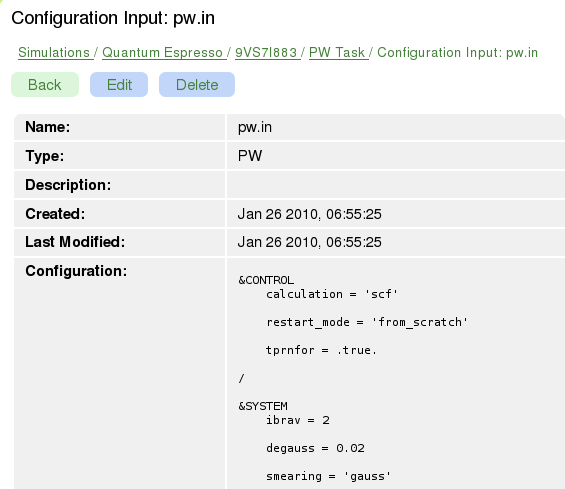

   *Fig. 17 Configuration input view*

Running Simulation Task
-----------------------

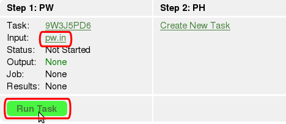

   *Fig. 18 PW configuration input is created. Ready to run the task!*

Now we are ready to run the task. All you need to do is just to click on the 
“Run Task” button to submit the simulation to the specified cluster. In our 
example it is foxtrot.danse.us. During this process the job will be created, 
so the configuration and other supporting files will be transferred to the 
computing cluster. The job will be submitted to the jobs queue (e.g. Torque), 
if your cluster supports it, or run directly on the cluster without submitting 
to any queue. 

You can run multiple jobs for one task. It is important to have this feature 
because sometimes jobs fail for a variety of reasons. When the job fails, you 
can check if the configuration file is correct or it is set too many processors 
and too few K-points which will affect the parallelization of the problem. To 
see what's wrong, just retrieve results and see the output and log files. To 
see all jobs, click on the link All Jobs

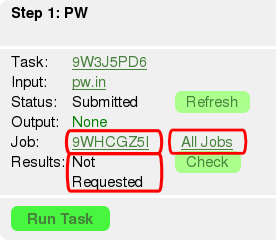

   *Fig. 19 Job is submitted, results are not requested yet*

Retrieving Results
------------------

When the simulation job is completed it is nice to get the results of the 
simulation :). To retrieve the results, just click on the button “Check”. 
The status of the results packing will be displayed

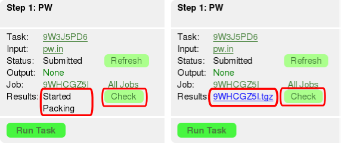

   *Fig. 20 Retrieving simulation results*

Here is the content of the results tarball:

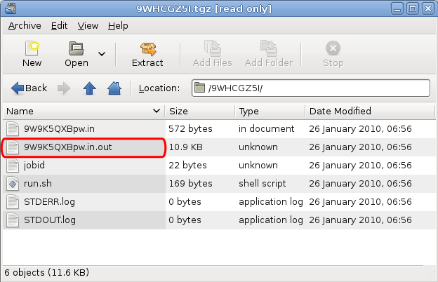

   *Fig. 21 PW results tar ball*

To avoid the results delivery failure you can try to retrieve results again from 
the computational cluster after 3 min. This feature is implemented to give some 
time for the results to be delivered or in case if the delivery failed.

Running the PH Task
-------------------

Once the PW task is successfully completed you can create PH task and set
configuration input for it.

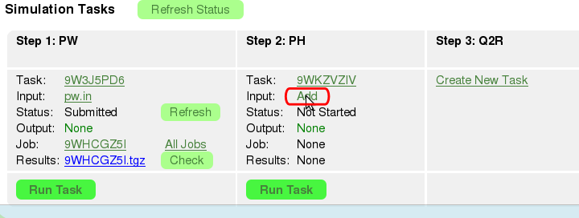

   *Fig. 22 Add PH configuration input*

The form will be displayed where you can set the size of Q grid. All parameters 
in this form are required.

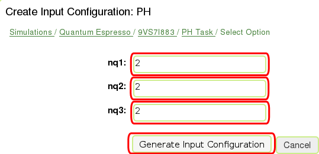

   *Fig. 23 PH configuration input form*

When you click on “Generate Input Configuration” the configuration form is displayed.
As for PW input you can edited the configuration text.

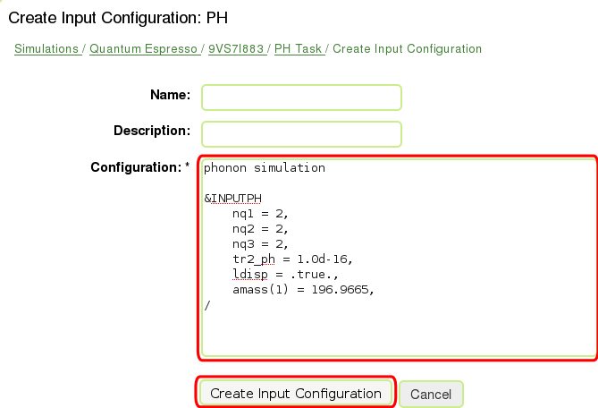

   *Fig. 24 PH configuration input form*

When the input is created we are ready to run task.

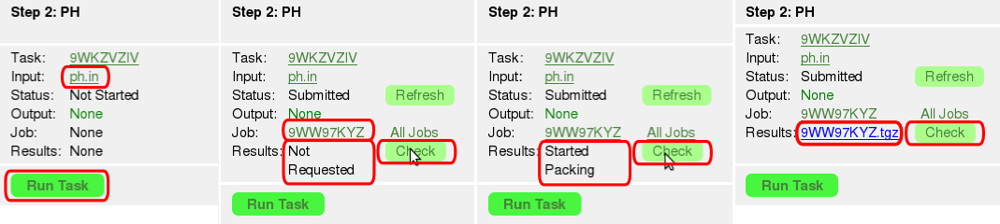

   *Fig. 25 Running PH task and retrieving results*

When the job is completed you can request the results (see section “Retrieving
Results”). The results will be packed in tarball and you can see its content:

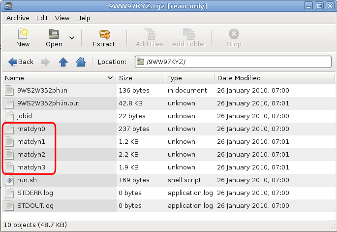

   *Fig. 26 PH results tar ball*

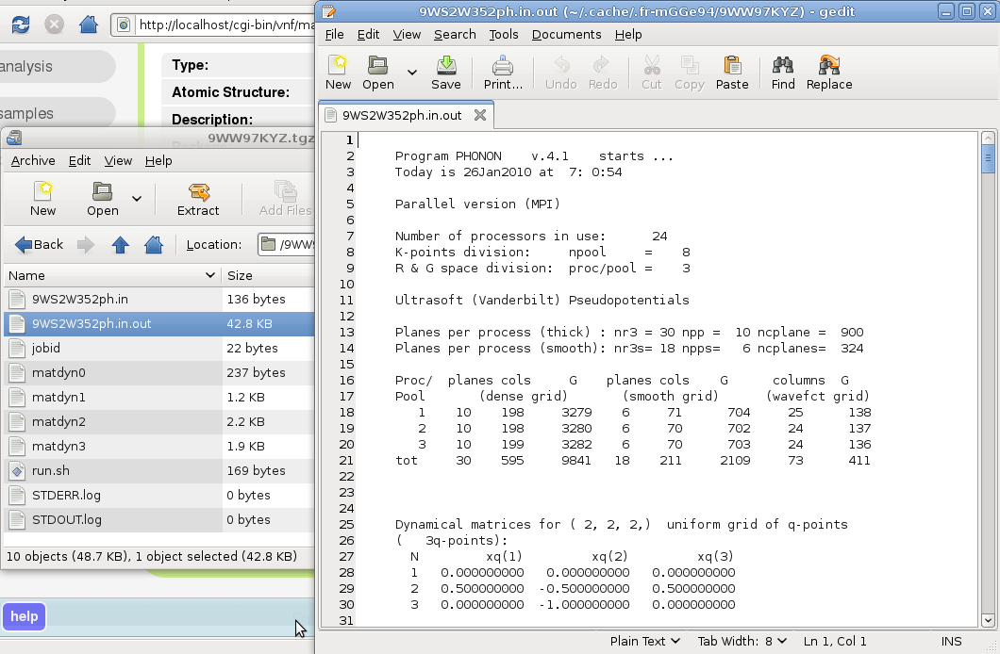

   *Fig. 27 PH output file*

Running the Q2R Task

Once the PH task is successfully completed, you can create a Q2R task and set 
the configuration input for it. Q2R and MATDYN tasks are postprocessing tasks

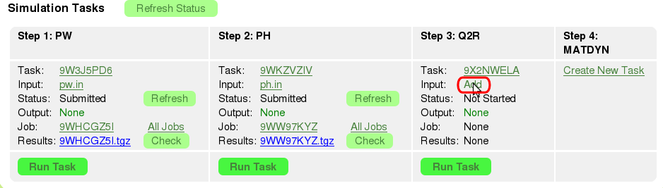

   *Fig. 28 Add Q2R configuration input*

The form will be displayed where you can set acoustic sum rules. This parameter 
will be different for metals and dielectrics.

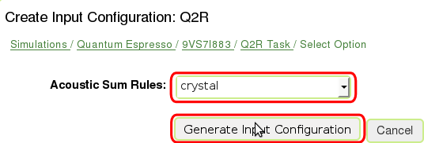

   *Fig. 29 Q2R configuration input form*

When you click on “Generate Input Configuration” the configuration form is
displayed and you can edited the configuration text.

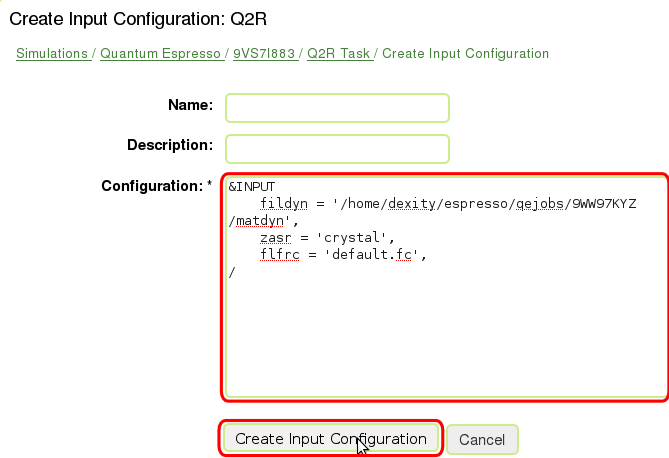

   *Fig. 30 Q2R configuration input form*

When the input is created we are ready to run task

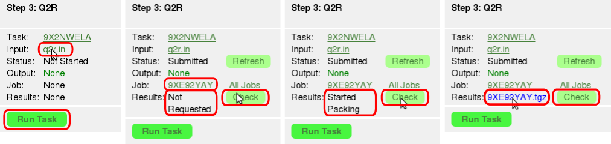

   *Fig. 31 Running Q2R task and retrieving results*

When the job is completed you can request the results. The results will be packed 
in tarball and you can see its content:

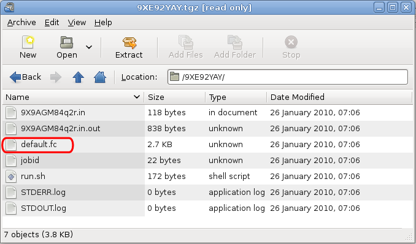

   *Fig. 32 Q2R results tarball.*

Force constants file (``default.fc``) will be used by the MATDYN task to create
the phonon DOS, so make sure that it is present in the results.

Running the MATDYN Task
-----------------------

Once the Q2R task is successfully completed, and has created a force constants
file default.fc you can create a MATDYN task and set the configuration input for it.

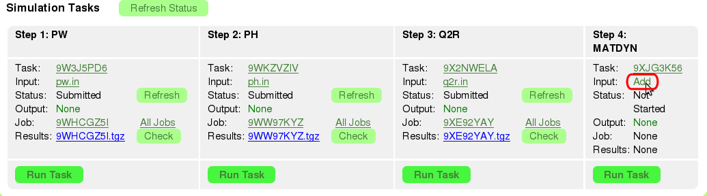

   *Fig. 33 Add MATDYN configuration input*

Here you can have two options:

* Phonon Density of States (DOS)
* Phonons on Grid

For purpose of this tutorial we will pick the “Phonon Density of States”.

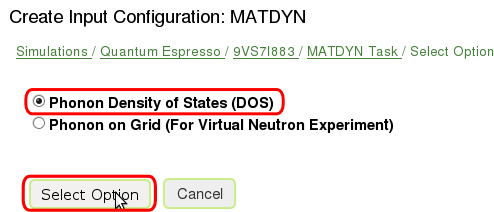

   *Fig. 34 Phonon Density of States*

The form will be displayed where you can set size of the uniform Q-point grid.

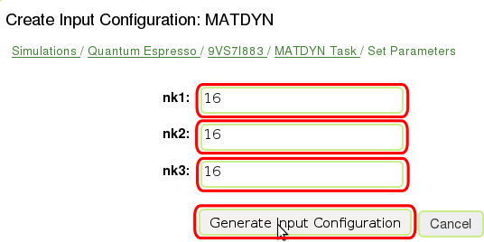

   *Fig. 35 MATDYN configuration input form for setting Q-point grid*

When you click on “Generate Input Configuration” the configuration form is
displayed and you can edited the configuration text.

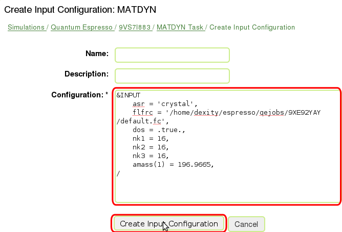

   *Fig. 36 MATDYN configuration input form*

When the input is created we are ready to run task.

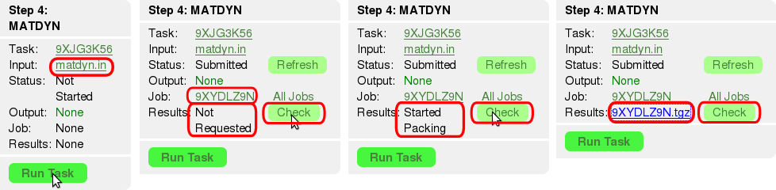

   *Fig. 37 Running MATDYN task and retrieving results*

When the job is completed you can request the results. The results will be
packed in tarball and you can see its content:

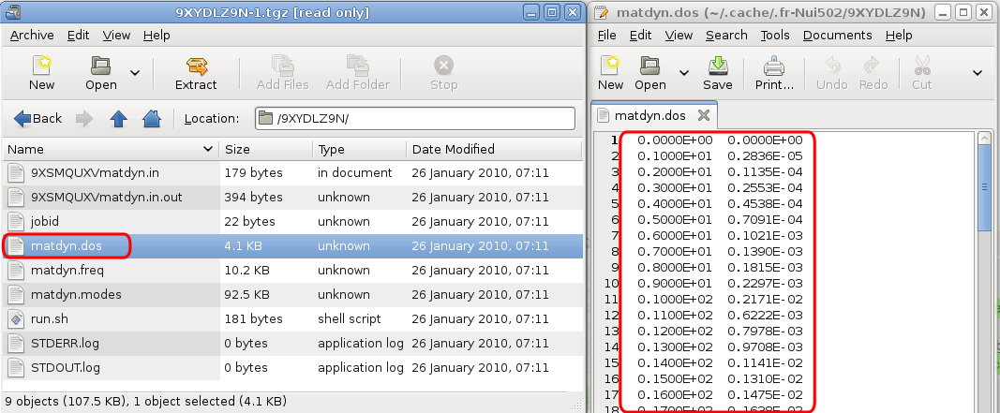

   Fig. 38 MATDYN results tar ball with phonon DOS file (``matdyn.dos``).

At this point we received phonon DOS (``matdyn.dos``) that can later be used to draw a plot.

Results Analysis
----------------

For analysis of the results, we implemented a basic interface that allows you to
display relevant information for the simulation. The alternative way will be to
get the results tarballs retrieved for each of the tasks and use your favorite
tools to analyze data. To do our results analysis of simulation, click on “Analyze”
button.

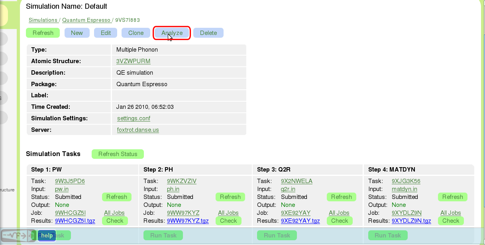

   *Fig. 39 Simulation view after all of the tasks are completed. Time to analyze results!*

The Results panel will displayed that consists of two parts:

* Electron System
* Phonon System

Electron-phonon calculation is not supported on VNF at this time. On the results
panel we can see the “Phonon DOS” plot that we have generated data for recently.
To see the phonon DOS on the atomic structures page, you need to create the phonon
DOS explicitly on the results page by clicking on “Create Phonon DOS” button.
Clicking this button will convert matdyn.dos to IDS (Inelastic Data Storage) format.

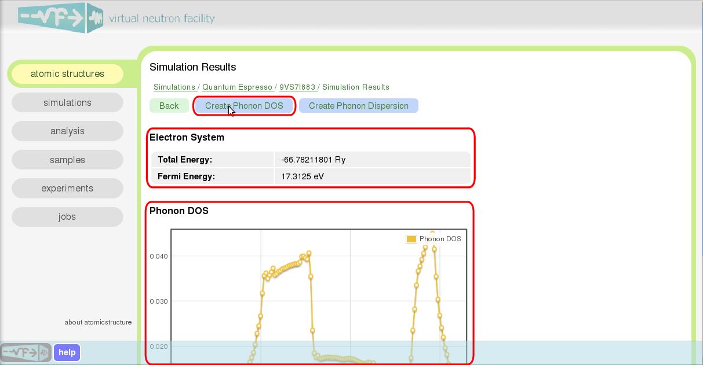

   *Fig. 40 Results view page*

Voila! The phonon DOS is created! Go to the simulation view page and click on the
link for the Atomic Structure field. In the subsection “Phonons” you will see the
plot for density of states (DOS).

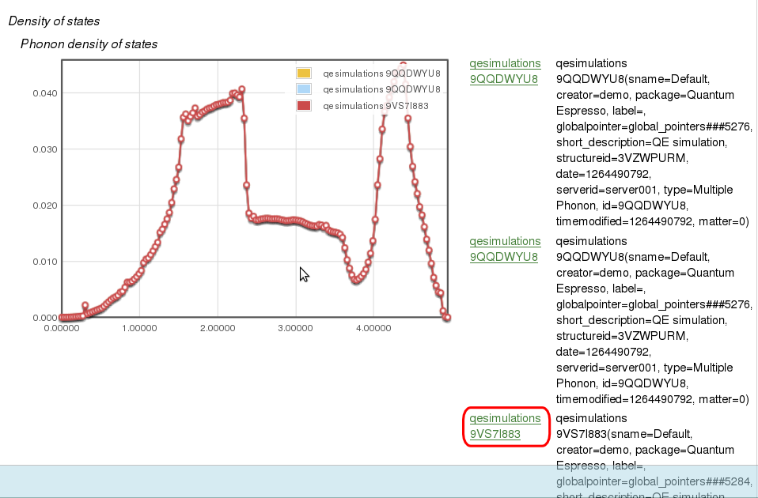

   *Fig. 41 Phonon DOS on the Atomic Structures page*

