.. _vulcan-instrument:

VULCAN Instrument
=================

Introduction
^^^^^^^^^^^^

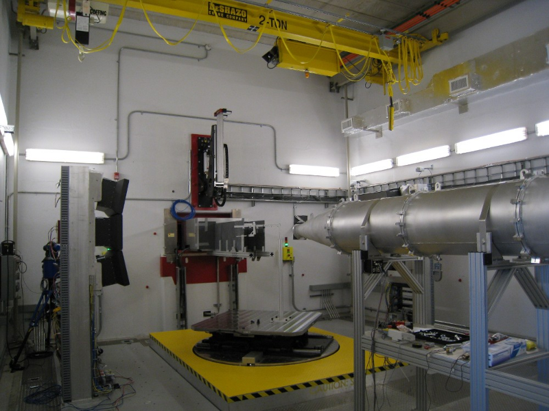

   *Fig. 1 Part of VULCAN instrument with sample and detectors*

.. figure:: images/vulcan/_2.vulcan-schema.png
   :width: 500px

   *Fig. 2 Geometry of VULCAN instrument with numbered sections*

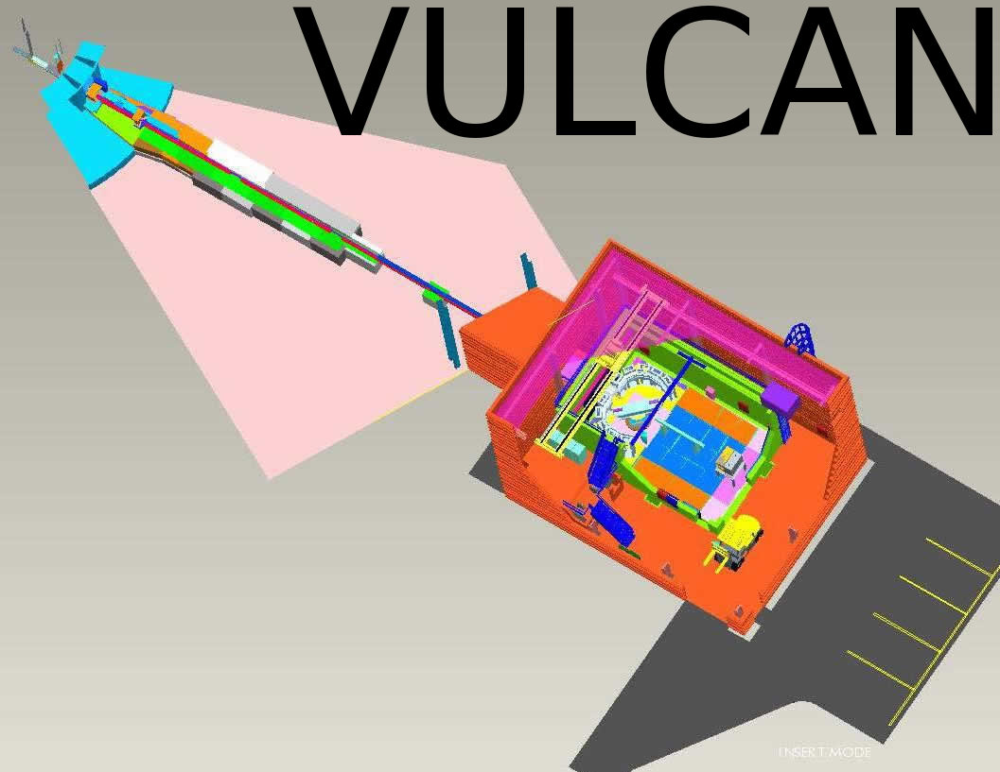

   *Fig. 3 Schema of VULCAN instrument*

VULCAN Instrument Model
^^^^^^^^^^^^^^^^^^^^^^^

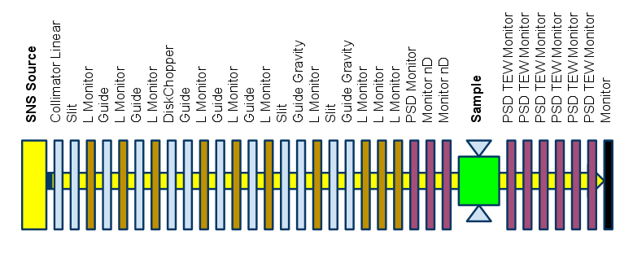

   *Fig. 4 Components sequence in VULCAN instrument model*

Instrument Before Sample
^^^^^^^^^^^^^^^^^^^^^^^^

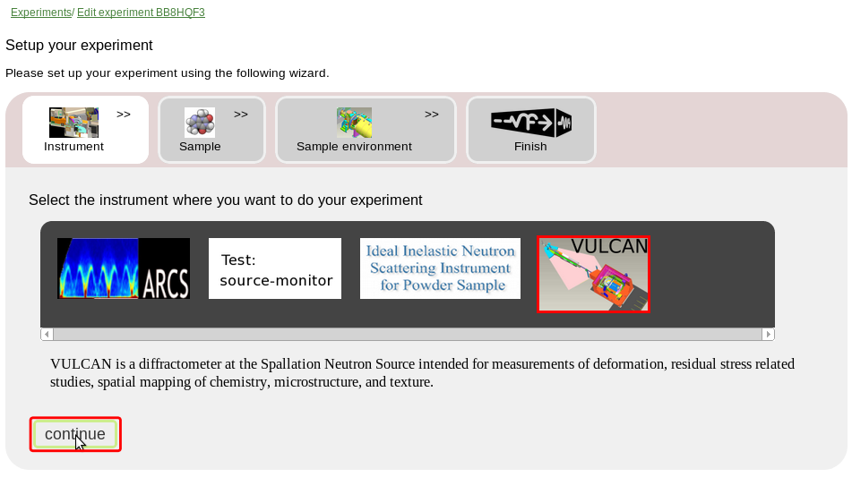

   *Fig. 5 Select VULCAN instrument*

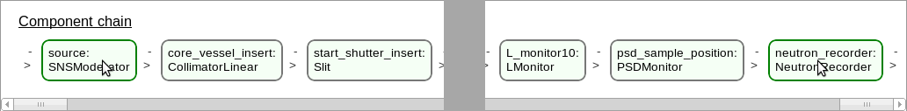

   *Fig. 6 Component chain of VULCAN instrument*

SNSModerator Component
^^^^^^^^^^^^^^^^^^^^^^

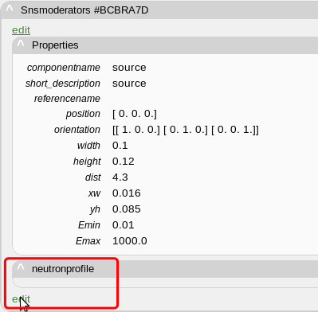

   *Fig. 7 No neutron profile specified*

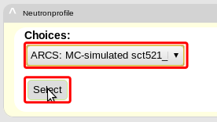

   *Fig. 8 Select neutron profile*

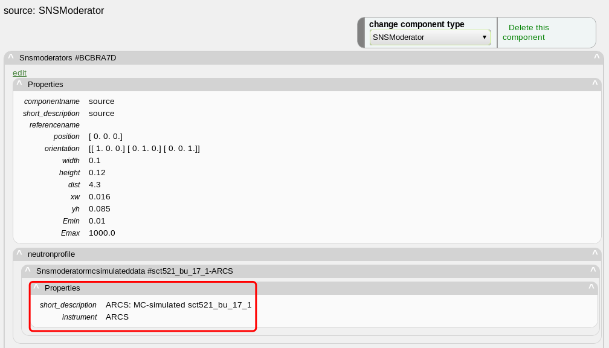

   *Fig. 9 SNSModerator component*

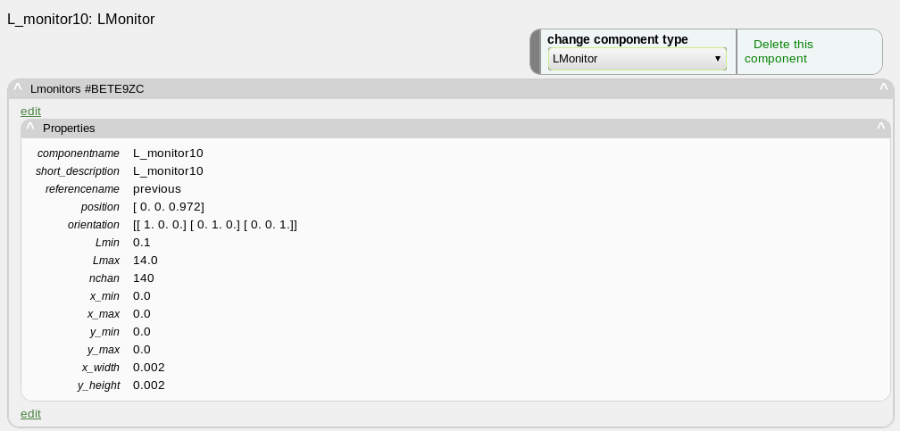

   *Fig. 10 LMonitor component*

NeutronRecorder Component
^^^^^^^^^^^^^^^^^^^^^^^^^

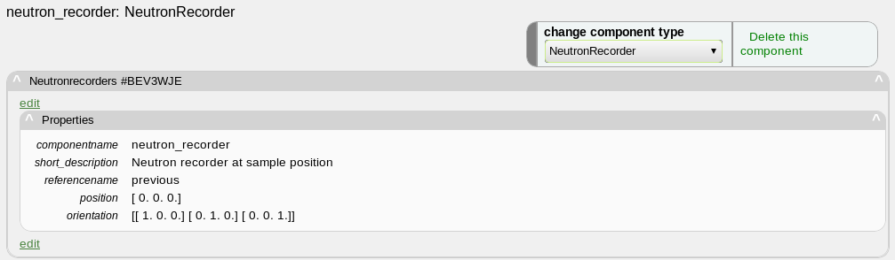

   *Fig. 11 NeutronRecorder component*

.. figure:: images/vulcan/8.edit-experiment.png
   :width: 400px

   *Fig. 12 Edit basic experiment configuration*

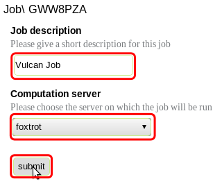

   *Fig. 13 Edit experiment job*

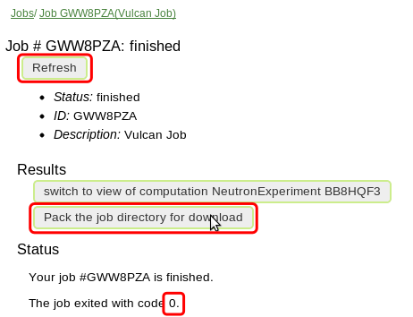

   *Fig. 14 Finished job*

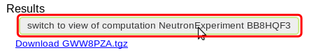

   *Fig. 15 Switch to NeutronExperiment view*

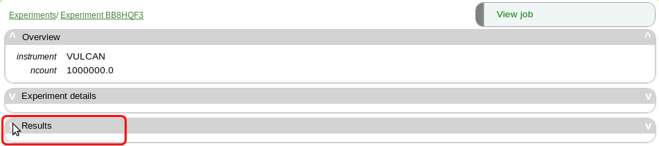

   *Fig. 16 NeutronExperiment view with results*

Intermediate Detectors
^^^^^^^^^^^^^^^^^^^^^^

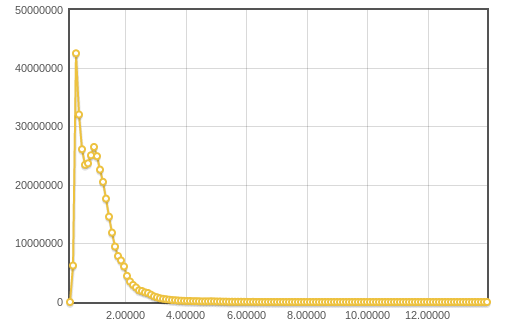

   *Fig. 17 Plot I(w) for LMonitor1*

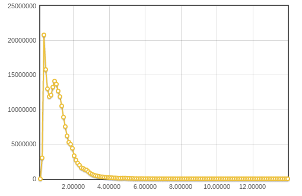

   *Fig. 18 Plot I(w) for LMonitor2*

.. figure:: images/vulcan/15.lmonitor3.png
   :width: 500px

   *Fig. 19 Plot I(w) for LMonitor3*

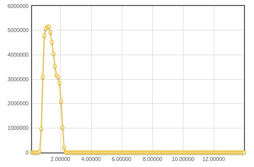

   *Fig. 20 Plot I(w) for LMonitor4*

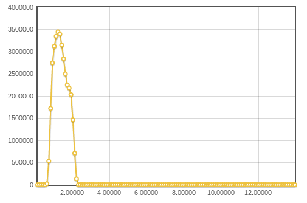

   *Fig. 21 Plot I(w) for LMonitor5*

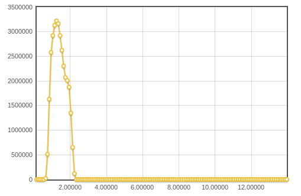

   *Fig. 22 Plot I(w) for LMonitor6*

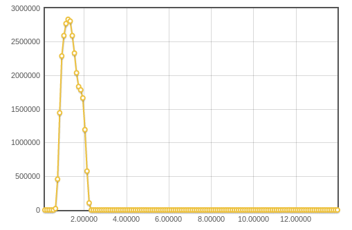

   *Fig. 23 Plot I(w) for LMonitor7*

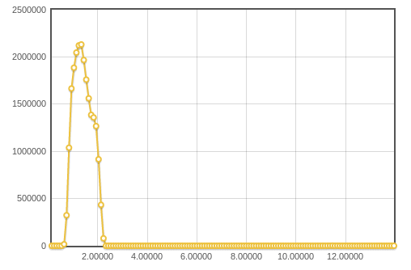

   *Fig. 24 Plot I(w) for LMonitor8*

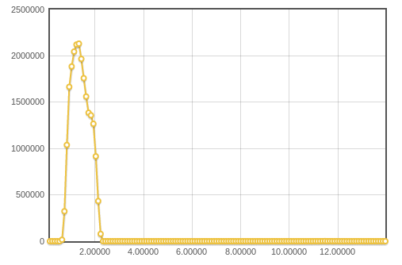

   *Fig. 25 Plot I(w) for LMonitor9*

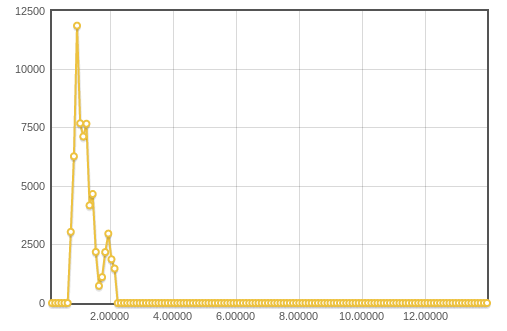

   *Fig. 26 Plot I(w) for LMonitor10*

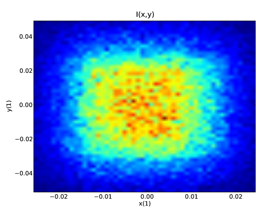

   *Fig. 27 Neutron intensity distribution I(x,y) for PSDMonitor*

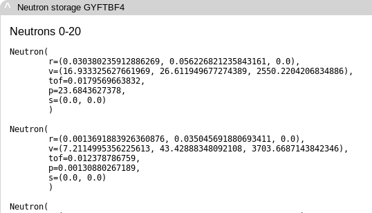

   *Fig. 28 Several neutrons saved by NeutronRecorder*

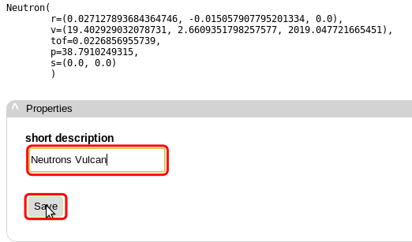

   *Fig. 29 Add description to recorded neutrons*

Instrument with Sample and Detector System
^^^^^^^^^^^^^^^^^^^^^^^^^^^^^^^^^^^^^^^^^^

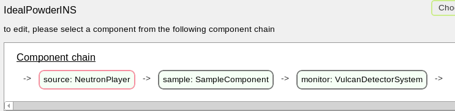

   *Fig. 30 Component chain for sample*

NeutronPlayer Component
^^^^^^^^^^^^^^^^^^^^^^

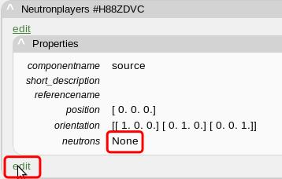

   *Fig. 31 No neutrons are set for NeutronPlayer*

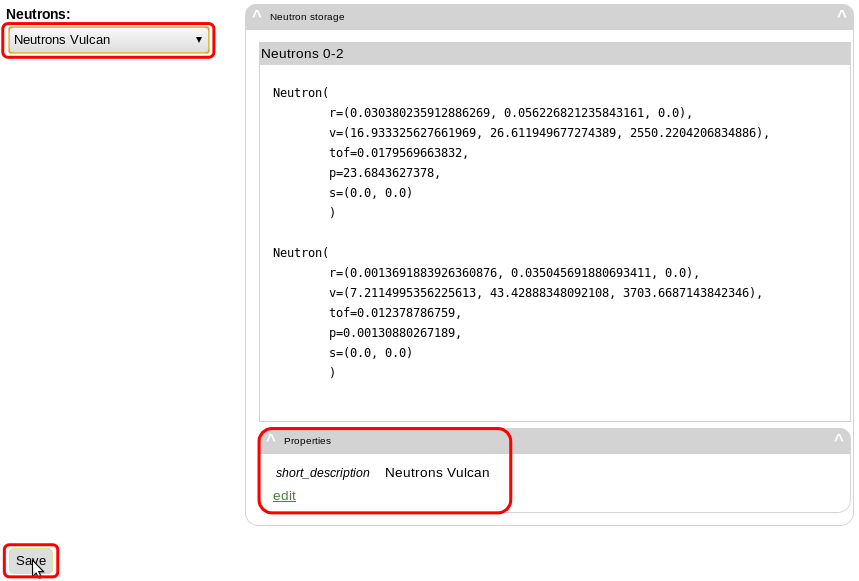

   *Fig. 32 Select recorded neutrons for NeutronPlayer*

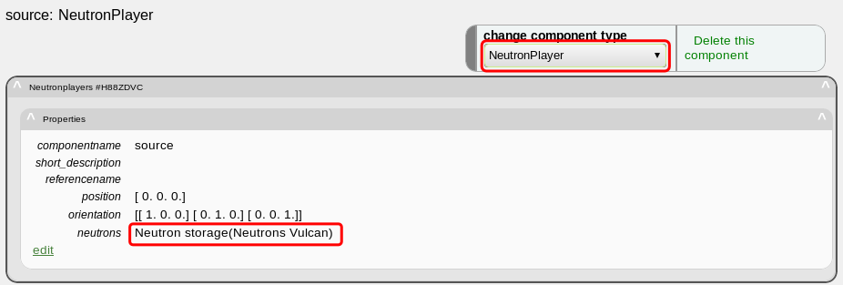

   *Fig. 33 NeutronPlayer component*

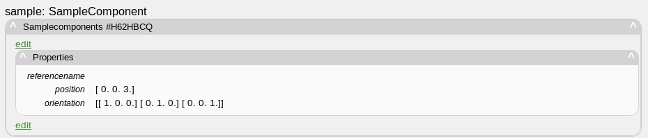

   *Fig. 34 Sample component*

Vulcan Detector System
^^^^^^^^^^^^^^^^^^^^^^

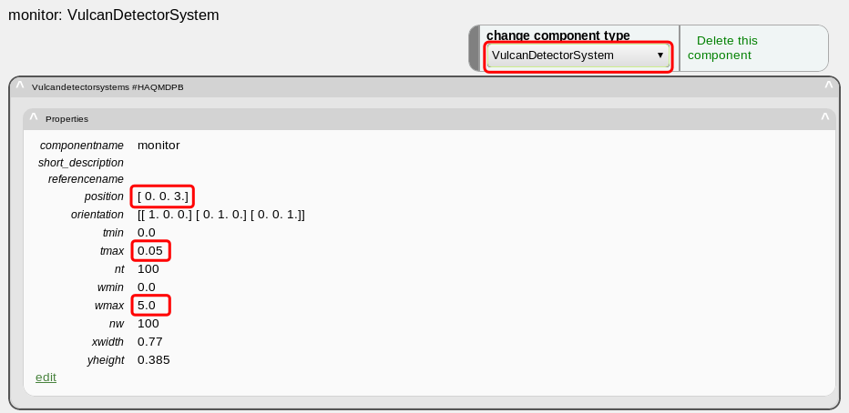

   *Fig. 35 VulcanDetectorSystem component*

.. figure:: images/vulcan/32.select-sample.png
   :width: 720px

   *Fig. 36 Select sample for sample component*

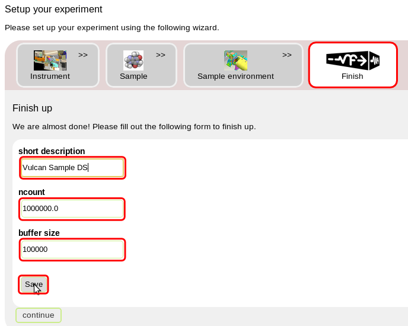

   *Fig. 37 Edit basic experiment configuration with sample*

Experiment Results
^^^^^^^^^^^^^^^^^^

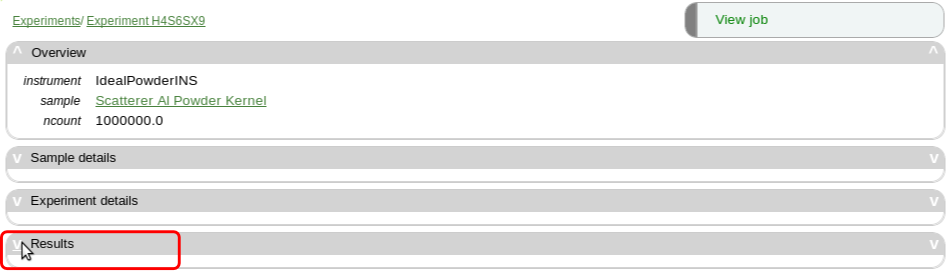

   *Fig. 38 Experiment view with results*

   *Fig. 39 Plot I(TOF) for side center detector*

   *Fig. 40 Plot I(w) for side center detector*

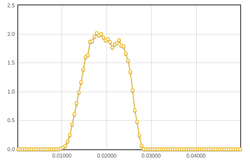

   *Fig. 41 Plot I(TOF) for side top detector*

   *Fig. 42 Plot I(w) for side top detector*

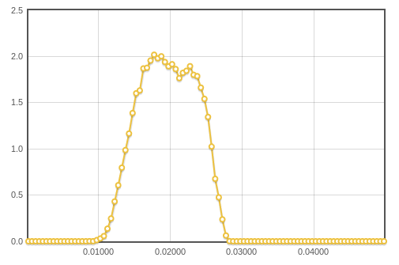

   *Fig. 43 Plot I(TOF) for side buttom detector*

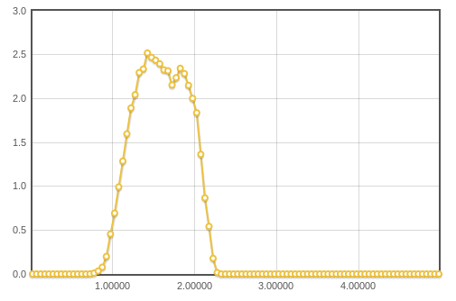

   *Fig. 44 Plot I(w) for side buttom detector*

